# Vision Language Models are In-Context Value Learners

[Original PDF](../Vision%20Language%20Models%20are%20In-Context%20Value%20Learners.pdf)

Pages: 27

> Automatically converted from PDF. Check the original for exact equations, symbols, table alignment, and figure details.

<!-- Page 1 -->

_2024-11-8_ 


# **Vision Language Models are In-Context Value Learners** 

**Yecheng Jason Ma**<sup>†</sup><sup>_,_1</sup><sup>_,_2</sup> **, Joey Hejna**<sup>1</sup><sup>_,_3</sup> **, Ayzaan Wahid**<sup>1</sup> **, Chuyuan Fu**<sup>1</sup> **, Dhruv Shah**<sup>1</sup> **, Jacky Liang**<sup>1</sup> **, Zhuo Xu**<sup>1</sup> **, Sean Kirmani**<sup>1</sup> **, Peng Xu**<sup>1</sup> **, Danny Driess**<sup>1</sup> **, Ted Xiao**<sup>1</sup> **, Jonathan Tompson**<sup>1</sup> **, Osbert Bastani**<sup>2</sup> **, Dinesh Jayaraman**<sup>2</sup> **, Wenhao Yu**<sup>1</sup> **, Tingnan Zhang**<sup>1</sup> **, Dorsa Sadigh**<sup>1</sup><sup>_,_3</sup> **, Fei Xia**<sup>1</sup> 1Google DeepMind, 2University of Pennsylvania, 3Stanford University Correspond to: `jasonyma@seas.upenn.edu, xiafei@google.com` 

Website and Interactive Demo: generative-value-learning.github.io 

##### **Abstract** 

Predicting temporal progress from visual trajectories is important for intelligent robots that can learn, adapt, and improve. However, learning such progress estimator, or temporal value function, across different tasks and domains requires both a large amount of diverse data and methods which can scale and generalize. To address these challenges, we present Generative Value Learning (GVL), a universal value function estimator that leverages the world knowledge embedded in vision-language models (VLMs) to predict task progress. Naively asking a VLM to predict values for a video sequence performs poorly due to the strong temporal correlation between successive frames. Instead, GVL poses value estimation as a temporal ordering problem over shuffled video frames; this seemingly more challenging task encourages VLMs to more fully exploit their underlying semantic and temporal grounding capabilities to differentiate frames based on their perceived task progress, consequently producing significantly better value predictions. Without any robot or task specific training, GVL can in-context zero-shot and few-shot predict effective values for more than 300 distinct real-world tasks across diverse robot platforms, including challenging bimanual manipulation tasks. Furthermore, we demonstrate that GVL permits flexible multi-modal in-context learning via examples from heterogeneous tasks and embodiments, such as human videos. The generality of GVL enables various downstream applications pertinent to visuomotor policy learning, including dataset filtering, success detection, and advantage-weighted regression – all without any model training or finetuning. 

### **1. Introduction** 

Predicting temporal progress from visual trajectories is an important task for embodied agents that interact with the physical world. A robot capable of generalizable progress estimation can in principle discern desirable and undesirable behaviors to learn visuomotor skills in new environments. This is most often studied in reinforcement learning literature [51], where progress estimation is equivalent to universal value learning under specific choices of reward function. However, universal value estimation comes with a number of key challenges: (1) broad _generalization_ to new tasks and scenes, (2) the ability to _accurately estimate state_ in partially observed environments, and (3) temporal _consistency_ (i.e. satisfying the Bellman equation) over long horizons. Most existing methods trained on relatively small amounts of vision-only data [8, 40, 1] lack the semantic, spatial, and temporal understanding needed to ground task progress in the space-time manifold of video, preventing generalization. Moreover, they often reason over single frames, inducing a high-degree of uncertainty in partially observed environments which in turn can effect the consistency of predictions for poorly estimated states. However, these challenges are not insurmountable: modern vision language models (VLMs) exhibit marked generalization and reasoning capabilities, potentially making them useful for value estimation. 

Though not often considered as candidates for value estimation, VLMs excel at its aforementioned core challenges. First, state-of-the-art VLMs have exhibited strong spatial reasoning and temporal 

> © 2024 Google DeepMind. All rights reserved 

> † Work done while a student researcher at Google DeepMind.

<!-- Page 2 -->

Vision Language Models are In-Context Value Learners 


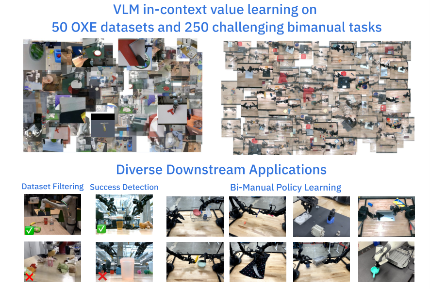


<!-- Start of picture text -->
VLM in - context value learning on<br> 50 OXE datasets and 250 challenging bimanual tasks<br>Diverse Downstream Applications<br>Dataset Filtering Success Detection Bi - Manual Policy Learning<br>❌<br><!-- End of picture text -->

Figure 1 | **Result highlights.** GVL can effectively zero-shot and few-shot predict task progress on diverse and challenging real-world tasks; these capabilities enable expansive set of downstream applications, including dataset filtering, success detection, and policy learning. 

understanding capabilities across various vision tasks [44, 9, 25, 21], allowing them to _generalize_ to novel scenarios. Second, large transformer-based VLMs have the requisite context window [22] to reason over large amounts of historical information to _accurately estimate state_ from observation sequences when predicting task progress. Finally, VLMs make predictions _auto-regressively_ , meaning they commit to their own outputs as inputs for subsequent predictions, imposing _consistency_ constraints on long generations. For example, a VLM is unlikely to estimate that a task is 50% completed if it already has a 50% completion prediction in context. However, how exactly a VLM should be used to predict values is unclear. Empirically, we find that simply placing a video in-context and prompting the model to return progress predictions for each frame fails – our analysis suggests strong temporal correlations between successive frames often cause VLMs to produce uninformative monotonic values that disregard the actual quality of the trajectory and differences between frames (Section 4) – and a different approach is needed. 

To effectively leverage the broad knowledge of VLMs, we introduce Generative Value Learning (GVL), a universal value estimation method enabled by long-context VLMs, which crucially operates over _shuffled_ frames. At its core, GVL asks frozen state-of-the-art VLMs, such as `Gemini-1.5-Pro` [22], to auto-regressively predict the completion percentage of a task specified in natural language for a sequence of shuffled input video frames; see Fig. 2. Perhaps surprisingly we find that simply shuffling the frames of the input video effectively overcomes the strong implicit temporal bias found in video, enabling VLMs to generate meaningful values. While GVL is capable of generating values in a zero-shot manner, we find that the performance of GVL scales with examples via multi-modal in-context learning. Providing more examples of visual “unshuffling” in context increases performance, irrespective of the target embodiment. For example, human videos can improve GVL’s performance on predicting robot task progress. 

2

<!-- Page 3 -->

Vision Language Models are In-Context Value Learners 

## G ~~e~~ n ~~e~~ ra ~~ti~~ v ~~e~~ Valu ~~e~~ L ~~e~~ arn ~~i~~ ng 


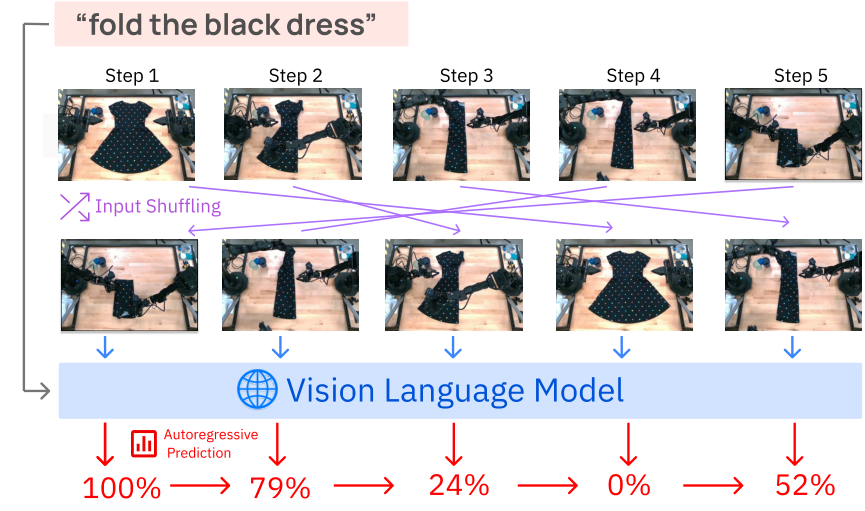


<!-- Start of picture text -->
“ fo ld  t h e  black dr e ss”<br>Step 1 Step 2 Step 3 Step 4 Step 5<br>Input Shuffling<br>Vision Language Model<br>Autoregressive<br> Prediction<br>100% 79% 24% 0% 52%<br><!-- End of picture text -->

Figure 2 | **Method overview.** Generative Value Learning (GVL) generates values by auto-regressively predicting task completion percentage over shuffled frames, enabling impressive in-context value learning. 

To facilitate large-scale value prediction evaluation, we additionally introduce a new evaluation metric, Value-Order Correlation (VOC), measuring how well predicted values correlate with the ground-truth timestep order in expert videos; as we will show, VOC is also a useful metric for measuring dataset and trajectory quality, which allows GVL to be used for applications beyond valuebased policy learning such as data quality estimation and success detection. We first evaluate GVL’s value prediction quality with VOC on a large suite of real-world robotics datasets, spanning 51 datasets, 20 embodiments, and more than 300 tasks. This includes 50 datasets from Open-X (OXE) dataset [45] in addition to our own bimanual manipulation dataset containing 250 challenging real-world tasks on an ALOHA platform [71], which are considerably longer horizon and more fine-grained than those in the OXE dataset. In aggregate, GVL exhibits strong zero-shot value prediction capabilities with highly positive VOC scores on most datasets; its performance further improves with various types of multi-modal in-context examples. Using GVL, we demonstrate scalable foundation model supervision for robot learning at various data abstraction levels. Specifically, GVL can help measure dataset quality in OXE. Second, it can be used for success detection, enabling imitation learning on mixed-quality datasets. Finally, the raw value estimates from GVL can be used for advantage-weighted regression for real-world offline reinforcement learning [47, 46]. 

In summary, our contributions are 

1. Generative Value Learning (GVL), a universal value prediction framework via VLM in-context autoregressive value estimation on shuffled video frames. 

2. An extensive evaluation on real-world datasets demonstrating GVL’s zero-shot scalability and multi-modal in-context learning capabilities. 

3. Demonstration that GVL can be used in downstream applications including dataset quality estimation, success detection, and advantage-weighted regression for real-world control. 

3

<!-- Page 4 -->

Vision Language Models are In-Context Value Learners 

### **2. Related Work** 

**Reward and value foundation models.** Several works have tried to learn transferable reward and value functions from diverse data. Early works learned models using robot [52] or even human videos with discriminators [8], contrastive learning [3] or offline RL [40, 41, 4] to guide manipulation tasks. With the advent of recent language and vision foundation models, several works have integrated them into various robotic applications such as semantic planning [1, 27, 56, 70, 14], imitation learning [6, 57], and symbolic programming [58, 36, 56, 63, 26, 39, 55, 14, 38, 67]. Most related to our work, LLMs and VLMs have been used as reward models. Kwon et al. [34], Mahmoudieh et al. [43] use language models to provide reward values for RL agents, while Klissarov et al. [32], Wang et al. [64], Kwon et al. [34] use them to provide preference feedback. Ma et al. [42], Yu et al. [69], Xie et al. [66] even have LLMs generate their code. These works use only the language capabilities of foundation models. More recent works directly use VLMs as zero-shot reward models [50] or success detectors [15, 23]. Critically, in these works the VLM acts only as an (often sparse) reward function which predicts success, and not a _value_ function that predicts task progress. Though some works use chain-of-thought prompting [61] or active learning [33], they generally do not make use of the autoregressive, long-context, or in-context learning capabilities of state-of-art VLMs. As a consequence, they often evalaute _reward_ prediction only on simple and simulated tasks. To our knowledge, we are the first to demonstrate that VLMs are capable of generalizable per-frame value estimation on real world tasks which can be used for downstream tasks like dataset selection. 

**In-context learning for robotics.** In-context learning has been explored in the robot learning literature, primarily focusing on action generation [16, 19, 11, 68, 13, 37, 20]. However, all these prior works require explicit, and often extensive training, on their robot tasks in order to realize in-context learning capabilities, and generalization is achieved only on narrow distribution of tasks. In contrast, we demonstrate that visual value estimation already enjoys flexible multi-modal in-context learning from pre-trained VLMs without any robot specific fine-tuning. 

### **3. Generative Value Learning** 

In this section, we introduce Generative Value Learning, GVL. At a high level, GVL frames value estimation as an autoregressive next-token prediction problem in which a VLM is tasked with outputting the task progress for a _batch of shuffled trajectory frames_ . 

**Problem setup.** We model robotics tasks as goal-conditioned partially observed Markov decision processes [48]: M( _𝜙_ ) := ( _𝑂, 𝐴, 𝑅, 𝑃, 𝑇𝜇, 𝐺_ ) with observation space _𝑂_ , action space _𝐴_ , reward function _𝑅_ , transition function _𝑃_ , task horizon _𝑇_ , initial state distribution _𝜇_ ( _𝑜_ ), and goal space _𝐺_ that specifies the task semantically. Conditioned on a task _𝑔_ an agent _𝜋_ : _𝑂_ → _𝐴_ aims to maximizes its value function, or the expected cumulative reward over the task horizon, _𝑉_<sup>_𝜋_</sup> ( _𝑜_ 1; _𝑔_ ) = 𝔼 _𝜇,𝜋,𝑃_ [ _𝑟_ ( _𝑜_ 1; _𝑔_ ) + · · · + _𝑟_ ( _𝑜𝑇_ ; _𝑔_ )]. However, reward and value functions can be difficult to define for robotics applications given their heterogeneity. Given this, a popular universal notion of value is task progress [52, 53, 18, 60, 35]. This kind of temporal value function maps an observation and goal specification to a real number between 0 and 1: _𝑉_ : O × G →[0 _,_ 1], where initial observations of the environment have value 0 and goalsatisfying observations have value 1. Under this definition, an expert trajectory _𝜏_ = ( _𝑜_ 1 _, . . . , 𝑜𝑇_ ) ∼ _𝜋𝐸_ , has value function _𝑉_<sup>_𝜋𝐸_</sup> ( _𝑜𝑡_ ; _𝑔_ ) = _𝑇_<sup>_<u>𝑡</u>_.In this work, our goal is to obtain such a temporal value function</sup> _𝑉_ that can predict such task progress _𝑣_ 1 _, . . . 𝑣𝑇_ for each frame of video _𝑜_ 1 _, . . . , 𝑜𝑇_ . 

Though we seek to leverage priors imbued in large foundation models, as shown in Section 4 simply prompting a VLM with video frames fails to produce meaningful estimates. To make VLMs amenable to value prediction, we propose three key components that comprise the GVL method: 1) autoregressive value prediction, 2)input observation shuffling, and 3) in-context value learning. 

4

<!-- Page 5 -->

Vision Language Models are In-Context Value Learners 

**1. Autoregressive value prediction.** Traditionally, value functions _𝑉_ (·) : O → ℝ are trained to be self-consistent by enforcing the bellman equation 


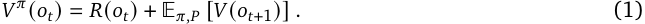


When parameterizing a value function as a feed-forward neural network, this is typically done by minimizing the mean-squared error of the equality above. As values for different observations within the same trajectory are related via the bellman equation, the resulting value function remains consistent even if we query it with only a single observation. VLMs on the other hand are not inherently trained with any consistency objective. Thus, if we independently query a VLM with different observations from the same trajectory it is likely to produce inconsistent values. Our insight is that providing the entire trajectory as input instead of just a single observation offers VLMs greater opportunity to generate self-consistent value estimates. Concretely, given a language description of the task _𝑙_ task we ask the VLM to auto-regressively generate values given the entire video as context: 


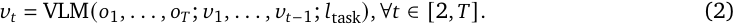


We abbreviate this auto-regressive prediction process as _𝑣_ 1 _, . . . , 𝑣𝑇_ = VLM( _𝑜_ 1 _, . . . , 𝑜𝑇_ ; _𝑙_ task). This simple mechanism allows the VLM to attend to all previous predictions and frames when making the next value prediction, enabling it to produce globally consistent estimates over long-horizon sequences without needing to be trained like classical feed-forward value functions. Though this design choice enables VLMs to produce consistent values, it doesn’t necessitate that the values are meaningfully. Nai¨vely prompting a VLM in this manner tends to produce linear, monotonic value functions for every single video, regardless of optimality. 

**2. Input observation shuffling.** Empirically we find that when presented a choronological sequence of frames VLMs discover the short-cut solution of outputting monotonically increasing values, often ignoring the task description or the actual quality of the trajectory. One hypothesis is that as VLMs are trained on ordered video frames for captioning and question answering, the chronology itself is a cue for downstream tasks unrelated to value prediction. As a consequence, model nai¨ve prompting results in unfaithful low-quality value predictions. To break this temporal bias, we propose randomly shuffling the input frames. In this manner, GVL forces the VLM to pay attention to each individual frame and output faithful value predictions using all information provided in context. Concretely, GVL prompts a VLM as: 


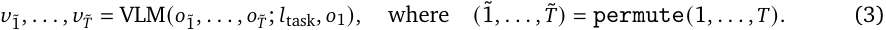


where the permute operator randomly shuffles the temporal indicies. Note however, that we cannot shuffle _every_ frame. If we do so, then the arrow of time in the original video can be ambiguous – i.e., in many cases, the reverse video is also physically plausible, making is the ground-truth order impossible to predict. Thus, as in the above equation we condition the VLM on the first input frame allow it to use the first observation as an anchor point for all other shuffled frames. 

**3. In-context value learning.** While auto-regressive prediction and shuffling are enough to obtain good performance, GVL can perform even better by leveraging the appealing properties of VLMs. Notably, large models often exhibit in-context learning, where tasks can be learned by simply providing examples [7]. This enables flexible and versatile in context value learning, by which GVL’s predictions can steadily improve by providing examples at test time without any model fine-tuning. In particular, we can simply prepend shuffled videos and their ground-truth task progress as in-context examples to boost the value prediction quality via few-shot learning: 


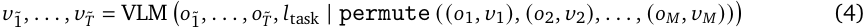


5

<!-- Page 6 -->

Vision Language Models are In-Context Value Learners 

As we show in Section 4, GVL benefits from flexible forms of in-context examples, including videos from unrelated tasks and even humans. Though GVL zero-shot is already effective across a broad range of tasks and robots, in-context learning can still realize substantial improvement on the most difficult bimanual dexterous tasks. 

**Practical implementation.** To predict temporal value functions in practice, GVL asks the VLM to output integer-valued percentage numbers between 0 and 100. Given that real-world robot video datasets are of different lengths and taken at different frequencies, we subsample all videos so that there are 30 frames in the input sequence to ensure comparable findings across datasets. See the Appendix for the full prompt and implementation. 

### **4. Experiments** 

We conduct large scale experiments assessing GVL’s value prediction generalization and in-context learning capabilities. Specifically, we study the following questions: 

1. Can GVL produce zero-shot value predictions for a broad range of tasks and embodiments? 

2. Can GVL improve from in-context learning? 

3. Can GVL be used for other downstream robot learning applications? 

In all our experiments, we use `Gemini-1.5-Pro` [22] as the backbone VLM for GVL; we ablate this model choice and find GVL effective with other VLMs as well. After thorough study of GVL’s value prediction capabilities, we study several downstream applications in visuomotor policy learning, aiming to improve data quality at dataset, trajectory, and individual transition levels. 

**Evaluation metric.** Our goal is to evaluate GVL value estimation at scale on as many robot datasets as possible, holistically testing its generalization capabilities and understanding its limitations. This makes it difficult to use traditional evaluation metrics for value functions, such as observing downstream learned policy performance, as they require value functions that are specifically trained or finetuned for individual tasks and embodiments. This quickly becomes very expensive for universal value functions that are intended for use across a large set of diverse real-world tasks and robots, many of which the practitioner may not have access to. Prior works on large-scale value learning have resorted to visually observing the smoothness of the value curve on expert trajectories as a qualitative “eye-test” for model generalization [40, 41, 29], but such evaluation is conducted on only few selected videos. We formalize and scale up this intuitive approach and introduce a lightweight, yet predictive method for evaluating value models: Value-Order Correlation (VOC). This metric computes the _rank correlation_ between the predicted values and the chronological order of the input expert video: 


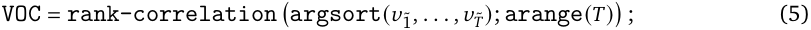


VOC ranges from −1 to 1, where 1 indicates that the two orderings are perfectly aligned. Expert quality demonstrations, by construction, have values that monotonically increase with time, and thus a good value model should have high VOC scores when evaluated on expert videos. On the other hand, fixing a good value model, low-quality trajectories should have low VOC scores. This is because sub-optimal trajectories often contain high repetition of visually similar frames due to the presence of redundant, re-attempt actions or poorly-placed cameras. As such, the values along the trajectories should not be monotonic, resulting in low correlation with the ground-truth timestep order. As we will show in our experiments, this value rank correlation metric has strong predictive power for the quality of the values as well as downstream policy learning performance, validating its usefulness as a standalone evaluation metric for value predictions. 

6

<!-- Page 7 -->

Vision Language Models are In-Context Value Learners 


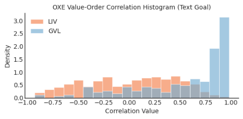


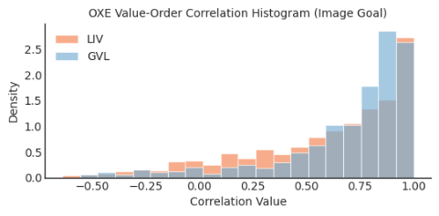


Figure 3 | **Zero-shot value predictions on OXE datasets.** Left: GVL significantly outperforms LIV on datasets with language goals. Right: GVL still outperforms LIV on datasets with image goals despite solving the more difficult task of frame re-shuffling. 

#### **4.1. Large-scale real-world evaluation** 

To study GVL’s zero-shot value prediction capability, we evaluate its VOC on two large expert robotics datasets. 

**Open X-Embodiment dataset.** First, we consider the Open X-Embodiment (OXE) dataset [45]. an aggregation of trajectory data from 50 standalone academic robot datasets that consists of diverse tasks, robots, and camera viewpoints. For each of the 50 datasets, we randomly sample 20 trajectories and evaluate GVL zero-shot on each of the sampled trajectories. Note that not all OXE datasets have language task annotations, so we use the last frame of the trajectory as the goal specification when text annotation is not provided. To better contextualize GVL’s value prediction quality, we compare to a state-of-the-art multi-modal value model **LIV** [41], a contrastive vision-language model [49] fine-tuned with value learning objective on human videos for in-the-wild value estimation. LIV predicts the temporal value of an input observation by computing its embedding distance to the embedding of the goal image or task description. 

For evaluation, we plot the histogram of all 1000 (50×20) Value Order Correlation (VOC) scores in Fig. 3, split by goal modalities. Given that most OXE datasets contain human-collected expert demonstrations, good value models should have high VOC scores; however, we acknowledge that there are sub-optimal trajectories within OXE that can introduce noise in our results. After we first establish GVL as an effective universal value model. we will present how GVL can be used to detect low-quality data in Section 4.3. As shown in Fig. 3, on both goal modalities, GVL consistently generates VOC scores that heavily skew to the right, indicating that it is able to zero-shot recover the temporal structure hidden in the shuffled demonstration videos, i.e., coherent value predictions. GVL’s performance is also markedly better than LIV on language goals (Fig. 3 left). Here, LIV’s predictions are random, suggesting that its embedding space does not contain sufficient knowledge for predicting dense values for arbitrary unseen robot videos. On image goals, LIV’s prediction problem is arguably simpler because an embedding space that simply captures image similarity can result in ascending values that correlate with timesteps. Even then, GVL generates better quality value predictions as judged by slightly higher VOCs (Fig. 3 right). In summary, GVL can indeed effectively utilize the world knowledge afforded by the backbone VLM to achieve effective value predictions zero-shot for the breadth of real-world robotic tasks and datasets. 

**Challenging bimanual datasets.** OXE datasets primarily focus on simpler, short horizon singlearm tasks. To further stress test GVL, we evaluate on a new diverse dataset of 250 distinct household tabletop tasks on the bi-manual ALOHA systems [71, 2]. This dataset includes highly challenging, long-horizon skills, such as removing three gears sequentially from a NIST board, folding a dress in eighth-fold, hanging a t-shirt on a cloth rack. See the bottom right of Fig. 2 for representative ALOHA 

7

<!-- Page 8 -->

Vision Language Models are In-Context Value Learners 

tasks. For each task, we evaluate on 2 human teleoperated demonstrations to evaluate GVL zero-shot. The aggregate histogram over all 500 (250 × 2) VOC scores is illustrated in Fig. 4. As shown, GVL is capable of generating value predictions that are positively correlated on more than 60% of them with median VOCs of 0.12. This is promising, but worse than the performance on the OXE datasets. While our main results use the top-down camera shown in Fig. 6, we show the effect of using GVL across each of the four cameras used in our ALOHA setup in Fig. 15. In Fig. 5, we present several qualitative examples of GVL predictions; see our project website for additional examples. In the next section, we extensively explore how to improve GVL on this dataset using in-context learning techniques. 


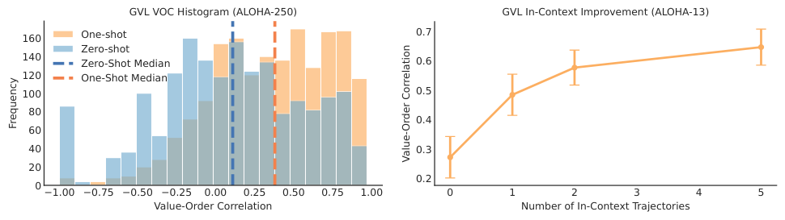


<!-- Start of picture text -->
GVL VOC Histogram (ALOHA-250) GVL In-Context Improvement (ALOHA-13)<br>160 One-shot 0.7<br>Zero-shot<br>140 Zero-Shot Median 0.6<br>120 One-Shot Median<br>100 0.5<br>80<br>0.4<br>60<br>40 0.3<br>20<br>0.2<br>0<br>1.00 0.75 0.50 0.25 0.00 0.25 0.50 0.75 1.00 0 1 2 3 4 5<br>Value-Order Correlation Number of In-Context Trajectories<br>Frequency<br>Value-Order Correlation<br><!-- End of picture text -->

Figure 4 | GVL scales up to 250 ALOHA bi-manual tasks and can improve with in-context examples. 

#### **4.2. Multi-Modal In-Context Value Learning** 

As the diverse ALOHA dataset is significantly more challenging, we explore whether GVL can benefit from in-context learning, where additional shuffled observation-value pairs are presented in the VLM context window (Eq. 4). 

**Few-shot in-context learning.** First, we collect an additional demonstration for each of the 250 tasks and use its shuffled value-observation pairs as context for one-shot GVL value prediction for the same set of 500 evaluations. As seen in Fig. 4, with one in-context trajectory, GVL’s performance substantially improves with 90% positive VOCs and a median VOC of 0.37. We further investigate whether performance can improve with more in-context examples on a represented subset of 13 tasks for which have more than 500 demonstrations. For these tasks, we evaluate few-shot GVL on 500 distinct trajectories per task with up to 5 in-context examples. The average VOCs over tasks and trajectories is shown in Fig. 4 (Right). We see that GVL demonstrates appealing in-context scaling as the average score steadily improves as we increase the number of in-context examples. Even with 5 incontext trajectories, meaning 150 total shuffled images, GVL is able to utilize its full context and exhibit strong generalization. This result demonstrates how state-of-art long-context-window VLMs, such as `Gemini-1.5-Pro` , can be re-purposed to make for general-purpose value functions with impressive test-time improvement capability, quickly mastering value predictions with minimal supervision. 

**Cross-embodiment in-context learning.** Examples in-context are not limited to robot demonstrations. One advantage of GVL is that it can still benefit from in-context learning even when the demonstrations come from a different embodiment. Specifically, we record humans performing the same tasks as the ALOHA robot demonstrations and then use these human demonstrations as incontext examples for value prediction. As shown in Fig. 6, GVL with one cross-embodiment in-context example can effectively improve over its zero-shot counterpart. In the Appendix, we also show that GVL can similarly benefit from _cross-task_ in-context learning. In conclusion, GVL presents a versatile framework for in-context value learning that can scale up to even the most challenging manipulation tasks. 

8

<!-- Page 9 -->

Vision Language Models are In-Context Value Learners 


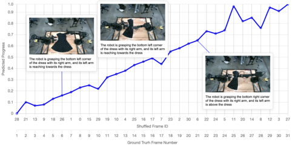


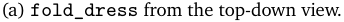


<!-- Start of picture text -->
(a)  fold_dress  from the top-down view.<br><!-- End of picture text -->


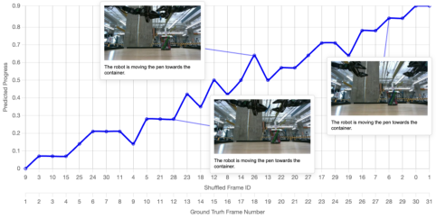


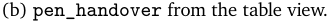


<!-- Start of picture text -->
(b)  pen_handover  from the table view.<br><!-- End of picture text -->


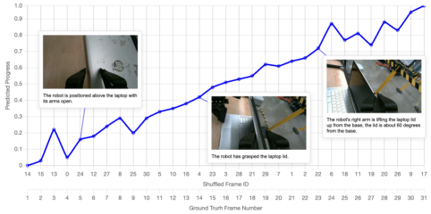


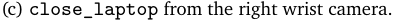


<!-- Start of picture text -->
(c)  close_laptop  from the right wrist camera.<br><!-- End of picture text -->


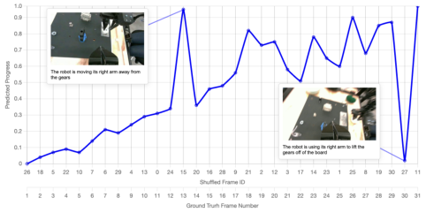


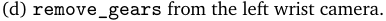


<!-- Start of picture text -->
(d)  remove_gears  from the left wrist camera.<br><!-- End of picture text -->

Figure 5 | Example GVL predictions on real-world ALOHA tasks. GVL can successfully unshuffle video frames and generate meaningful task values on diverse tasks and camera viewpoints. 


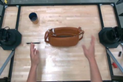


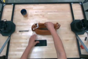


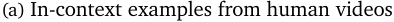


<!-- Start of picture text -->
(a) In-context examples from human videos<br><!-- End of picture text -->


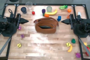


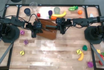


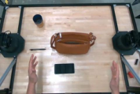


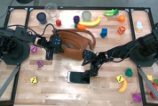


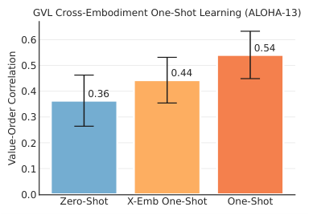


<!-- Start of picture text -->
GVL Cross-Embodiment One-Shot Learning (ALOHA-13)<br>0.6<br>0.54<br>0.5<br>0.44<br>0.4 0.36<br>0.3<br>0.2<br>0.1<br>0.0<br>Zero-Shot X-Emb One-Shot One-Shot<br>Value-Order Correlation<br><!-- End of picture text -->


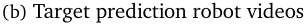


<!-- Start of picture text -->
(b) Target prediction robot videos<br><!-- End of picture text -->

Figure 6 | GVL benefits from cross-embodiment in-context learning capability: its value predictions can be improved by examples from human videos. 

9

<!-- Page 10 -->

Vision Language Models are In-Context Value Learners 

#### **4.3. GVL Applications** 

As GVL can generate high-quality value estimates, it can be applied to a number of downstream tasks including dataset quality estimation, success detection, and weighted imitation learning. 

**Dataset Quality Estimation.** Robotic action models are increasingly trained on large mixtures of datasets [45, 59, 31] and selecting the right mixture is critical for policy performance [24]. However, dataset mixing is often done in an ad-hoc fashion by visual inspection [59]. Having validated that GVL is an effective zeroshot value model, we investigate whether we can in turn use GVL’s VOC scores to determine dataset quality within OXE. To this end, for each OXE dataset in Fig. 3, we compute the average correlation scores for its sampled trajectories and present the ranking of the average score in Appendix B. In Table 1, we present a subset of selected representative large-scale datasets 

|Dataset<br>Avg. VOC|
|---|
|RT-1 [5]<br>0.74|
|Dobb-E [54]<br>0.53|
|Bridge [62]<br>0.51|
|QT-OPT [28]<br>0.19|
|DROID [30]<br>-0.01|
|RoboNet [12]<br>-0.85|


Table 1 | Average Value-Order Correlation (VOC) scores on selected OXE datasets. As shown, demonstration datasets with un-occluded camera views generally have high scores. In contrast, exploration datasets have low scores. 

in OXE. We see that datasets have large spread in their VOC scores, but these scores are interpretable and match human intuitions. Specifically, datasets collected from human teleoperators with relative fixed camera placements, such as RT-1 [5], Dobb-E [54], and Bridge [17, 62], have high VOC scores, despite their diversity in scenes and tasks. In contrast, datasets with autonomous data collection via scripted motions or motor babbling, such as QT-OPT [28] and RoboNet [12], contain high number of suboptimal trajectories that do not exhibit smooth temporal structure to be re-shuffled. 

Interestingly, DROID [30], a recent large household manipulation ataset is ranked very low, consistent with prior works [31] that found that removing DROID from large action model training improved final performance. After inspecting trajectories from DROID with a low VOC score from GVL we found that many have poor camera angles that do not capture robot motion or have the arm or manipulated objects heavily occluded. These observations indicate that GVL VOC can be indicative of dataset quality. 

**Success detection and filtered imitation learning.** Next we consider more granular intradataset quality control by investigating how GVL can be used as a success detector for trajectory filtering, enabling filtered imitation learning on mixed quality datasets. As discussed, good value models should return low VOC scores on unsuccessful trajectories; in particular, it is difficult for GVL to re-shuffle frames within suboptimal trajectories which often contain irregu- 

|Method|Accuracy|Precision|Recall|
|---|---|---|---|
|GVL-SD (Zero-Shot)|0.71|0.71|0.71|
|GVL-SD (One-Shot)|**0.75**|**0.85**|0.70|
|SuccessVQA [15]|0.62|0.33|**0.73**|
|SuccessVQA-CoT|0.63|0.44|0.68|


Table 2 | Comparison of VLM success detectors. 

lar or repetitive behavior. Thus, we can use GVL for success detection by filtering trajectories that have VOC scores below certain numerical threshold; we refer to this procedure as GVL-SD. We evaluate GVL-SD on six simulated bimanual dexterous manipulation tasks on the ALOHA system (see Fig. 10). Simulation is well-suited for this experiment because we can naturally control for data quality and reproducibility. More specifically, for each task, we construct a mixed quality dataset by rolling out a pre-trained policy of roughly 50% success rate for 1000 episodes, mirroring real-world autonomous data collection settings with high failure rate [28]. We compare to **SuccessVQA** [15], which poses 

10

<!-- Page 11 -->

Vision Language Models are In-Context Value Learners 

success detection as a Visual-Question Answering problem. To ensure that the same amount of information is provided, we feed the full video sequence to the VLM; therefore, this baseline tests whether the VLM is equipped with video understanding capability good enough for out-of-the-box success detection. In addition, we consider **SuccessVQA-CoT** , which uses chain-of-thought prompting [65] to encourage the VLM to output intermediate textual reasoning outputs before providing the final success answer. Unless otherwise stated we use a VOC threshold of 0 _._ 5 for GVL-SD. 


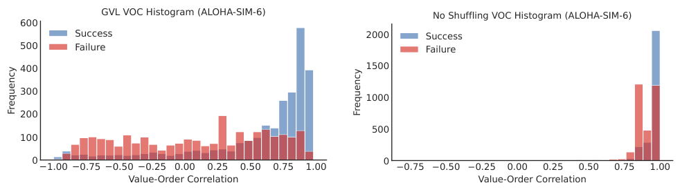


<!-- Start of picture text -->
GVL VOC Histogram (ALOHA-SIM-6) No Shuffling VOC Histogram (ALOHA-SIM-6)<br>600<br>Success 2000 Success<br>500 Failure Failure<br>400 1500<br>300<br>1000<br>200<br>500<br>100<br>0 0<br>1.00 0.75 0.50 0.25 0.00 0.25 0.50 0.75 1.00 0.75 0.50 0.25 0.00 0.25 0.50 0.75 1.00<br>Value-Order Correlation Value-Order Correlation<br>Frequency Frequency<br><!-- End of picture text -->

Figure 7 | **GVL for Success Detection.** Left: GVL behaves qualitatively differently on successful and failed trajectories. Right: GVL (No-Shuffling) loses discriminability on failure trajectories. 

For all methods, we report the accuracy, precision, and recall in Table 2. GVL-SD consistently outperforms or matches SuccessVQA on all classification metrics. In particular, SuccessVQA has low precision, indicating that the base VLM systematically biases towards outputting failure. Adding one in-context demonstration further improves GVL’s performance across all metrics. In Fig. 7 (Left), we also visualize the histogram of the VOC scores GVL produces on success and failure trajectories. As expected, GVL on failure trajectories renders a uniform distribution when the task is unsuccess- 

|Real-World ALOHA Tasks|GVL + DP|DP|Avg. VOC|
|---|---|---|---|
|`bowl-in-rack`|**7/10**|6/10|0.57|
|`banana-handover`|**7/10**|5/10|0.73|
|`close-laptop`|**9/10**|6.5/10|0.59|
|`open-drawer`|4/10|**6/10**|0.09|
|`remove-gears`|4.67/10|**7/10**|0.19|
|`pen-handover`|**1.5/10**|0/10|0.43|
|`fold-dress`|**7/10**|**7/10**|0.66|


Table 3 | **Real-World ALOHA Policy Learning Results.** AWR with GVL (One-Shot) outperforms IL baselines when the predicted values have high VOCs. 

ful, indicating the model’s inability to uncover the original temporal order – success and failure trajectories have distinct distributions over the correlation values indicating that GVL can adequately separate them. Fig. 7 (Right) shows that the histograms without shuffling are largely the same independent of success or failure. This shows that by forcing the VLM to perform the more difficult prediction task over shuffled frames, GVL can elicit better zero-shot values. 

Now, we use the above success detection methods for filtered imitation learning; for all methods, we use Action Chunking Transformer (ACT) as the imitation learning algorithm [71]; ACT hyperparameters are tuned for ACT on the success-only subset and are fixed for all methods. Given the noisiness in model checkpoints performance, we report the average success rate of the last 10 model training checkpoints. Results for the six simulation tasks are shown to the right of Fig. 8, where GVL-SD’s improved success detection leads to better performance over SuccessVQA. In fact, SuccessVQA often hurts performance, likely because of its low precision which causes the policy to train on a high number of false positive (i.e. failure) trajectories. In Fig. 8 (Right) we show the effect of varying the VOC threshold in {−1 _._ 0 _,_ 0 _,_ 0 _._ 25 _,_ 0 _._ 5 _,_ 0 _._ 75} in comparison to training on all the data with ACT; note that this is the same using the lowest threshold, −1 _._ 0 as it is a lower bound on the 

11

<!-- Page 12 -->

Vision Language Models are In-Context Value Learners 


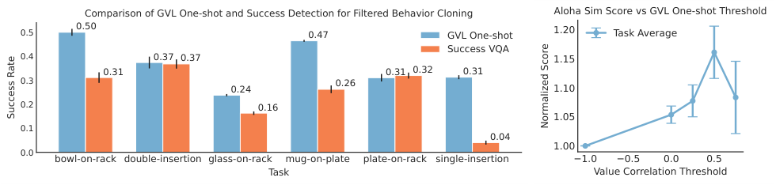


<!-- Start of picture text -->
Comparison of GVL One-shot and Success Detection for Filtered Behavior Cloning Aloha Sim Score vs GVL One-shot Threshold<br>0.5 0.50 0.47 GVL One-shot 1.20 Task Average<br>Success VQA<br>0.4 0.37 0.37 1.15<br>0.31 0.31 0.32 0.31<br>0.3 0.24 0.26 1.10<br>0.2 0.16<br>1.05<br>0.1<br>0.04<br>1.00<br>0.0<br>bowl-on-rack double-insertion glass-on-rack mug-on-plate plate-on-rack single-insertion 1.0 0.5 0.0 0.5<br>Task Value Correlation Threshold<br>Success Rate<br>Normalized Score<br><!-- End of picture text -->

Figure 8 | **Success-Filtered Imitation Learning on ALOHA Simulation Tasks.** Left: Using GVL-SD for successfiltered BC substantially outperforms SuccessVQA. Right: GVL-SD is not sensitive to the VOC threshold for improving imitation learning. 


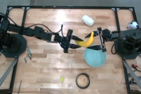


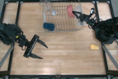


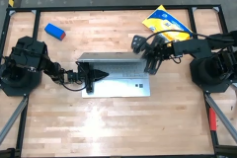


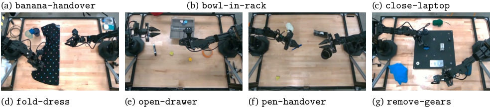


<!-- Start of picture text -->
(a)  banana-handover (b)  bowl-in-rack (c)  close-laptop<br>(d)  fold-dress (e)  open-drawer (f)  pen-handover (g)  remove-gears<br><!-- End of picture text -->

Figure 9 | Real-world ALOHA tasks for real-word policy evaluation. 

VOC metric. As seen, GVL consistently outperforms ACT regardless of threshold values; when the threshold value is too high, i.e., 0 _._ 75, we see a slight dip in performance when the overall dataset size becomes too small. 

**Advantage-weighted regression for real-world visuomotor control.** Finally, we illustrate how GVL can assign importance weights to individual transitions within trajectories at a fine-grained level akin to offline reinforcement learning. For these experiments we use real-world demonstration data collected by human teleoperation on bi-manual ALOHA robot setups. Unlike simulation, our datasets only contain successful task executions but can be sub-optimal and multi-modal. Thus, we directly utilize GVL’s values with _advantage weighted regression_ (AWR) [47, 46], in which we weight each individual transition by the estimated advantange, or GVL value difference for that step: 


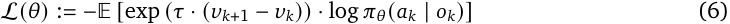


If an action were deemed to make progress towards the task goal, then its future value _𝑣𝑘_ +1 should be significantly higher than the present value _𝑣𝑘_ , leading to a large positive weight. By upweighting the most promising actions in diverse human-collected datasets, we posit that AWR can outperform imitation learning approaches. 

We use diffusion policy (DP) as the policy backbone [10] for each task, and compare training diffusion policies with GVL (One-Shot) advantage weighting or lack thereof. We evaluate on 7 tasks with 10 trials per task and report success rate in Table 3. As can be seen, on a majority tasks, GVL-DP 

12

<!-- Page 13 -->

Vision Language Models are In-Context Value Learners 

outperforms DP and we see a clear correlation between improvement over DP and the VOC score. That is, when the value predictions are of high quality as judged by VOC, policy learning can benefit from GVL value weighting. On `open-drawer` and `remove-gears` , the top-down view does not provide sufficient resolution to distinguish task progress (see Fig. 9), as a consequence, the value predictions can be noisy, which can hurt policy learning. However, given the in-context learning results, we believe that it is possible to improve policy learning even on difficult tasks with non-ideal camera viewpoints. 

#### **4.4. Ablations** 

Finally, we ablate key algorithmic design choices of GVL to validate their necessity. In the Appendix, we additionally demonstrate that GVL’s performance is robust to the choice of backbone VLMs as well as input camera viewpoint. 

**Is autoregressive value prediction necessary?** We consider an ablation that simply asks the VLM to predict values of input observations one by one without GVL’s autoregressive batch prediction mechanism. This ablation, which we refer to as **VLM (Single Frame)** , essentially poses value estimation as a VQA problem. We compare this ablation to GVL on a subset of RT-1 dataset as in Section 4.1; the average VOC for VLM (Single Frame) is a mere −0 _._ 08, a significant drop from GVL’s 0.74 on RT-1 dataset. As seen, pre-trained VLMs by themselves are poor value estimators, generating inconsistent values that are too noisy to be used in practice. 

**Is input observation shuffling necessary?** As discussed, we find that removing shuffling collapses ICV’s predictions into generating degenerate values; that is, regardless of the quality of the provided trajectory, GVL tends to predict monotonically increasing values, resulting in inflated VOC scores that cannot be used to discriminate successful and failure trajectories.; see Fig. 7 (Right). To further qualitatively illustrate this phenomenon, in Fig. 11 in the Appendix, we overlay raw GVL value predictions with frame shuffling and lackthereof to understand the spread of the value curves. We see that the overlay for original GVL looks “messy”, suggesting that GVL outputs varied value curves that better capture the heterogeneity of the queried video qualities. In contrast, without frame shuffling, GVL predictions indeed collapses onto a few linear ascending patterns. 

### **5. Conclusion** 

We have introduced Generative Value Learning (GVL), a universal value function via VLM autoregressive value prediction on shuffled video frames. GVL can zero-shot output dense and high-quality value predictions for diverse and challenging real-world robotic tasks, spanning various robot embodiments and task categories. With few-shot learning from the same task, different task, or different embodiment, GVL performance steadily improves. We have demonstrated several use cases of using GVL to perform dataset, trajectory, and transition selection to improve downstream policy learning performance and generalization. We believe that GVL takes an important step in using foundation models supervision for robot learning. 

**Limitations and future work.** We have not investigated whether pre-trained VLMs can be finetuned to perform better value predictions. In addition, though we test on diverse camera viewpoints, we have not yet investigated whether multi-view observations can improve value prediction quality. In addition, our evaluation metric Value-Order Correlation is most suitable for a-periodic tasks for which there exists a unique ordering of frames from an expert demonstration. Tasks such as wiping or stirring may be hard to discern. Though these limitations present avenues for future work, we believe GVL is a step towards improved in-the-wild value estimation. 

13

<!-- Page 14 -->

Vision Language Models are In-Context Value Learners 

### **Acknowledment** 

We thank Jie Tan, Pannag Sanketi, Oliver Groth, and the rest the Google DeepMind Robotics team for helpful discussions and providing feedback on the paper. 

14

<!-- Page 15 -->

Vision Language Models are In-Context Value Learners 

### **References** 

- [1] Michael Ahn, Anthony Brohan, Noah Brown, Yevgen Chebotar, Omar Cortes, Byron David, Chelsea Finn, Chuyuan Fu, Keerthana Gopalakrishnan, Karol Hausman, et al. Do as i can, not as i say: Grounding language in robotic affordances. _arXiv preprint arXiv:2204.01691_ , 2022. 

- [2] Jorge Aldaco, Travis Armstrong, Robert Baruch, Jeff Bingham, Sanky Chan, Kenneth Draper, Debidatta Dwibedi, Chelsea Finn, Pete Florence, Spencer Goodrich, et al. Aloha 2: An enhanced low-cost hardware for bimanual teleoperation. _arXiv preprint arXiv:2405.02292_ , 2024. 

- [3] Kate Baumli, Satinder Baveja, Feryal Behbahani, Harris Chan, Gheorghe Comanici, Sebastian Flennerhag, Maxime Gazeau, Kristian Holsheimer, Dan Horgan, Michael Laskin, et al. Visionlanguage models as a source of rewards. _arXiv preprint arXiv:2312.09187_ , 2023. 

- [4] Chethan Bhateja, Derek Guo, Dibya Ghosh, Anikait Singh, Manan Tomar, Quan Vuong, Yevgen Chebotar, Sergey Levine, and Aviral Kumar. Robotic offline rl from internet videos via valuefunction pre-training. _arXiv preprint arXiv:2309.13041_ , 2023. 

- [5] Anthony Brohan, Noah Brown, Justice Carbajal, Yevgen Chebotar, Joseph Dabis, Chelsea Finn, Keerthana Gopalakrishnan, Karol Hausman, Alex Herzog, Jasmine Hsu, et al. Rt-1: Robotics transformer for real-world control at scale. _arXiv preprint arXiv:2212.06817_ , 2022. 

- [6] Anthony Brohan, Noah Brown, Justice Carbajal, Yevgen Chebotar, Xi Chen, Krzysztof Choromanski, Tianli Ding, Danny Driess, Avinava Dubey, Chelsea Finn, et al. Rt-2: Vision-language-action models transfer web knowledge to robotic control. _arXiv preprint arXiv:2307.15818_ , 2023. 

- [7] Tom B Brown. Language models are few-shot learners. _arXiv preprint arXiv:2005.14165_ , 2020. 

- [8] Annie S Chen, Suraj Nair, and Chelsea Finn. Learning generalizable robotic reward functions from" in-the-wild" human videos. _arXiv preprint arXiv:2103.16817_ , 2021. 

- [9] Boyuan Chen, Zhuo Xu, Sean Kirmani, Brain Ichter, Dorsa Sadigh, Leonidas Guibas, and Fei Xia. Spatialvlm: Endowing vision-language models with spatial reasoning capabilities. In _Proceedings of the IEEE/CVF Conference on Computer Vision and Pattern Recognition_ , pp. 14455–14465, 2024. 

- [10] Cheng Chi, Siyuan Feng, Yilun Du, Zhenjia Xu, Eric Cousineau, Benjamin Burchfiel, and Shuran Song. Diffusion policy: Visuomotor policy learning via action diffusion. _arXiv preprint arXiv:2303.04137_ , 2023. 

- [11] Sudeep Dasari and Abhinav Gupta. Transformers for one-shot visual imitation. In _Conference on Robot Learning_ , pp. 2071–2084. PMLR, 2021. 

- [12] Sudeep Dasari, Frederik Ebert, Stephen Tian, Suraj Nair, Bernadette Bucher, Karl Schmeckpeper, Siddharth Singh, Sergey Levine, and Chelsea Finn. Robonet: Large-scale multi-robot learning. _arXiv preprint arXiv:1910.11215_ , 2019. 

- [13] Norman Di Palo and Edward Johns. Keypoint action tokens enable in-context imitation learning in robotics. _arXiv preprint arXiv:2403.19578_ , 2024. 

- [14] Yan Ding, Xiaohan Zhang, Chris Paxton, and Shiqi Zhang. Task and motion planning with large language models for object rearrangement. _arXiv preprint arXiv:2303.06247_ , 2023. 

- [15] Yuqing Du, Ksenia Konyushkova, Misha Denil, Akhil Raju, Jessica Landon, Felix Hill, Nando de Freitas, and Serkan Cabi. Vision-language models as success detectors. _arXiv preprint arXiv:2303.07280_ , 2023. 

15

<!-- Page 16 -->

Vision Language Models are In-Context Value Learners 

- [16] Yan Duan, Marcin Andrychowicz, Bradly Stadie, OpenAI Jonathan Ho, Jonas Schneider, Ilya Sutskever, Pieter Abbeel, and Wojciech Zaremba. One-shot imitation learning. _Advances in neural information processing systems_ , 30, 2017. 

- [17] Frederik Ebert, Yanlai Yang, Karl Schmeckpeper, Bernadette Bucher, Georgios Georgakis, Kostas Daniilidis, Chelsea Finn, and Sergey Levine. Bridge data: Boosting generalization of robotic skills with cross-domain datasets. _arXiv preprint arXiv:2109.13396_ , 2021. 

- [18] Benjamin Eysenbach, Ruslan Salakhutdinov, and Sergey Levine. C-learning: Learning to achieve goals via recursive classification. _arXiv preprint arXiv:2011.08909_ , 2020. 

- [19] Chelsea Finn, Tianhe Yu, Tianhao Zhang, Pieter Abbeel, and Sergey Levine. One-shot visual imitation learning via meta-learning. In _Conference on robot learning_ , pp. 357–368. PMLR, 2017. 

- [20] Letian Fu, Huang Huang, Gaurav Datta, Lawrence Yunliang Chen, William Chung-Ho Panitch, Fangchen Liu, Hui Li, and Ken Goldberg. In-context imitation learning via next-token prediction. _arXiv preprint arXiv:2408.15980_ , 2024. 

- [21] Jensen Gao, Bidipta Sarkar, Fei Xia, Ted Xiao, Jiajun Wu, Brian Ichter, Anirudha Majumdar, and Dorsa Sadigh. Physically grounded vision-language models for robotic manipulation. In _2024 IEEE International Conference on Robotics and Automation (ICRA)_ , pp. 12462–12469. IEEE, 2024. 

- [22] GeminiTeam, Machel Reid, Nikolay Savinov, Denis Teplyashin, Dmitry Lepikhin, Timothy Lillicrap, Jean-baptiste Alayrac, Radu Soricut, Angeliki Lazaridou, Orhan Firat, Julian Schrittwieser, et al. Gemini 1.5: Unlocking multimodal understanding across millions of tokens of context. _arXiv preprint arXiv:2403.05530_ , 2024. 

- [23] Lin Guan, Yifan Zhou, Denis Liu, Yantian Zha, Heni Ben Amor, and Subbarao Kambhampati. " task success" is not enough: Investigating the use of video-language models as behavior critics for catching undesirable agent behaviors. _arXiv:2402.04210_ , 2024. 

- [24] Joey Hejna, Chethan Anand Bhateja, Yichen Jiang, Karl Pertsch, and Dorsa Sadigh. Remix: Optimizing data mixtures for large scale imitation learning. In _8th Annual Conference on Robot Learning_ , 2024. URL `https://openreview.net/forum?id=fIj88Tn3fc` . 

- [25] Yining Hong, Haoyu Zhen, Peihao Chen, Shuhong Zheng, Yilun Du, Zhenfang Chen, and Chuang Gan. 3d-llm: Injecting the 3d world into large language models. _Advances in Neural Information Processing Systems_ , 36:20482–20494, 2023. 

- [26] Siyuan Huang, Zhengkai Jiang, Hao Dong, Yu Qiao, Peng Gao, and Hongsheng Li. Instruct2act: Mapping multi-modality instructions to robotic actions with large language model. _arXiv preprint arXiv:2305.11176_ , 2023. 

- [27] Wenlong Huang, Fei Xia, Dhruv Shah, Danny Driess, Andy Zeng, Yao Lu, Pete Florence, Igor Mordatch, Sergey Levine, Karol Hausman, et al. Grounded decoding: Guiding text generation with grounded models for robot control. _arXiv preprint arXiv:2303.00855_ , 2023. 

- [28] Dmitry Kalashnikov, Alex Irpan, Peter Pastor, Julian Ibarz, Alexander Herzog, Eric Jang, Deirdre Quillen, Ethan Holly, Mrinal Kalakrishnan, Vincent Vanhoucke, et al. Scalable deep reinforcement learning for vision-based robotic manipulation. In _Conference on robot learning_ , pp. 651–673. PMLR, 2018. 

16

<!-- Page 17 -->

Vision Language Models are In-Context Value Learners 

- [29] Siddharth Karamcheti, Suraj Nair, Annie S Chen, Thomas Kollar, Chelsea Finn, Dorsa Sadigh, and Percy Liang. Language-driven representation learning for robotics. _arXiv preprint arXiv:2302.12766_ , 2023. 

- [30] Alexander Khazatsky, Karl Pertsch, Suraj Nair, Ashwin Balakrishna, Sudeep Dasari, Siddharth Karamcheti, Soroush Nasiriany, Mohan Kumar Srirama, Lawrence Yunliang Chen, Kirsty Ellis, et al. Droid: A large-scale in-the-wild robot manipulation dataset. _arXiv preprint arXiv:2403.12945_ , 2024. 

- [31] Moo Jin Kim, Karl Pertsch, Siddharth Karamcheti, Ted Xiao, Ashwin Balakrishna, Suraj Nair, Rafael Rafailov, Ethan Foster, Grace Lam, Pannag Sanketi, et al. Openvla: An open-source vision-language-action model. _arXiv preprint arXiv:2406.09246_ , 2024. 

- [32] Martin Klissarov, Pierluca D’Oro, Shagun Sodhani, Roberta Raileanu, Pierre-Luc Bacon, Pascal Vincent, Amy Zhang, and Mikael Henaff. Motif: Intrinsic motivation from artificial intelligence feedback. _arXiv preprint arXiv:2310.00166_ , 2023. 

- [33] Minae Kwon, Hengyuan Hu, Vivek Myers, Siddharth Karamcheti, Anca Dragan, and Dorsa Sadigh. Toward grounded social reasoning. _arXiv:2306.08651_ , 2023. 

- [34] Teyun Kwon, Norman Di Palo, and Edward Johns. Language models as zero-shot trajectory generators. _arXiv preprint arXiv:2310.11604_ , 2023. 

- [35] Youngwoon Lee, Andrew Szot, Shao-Hua Sun, and Joseph J Lim. Generalizable imitation learning from observation via inferring goal proximity. _Advances in neural information processing systems_ , 34:16118–16130, 2021. 

- [36] Jacky Liang, Wenlong Huang, Fei Xia, Peng Xu, Karol Hausman, Brian Ichter, Pete Florence, and Andy Zeng. Code as policies: Language model programs for embodied control. In _2023 IEEE International Conference on Robotics and Automation (ICRA)_ , pp. 9493–9500. IEEE, 2023. 

- [37] Jacky Liang, Fei Xia, Wenhao Yu, Andy Zeng, Montserrat Gonzalez Arenas, Maria Attarian, Maria Bauza, Matthew Bennice, Alex Bewley, Adil Dostmohamed, et al. Learning to learn faster from human feedback with language model predictive control. _arXiv preprint arXiv:2402.11450_ , 2024. 

- [38] Kevin Lin, Christopher Agia, Toki Migimatsu, Marco Pavone, and Jeannette Bohg. Text2motion: From natural language instructions to feasible plans. _arXiv preprint arXiv:2303.12153_ , 2023. 

- [39] Bo Liu, Yuqian Jiang, Xiaohan Zhang, Qiang Liu, Shiqi Zhang, Joydeep Biswas, and Peter Stone. Llm+ p: Empowering large language models with optimal planning proficiency. _arXiv preprint arXiv:2304.11477_ , 2023. 

- [40] Yecheng Jason Ma, Shagun Sodhani, Dinesh Jayaraman, Osbert Bastani, Vikash Kumar, and Amy Zhang. Vip: Towards universal visual reward and representation via value-implicit pre-training. _arXiv preprint arXiv:2210.00030_ , 2022. 

- [41] Yecheng Jason Ma, Vikash Kumar, Amy Zhang, Osbert Bastani, and Dinesh Jayaraman. Liv: Language-image representations and rewards for robotic control. In _International Conference on Machine Learning_ , pp. 23301–23320. PMLR, 2023. 

- [42] Yecheng Jason Ma, William Liang, Guanzhi Wang, De-An Huang, Osbert Bastani, Dinesh Jayaraman, Yuke Zhu, Linxi Fan, and Anima Anandkumar. Eureka: Human-level reward design via coding large language models. _arXiv preprint arXiv:2310.12931_ , 2023. 

17

<!-- Page 18 -->

Vision Language Models are In-Context Value Learners 

- [43] Parsa Mahmoudieh, Deepak Pathak, and Trevor Darrell. Zero-shot reward specification via grounded natural language. In _International Conference on Machine Learning_ , pp. 14743–14752. PMLR, 2022. 

- [44] Sauradip Nag, Xiatian Zhu, Yi-Zhe Song, and Tao Xiang. Zero-shot temporal action detection via vision-language prompting. In _European Conference on Computer Vision_ , pp. 681–697. Springer, 2022. 

- [45] Abhishek Padalkar, Acorn Pooley, Ajinkya Jain, Alex Bewley, Alex Herzog, Alex Irpan, Alexander Khazatsky, Anant Rai, Anikait Singh, Anthony Brohan, et al. Open x-embodiment: Robotic learning datasets and rt-x models. _arXiv preprint arXiv:2310.08864_ , 2023. 

- [46] Xue Bin Peng, Aviral Kumar, Grace Zhang, and Sergey Levine. Advantage-weighted regression: Simple and scalable off-policy reinforcement learning. _arXiv preprint arXiv:1910.00177_ , 2019. 

- [47] Jan Peters and Stefan Schaal. Reinforcement learning by reward-weighted regression for operational space control. In _Proceedings of the 24th international conference on Machine learning_ , pp. 745–750, 2007. 

- [48] Martin L Puterman. _Markov decision processes: discrete stochastic dynamic programming_ . John Wiley & Sons, 2014. 

- [49] Alec Radford, Jong Wook Kim, Chris Hallacy, Aditya Ramesh, Gabriel Goh, Sandhini Agarwal, Girish Sastry, Amanda Askell, Pamela Mishkin, Jack Clark, et al. Learning transferable visual models from natural language supervision. In _International conference on machine learning_ , pp. 8748–8763. PMLR, 2021. 

- [50] Juan Rocamonde, Victoriano Montesinos, Elvis Nava, Ethan Perez, and David Lindner. Visionlanguage models are zero-shot reward models for reinforcement learning. _arXiv preprint arXiv:2310.12921_ , 2023. 

- [51] Tom Schaul, Daniel Horgan, Karol Gregor, and David Silver. Universal value function approximators. In _International conference on machine learning_ , pp. 1312–1320. PMLR, 2015. 

- [52] Pierre Sermanet, Kelvin Xu, and Sergey Levine. Unsupervised perceptual rewards for imitation learning. _arXiv:1612.06699_ , 2016. 

- [53] Pierre Sermanet, Corey Lynch, Yevgen Chebotar, Jasmine Hsu, Eric Jang, Stefan Schaal, Sergey Levine, and Google Brain. Time-contrastive networks: Self-supervised learning from video. In _2018 IEEE international conference on robotics and automation (ICRA)_ , pp. 1134–1141. IEEE, 2018. 

- [54] Nur Muhammad Mahi Shafiullah, Anant Rai, Haritheja Etukuru, Yiqian Liu, Ishan Misra, Soumith Chintala, and Lerrel Pinto. On bringing robots home. _arXiv preprint arXiv:2311.16098_ , 2023. 

- [55] Tom Silver, Soham Dan, Kavitha Srinivas, Joshua B Tenenbaum, Leslie Pack Kaelbling, and Michael Katz. Generalized planning in pddl domains with pretrained large language models. _arXiv preprint arXiv:2305.11014_ , 2023. 

- [56] Ishika Singh, Valts Blukis, Arsalan Mousavian, Ankit Goyal, Danfei Xu, Jonathan Tremblay, Dieter Fox, Jesse Thomason, and Animesh Garg. Progprompt: Generating situated robot task plans using large language models. In _2023 IEEE International Conference on Robotics and Automation (ICRA)_ , pp. 11523–11530. IEEE, 2023. 

18

<!-- Page 19 -->

Vision Language Models are In-Context Value Learners 

- [57] Andrew Szot, Max Schwarzer, Harsh Agrawal, Bogdan Mazoure, Walter Talbott, Katherine Metcalf, Natalie Mackraz, Devon Hjelm, and Alexander Toshev. Large language models as generalizable policies for embodied tasks. _arXiv preprint arXiv:2310.17722_ , 2023. 

- [58] Yujin Tang, Wenhao Yu, Jie Tan, Heiga Zen, Aleksandra Faust, and Tatsuya Harada. Saytap: Language to quadrupedal locomotion. _arXiv preprint arXiv:2306.07580_ , 2023. 

- [59] Octo Model Team, Dibya Ghosh, Homer Walke, Karl Pertsch, Kevin Black, Oier Mees, Sudeep Dasari, Joey Hejna, Tobias Kreiman, Charles Xu, et al. Octo: An open-source generalist robot policy. _arXiv preprint arXiv:2405.12213_ , 2024. 

- [60] Stephen Tian, Suraj Nair, Frederik Ebert, Sudeep Dasari, Benjamin Eysenbach, Chelsea Finn, and Sergey Levine. Model-based visual planning with self-supervised functional distances. _arXiv preprint arXiv:2012.15373_ , 2020. 

- [61] David Venuto, Sami Nur Islam, Martin Klissarov, Doina Precup, Sherry Yang, and Ankit Anand. Code as reward: Empowering reinforcement learning with vlms. _arXiv preprint arXiv:2402.04764_ , 2024. 

- [62] Homer Rich Walke, Kevin Black, Tony Z Zhao, Quan Vuong, Chongyi Zheng, Philippe HansenEstruch, Andre Wang He, Vivek Myers, Moo Jin Kim, Max Du, et al. Bridgedata v2: A dataset for robot learning at scale. In _Conference on Robot Learning_ , pp. 1723–1736. PMLR, 2023. 

- [63] Huaxiaoyue Wang, Gonzalo Gonzalez-Pumariega, Yash Sharma, and Sanjiban Choudhury. Demo2code: From summarizing demonstrations to synthesizing code via extended chain-ofthought. _arXiv preprint arXiv:2305.16744_ , 2023. 

- [64] Yufei Wang, Zhanyi Sun, Jesse Zhang, Zhou Xian, Erdem Biyik, David Held, and Zackory Erickson. Rl-vlm-f: Reinforcement learning from vision language foundation model feedback. _arXiv preprint arXiv:2402.03681_ , 2024. 

- [65] Jason Wei, Xuezhi Wang, Dale Schuurmans, Maarten Bosma, Fei Xia, Ed Chi, Quoc V Le, Denny Zhou, et al. Chain-of-thought prompting elicits reasoning in large language models. _Advances in neural information processing systems_ , 35:24824–24837, 2022. 

- [66] Tianbao Xie, Siheng Zhao, Chen Henry Wu, Yitao Liu, Qian Luo, Victor Zhong, Yanchao Yang, and Tao Yu. Text2reward: Automated dense reward function generation for reinforcement learning. _arXiv preprint arXiv:2309.11489_ , 2023. 

- [67] Yaqi Xie, Chen Yu, Tongyao Zhu, Jinbin Bai, Ze Gong, and Harold Soh. Translating natural language to planning goals with large-language models. _arXiv preprint arXiv:2302.05128_ , 2023. 

- [68] Mengdi Xu, Yikang Shen, Shun Zhang, Yuchen Lu, Ding Zhao, Joshua Tenenbaum, and Chuang Gan. Prompting decision transformer for few-shot policy generalization. In _international conference on machine learning_ , pp. 24631–24645. PMLR, 2022. 

- [69] Wenhao Yu, Nimrod Gileadi, Chuyuan Fu, Sean Kirmani, Kuang-Huei Lee, Montse Gonzalez Arenas, Hao-Tien Lewis Chiang, Tom Erez, Leonard Hasenclever, Jan Humplik, et al. Language to rewards for robotic skill synthesis. _arXiv preprint arXiv:2306.08647_ , 2023. 

- [70] Jesse Zhang, Jiahui Zhang, Karl Pertsch, Ziyi Liu, Xiang Ren, Minsuk Chang, Shao-Hua Sun, and Joseph J Lim. Bootstrap your own skills: Learning to solve new tasks with large language model guidance. _arXiv preprint arXiv:2310.10021_ , 2023. 

- [71] Tony Z Zhao, Vikash Kumar, Sergey Levine, and Chelsea Finn. Learning fine-grained bimanual manipulation with low-cost hardware. _arXiv preprint arXiv:2304.13705_ , 2023. 

19

<!-- Page 20 -->

Vision Language Models are In-Context Value Learners 

### **A. Prompt** 

In this section, we provide the full prompt provided to the VLM for GVL predictions. The same prompt is used for all OXE datasets. 

- `You are an expert roboticist tasked to predict task completion percentages for frames of a robot for the task of {task_description}. The task completion percentages are between 0 and 100, where 100` 

- `corresponds to full task completion. We provide several examples of the robot performing the task at various stages and their corresponding task completion percentages. Note that these frames are in random order, so please pay attention to the individual frames` 

- `when reasoning about task completion percentage.` 

```
Initialrobotscene:[IMG]
```

```
Intheinitialrobotscene,thetaskcompletionpercentageis0.
```

- `Now, for the task of {task_description}, output the task completion percentage for the following frames that are presented in random order. For each frame, format your response as follow: Frame {i}: Frame Description: {}, Task Completion Percentages:{}%` 

```
Frame1:[IMG]
...
Framen:[IMG]
```

### **B. GVL OXE Dataset VOC Breakdown** 

In this section, we provide the full list of average VOC score for each OXE dataset. In Appendix B, we provide the VOC scores for GVL with `Gemini-1.5-Pro` as the backbone VLM. In Table 5, we provide the VOC scores for GVL with `GPT-4o` as the backbone VLM. 

### **C. Simulation Tasks** 

In Figure 10, we illustrate the six simulation tasks used for the success detection and filtered imitation learning experiment. For each task, we use VR teleoperation to collect 500 trajectories for initial policy training. After the policy converges, we rollout the last checkpoint for 1000 imtes, resulting in naturally balanced mix-quality datasets of about half success and half failure trajectories. 

### **D. Additional Results** 

In this section, we present additional results and analysis. 

**GVL and No-Shuffling ablation qualitative comparison.** As shown in Fig. 11, GVL generates value predictions that are varied over time; in contrast, without frame shuffling, the predictions all collapses onto a few monotonic patterns. 

20

<!-- Page 21 -->

Vision Language Models are In-Context Value Learners 

|**Dataset**|**VOC Score**|
|---|---|
|utokyo_pr2_opening_fridge_converted_externally_to_rlds|0.8095|
|utokyo_xarm_bimanual_converted_externally_to_rlds|0.7955|
|utokyo_xarm_pick_and_place_converted_externally_to_rlds|0.7880|
|fractal20220817_data<br>|0.7385<br>|
|maniskill_dataset_converted_externally_to_rlds<br>|0.7260|
|berkeley_autolab_ur5|0.7185|
|nyu_door_opening_surprising_effectiveness<br>|0.6685<br>|
|utokyo_pr2_tabletop_manipulation_converted_externally_to_rlds|0.5875|
|utaustin_mutex|0.5810|
|iamlab_cmu_pickup_insert_converted_externally_to_rlds|0.5585|
|fmb|0.5555|
|ucsd_kitchen_dataset_converted_externally_to_rlds|0.5295|
|dobbe|0.5295|
|toto|0.5270|
|bridge|0.5145|
|austin_sirius_dataset_converted_externally_to_rlds|0.5100|
|asu_table_top_converted_externally_to_rlds|0.5055|
|berkeley_rpt_converted_externally_to_rlds|0.4835|
|berkeley_cable_routing|0.4470|
|usc_cloth_sim_converted_externally_to_rlds|0.4410|
|jaco_play|0.4205|
|bc_z|0.4065|
|viola|0.4035|
|berkeley_mvp_converted_externally_to_rlds|0.3900|
|roboturk|0.3545|
|austin_buds_dataset_converted_externally_to_rlds|0.3415|
|stanfordhydradatasetconvertedexternallytorlds|0.3325|
|______<br>tokyoulsmoconvertedexternallytorlds|0.3140|
|______<br>berkeley_fanuc_manipulation|0.2685|
|cmu_stretch|0.2625|
|ucsd_pick_and_place_dataset_converted_externally_to_rlds|0.2410|
|kuka|0.1915|
|dlr_sara_pour_converted_externally_to_rlds|0.1600|
|taco_play|0.0945|
|dlr_edan_shared_control_converted_externally_to_rlds|0.0855|
|droid|-0.0060|
|stanford_robocook_converted_externally_to_rlds|-0.0690|
|imperialcollege_sawyer_wrist_cam|-0.1225|
|kaist_nonprehensile_converted_externally_to_rlds|-0.1310|
|austin_sailor_dataset_converted_externally_to_rlds|-0.1715|
|cmu_play_fusion|-0.3445|
|stanford_kuka_multimodal_dataset_converted_externally_to_rlds|-0.3770|
|stanfordmaskvitconvertedexternallytorlds|-0.4505|
|______<br>nyufrankaplaydatasetconvertedexternallytorlds|-0.4555|
|_______<br>uiuc_d3field|-0.7025|
|cmu_franka_exploration_dataset_converted_externally_to_rlds|-0.7395|
|columbia_cairlab_pusht_real|-0.7625|
|robo_net|-0.8485|
|dlr_sara_grid_clamp_converted_externally_to_rlds|-1.0000|


Table 4 | GVL ( `Gemini-1.5-Pro` ) OXE Dataset VOC Scores 

21

<!-- Page 22 -->

Vision Language Models are In-Context Value Learners 

|**Dataset**|**VOC Score**|
|---|---|
|nyu_door_opening_surprising_effectiveness|0.883|
|utokyo_pr2_opening_fridge_converted_externally_to_rlds|0.864|
|berkeley_mvp_converted_externally_to_rlds|0.8285|
|utaustin_mutex|0.813|
|fractal20220817_data|0.803|
|utokyo_xarm_pick_and_place_converted_externally_to_rlds|0.7665|
|berkeley_autolab_ur5|0.755|
|utokyo_xarm_bimanual_converted_externally_to_rlds|0.749|
|utokyo_pr2_tabletop_manipulation_converted_externally_to_rlds|0.734|
|austin_sirius_dataset_converted_externally_to_rlds|0.7235|
|toto<br>|0.713|
|dlr_edan_shared_control_converted_externally_to_rlds|0.6595|
|bridge<br>|0.6445<br>|
|berkeley_fanuc_manipulation<br>|0.6295<br>|
|berkeley_rpt_converted_externally_to_rlds<br>|0.6235<br>|
|ucsd_kitchen_dataset_converted_externally_to_rlds|0.603|
|roboturk|0.57|
|jaco_play|0.5615|
|iamlab_cmu_pickup_insert_converted_externally_to_rlds|0.557|
|uiuc_d3field|0.5395|
|usc_cloth_sim_converted_externally_to_rlds|0.5355|
|asu_table_top_converted_externally_to_rlds|0.5025|
|maniskill_dataset_converted_externally_to_rlds|0.499|
|kaist_nonprehensile_converted_externally_to_rlds|0.492|
|viola|0.4605|
|austin_buds_dataset_converted_externally_to_rlds|0.454|
|cmu_play_fusion|0.4235|
|tokyo_u_lsmo_converted_externally_to_rlds<br>|0.3875|
|austin_sailor_dataset_converted_externally_to_rlds|0.3015|
|ucsd_pick_and_place_dataset_converted_externally_to_rlds|0.2675|
|berkeley_cable_routing<br>|0.255|
|dlr_sara_pour_converted_externally_to_rlds|0.252|
|imperialcollege_sawyer_wrist_cam<br>|0.239|
|robo_net|0.237|
|stanford_hydra_dataset_converted_externally_to_rlds|0.205|
|cmu_stretch|0.1895|
|bc_z|0.176|
|nyu_franka_play_dataset_converted_externally_to_rlds|0.1735|
|stanford_robocook_converted_externally_to_rlds|0.16|
|kuka|0.132|
|stanford_mask_vit_converted_externally_to_rlds|-0.173|
|stanford_kuka_multimodal_dataset_converted_externally_to_rlds|-0.1785|
|columbia_cairlab_pusht_real|-0.1815|
|cmu_franka_exploration_dataset_converted_externally_to_rlds|-0.2075|
|taco_play<br>f|-0.2705|
|eth_agent_affordances|-0.279|
|dlr_sara_grid_clamp_converted_externally_to_rlds|-1|


Table 5 | GVL ( `GPT-4o` ) OXE Dataset VOC Scores 

22

<!-- Page 23 -->

Vision Language Models are In-Context Value Learners 


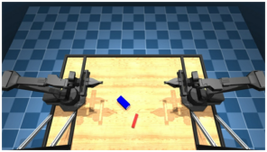


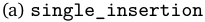


<!-- Start of picture text -->
(a)  single_insertion<br><!-- End of picture text -->


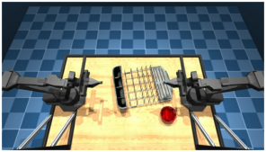


(d) `bowl_on_rack` 


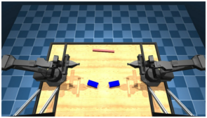


(b) `double_insertion` 


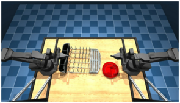


(e) `plate_on_rack` 


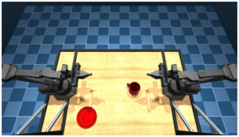


<!-- Start of picture text -->
(c)  mug_on_plate<br><!-- End of picture text -->


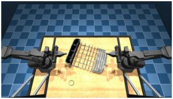


(f) `glass_on_rack` 

Figure 10 | Simulated task setups of dexterous manipulation on the ALOHA robot. 


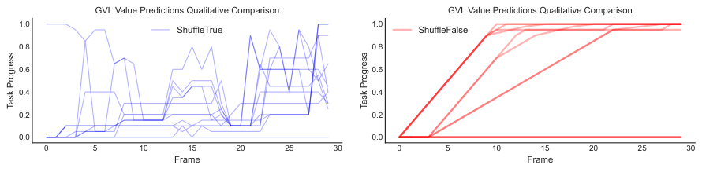


<!-- Start of picture text -->
GVL Value Predictions Qualitative Comparison GVL Value Predictions Qualitative Comparison<br>1.0 1.0<br>ShuffleTrue ShuffleFalse<br>0.8 0.8<br>0.6 0.6<br>0.4 0.4<br>0.2 0.2<br>0.0 0.0<br>0 5 10 15 20 25 30 0 5 10 15 20 25 30<br>Frame Frame<br>Task Progress Task Progress<br><!-- End of picture text -->

Figure 11 | GVL without shuffling produces uninformative monotonic values regardless of trajectory quality. 


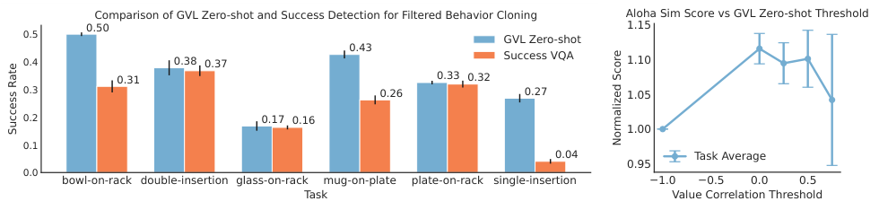


<!-- Start of picture text -->
Comparison of GVL Zero-shot and Success Detection for Filtered Behavior Cloning Aloha Sim Score vs GVL Zero-shot Threshold<br>0.50 1.15<br>0.5 GVL Zero-shot<br>0.43<br>0.4 0.38 0.37 Success VQA 1.10<br>0.31 0.33 0.32<br>0.3 0.26 0.27 1.05<br>0.2 0.17 0.16<br>1.00<br>0.1<br>0.04 Task Average<br>0.95<br>0.0<br>bowl-on-rack double-insertion glass-on-rack mug-on-plate plate-on-rack single-insertion 1.0 0.5 0.0 0.5<br>Task Value Correlation Threshold<br>Success Rate<br>Normalized Score<br><!-- End of picture text -->

Figure 12 | **Success-Filtered Imitation Learning on ALOHA Tasks.** Left: Using GVL-SD for success-filtered BC substantially outperforms SuccessVQA. Right: GVL-SD is not sensitive to the VOC threshold for improving imitation learning. 

**Zero-Shot Aloha Sim Results.** In Fig. 12 we include results for GVL-SD zero-shot instead of one-shot. The results are qualitatively similar, where GVL-SD consistently outperforms SuccessVQA, and different VOC threshold values all provide performance gain. 

**Different VLM backbone.** We additionally consider GPT-4o as the backbone VLM to better understand GVL’s performance in relation to the backbone VLM model. For evaluation, we plot the histogram of all 1000 (50×20) Value Order Correlation (VOC) scores across all trajectories in Figure 13. As shown, GVL, independent of the backbone models, consistently generates VOC scores that heavily skews to the right, indicating that it is able to zero-shot recover the temporal structure 

23

<!-- Page 24 -->

Vision Language Models are In-Context Value Learners 

hidden in the shuffled demonstration videos, i.e., coherent value predictions. 


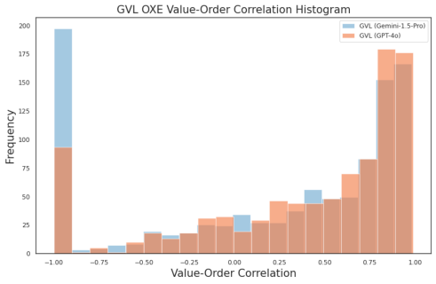


Figure 13 | GVL has comparable performances with different backbone VLMs; the main difference is in the backbone model’s refusal rate and conforming to the response template, which is reflected in the tall bar at −1 _._ 0. 

**Cross-task in-context learning.** We investigate whether examples from other tasks can also unlock GVL’s in-context learning capability. On the previous ALOHA-13 tasks, we randomly pair up tasks, where we draw one demonstration from one task as the one-shot in-context example for another. Then, we compare VOCs with the original same-task one-shot setup. The results are shown in Figure 14. We see that providing examples from a different task is still beneficial, though the improvement is not as much as same-task examples. This is to be expected as intra-task examples still provide clue on the output format as well as a generic notion of task progress, but such information is not specific to the target task. That said, cross-task ICL enables the flexibility of enabling foundation model guidance on a task without any task-specific prior. 


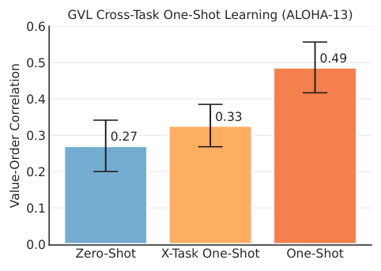


<!-- Start of picture text -->
GVL Cross-Task One-Shot Learning (ALOHA-13)<br>0.6<br>0.5 0.49<br>0.4<br>0.33<br>0.3 0.27<br>0.2<br>0.1<br>0.0<br>Zero-Shot X-Task One-Shot One-Shot<br>Value-Order Correlation<br><!-- End of picture text -->

Figure 14 | GVL demonstrates cross-task in-context learning capability: its value predictions can be improved by value examples from different tasks. 

**Does GVL work on different camera viewpoints?** On our ALOHA setup, we collected all demonstrations using four camera viewpoints. Besides the top-down view reported in the main experiment above, we test whether GVL remains performant when using alternative viewpoints, especially gripper views that are likely more out-of-distribution with respect to the natural images used for VLM training. The aggregate zero-shot and one-shot results are shown in Figure 15. As seen, on average, GVL zero-shot works best on the Table viewpoint. This is not surprising, as images taken with the front facing table camera are arguably visually closer to naturally captured images used for 

24

<!-- Page 25 -->

Vision Language Models are In-Context Value Learners 


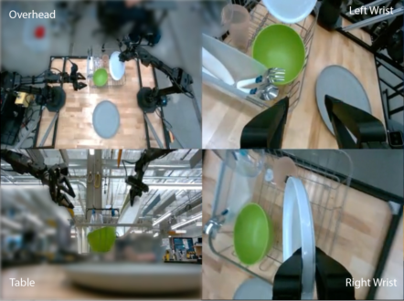


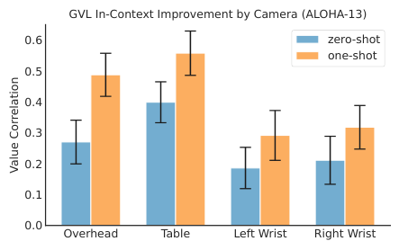


<!-- Start of picture text -->
GVL In-Context Improvement by Camera (ALOHA-13)<br>0.6 zero-shot<br>one-shot<br>0.5<br>0.4<br>0.3<br>0.2<br>0.1<br>0.0<br>Overhead Table Left Wrist Right Wrist<br>Value Correlation<br><!-- End of picture text -->

Figure 15 | GVL works better on more in-distribution table view, but one-shot improvement benefits all camera views. 

VLM training. Yet, with in-context examples, GVL consistently improves on all camera viewpoints. In practice, this means that GVL is robust to camera viewpoints – even when a camera viewpoint is determined to be sub-optimal post-hoc, practitioners can make up for that by simply providing few in-context examples. 

**Does GVL pay attention to the task specification?** To validate that GVL is not merely recovering the temporal coherence in the shuffled input video but actively tracking visual progress according to the task language command, we compute the VOC scores for every combination of task input video and language description in the ALOHA-13 split. The heatmap visualization of the average VOC for every pairing is illustrated in Fig. 16 and Fig. 17 for GVL and the no shuffling ablation. On 9 out of 13 tasks, GVL achieves the highest VOC when the input video and the task description matches; in many unmatched cases, the model simply refuses to output value predictions, stating that the frames and the language description are not related. In contrast, when we do not shuffle the input frames, the quality dramatically drops. 

25

<!-- Page 26 -->

Vision Language Models are In-Context Value Learners 


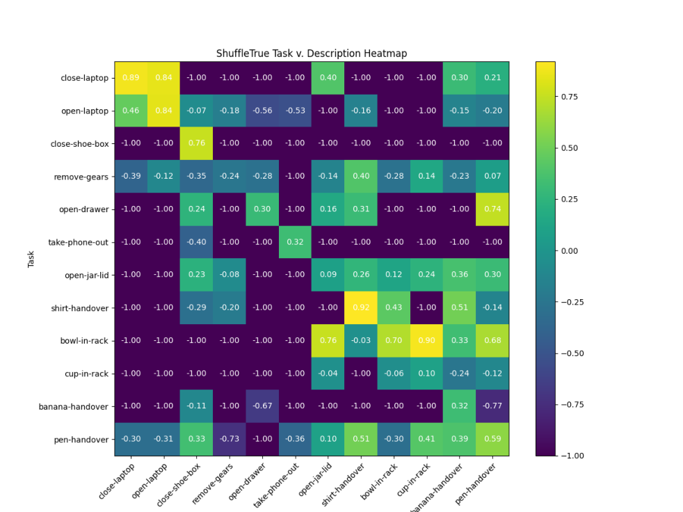


Figure 16 | GVL VOC for video and language description pairs. Shuffling enables GVL to pay attention to the language task description in order to faithfully predict observation values. 

26

<!-- Page 27 -->

Vision Language Models are In-Context Value Learners 


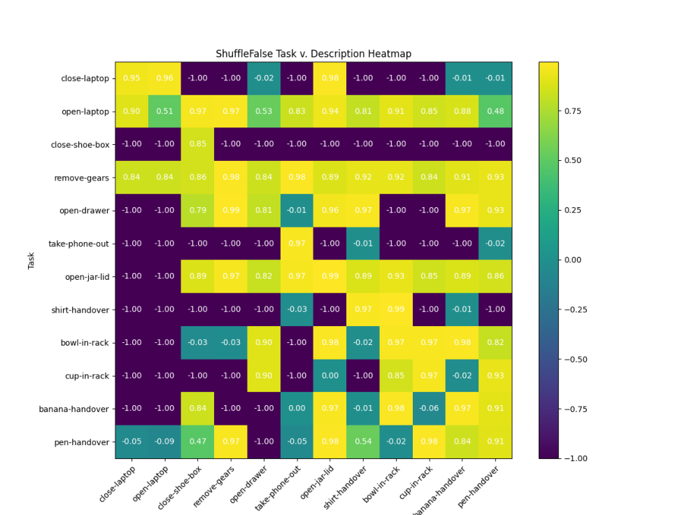


Figure 17 | No-shuffling ablation VOC for video and language description pairs. Removing shuffling makes VLM output high VOCs independent of task descriptions. 

27
