# Vision-Language Models as Success Detectors

[Original PDF](../Vision-Language%20Models%20as%20Success%20Detectors.pdf)

Pages: 22

> Automatically converted from PDF. Check the original for exact equations, symbols, table alignment, and figure details.

<!-- Page 1 -->

_2023-3-14_ 

# **Vision-Language Models as Success Detectors** 

**Yuqing Du**2* **, Ksenia Konyushkova**1 **, Misha Denil**1 **, Akhil Raju**1 **, Jessica Landon**1 **, Felix Hill**1 **, Nando de Freitas**1 **and Serkan Cabi**1 

1DeepMind, 2UC Berkeley, *Work done during internship at DeepMind 

**Detecting successful behaviour is crucial for training intelligent agents. As such, generalisable reward models are a prerequisite for agents that can learn to generalise their behaviour. In this work we focus on developing robust success detectors that leverage large, pretrained vision-language models (Flamingo, Alayrac et al. (2022)) and human reward annotations. Concretely, we treat success detection as a visual question answering (VQA) problem, denoted** **_SuccessVQA_ . We study success detection across three vastly different domains: (i) interactive language-conditioned agents in a simulated household, (ii) real world robotic manipulation, and (iii) “in-the-wild" human egocentric videos. We investigate the generalisation properties of a Flamingo-based success detection model across unseen language and visual changes in the first two domains, and find that the proposed method is able to outperform bespoke reward models in out-of-distribution test scenarios with either variation. In the last domain of “in-the-wild" human videos, we show that success detection on unseen real videos presents an even more challenging generalisation task warranting future work. We hope our initial results encourage further work in real world success detection and reward modelling.** 

_Keywords: success detection, vision language models, generalisation, reward models_ 

### **1. Introduction** 

Being able to detect successful ( _i.e.,_ preferred) behaviour is a crucial prerequisite for training intelligent agents. For example, a signal of successful behaviour is necessary as a reward for policy learning, or as an evaluation metric for identifying performant policies. As such, in this work we are concerned with developing accurate and generalisable _success detectors_ , which _classify if a behaviour is successful or not_ . While it is possible to engineer success detectors in specific domains, such as games (Mnih et al., 2013) or control tasks (Tunyasuvunakool et al., 2020), in most real-world tasks they can be challenging to define. Success detection in realistic settings can be difficult not only due to challenges with identifying the environment state ( _e.g.,_ detecting a particular object configuration from pixels), but also due to ambiguities about what a successful state is ( _e.g.,_ subjective goals, such as “generate an entertaining story”). One possible approach for developing success detectors is through reward modelling with preference data (Abbeel and Ng, 2004; Cabi et al., 2020; Christiano et al., 2017; Ng et al., 2000; Ouyang et al., 2022). However, the trained preference models are often accurate only for the fixed set of tasks and narrow environment conditions observed in the preference-annotated training data, and thus they require extensive labour-intensive annotations for better coverage. This presents a significant bottleneck, as we would like success detectors to be able to generalise broadly – for instance, once a success detector learns what “successfully picking up a block” looks like, it should be able to detect this behaviour even if the background or agent morphology changes thanks to a semantic understanding of “picking up a block”. 

Consider success detection in robotic manipulation, where tasks are specified with language instructions and observations consist of images. We posit that generalisable success detection is useful for learning generalisable policies in this domain. Here, effective success detectors should generalise to task variations along two axes. Firstly, they should generalise to _language variations_ in the task 

_Corresponding author(s): yuqing_du@berkeley.edu, kksenia@deepmind.com, cabi@deepmind.com_ © 2023 DeepMind. All rights reserved

<!-- Page 2 -->

Vision-Language Models as Success Detectors 

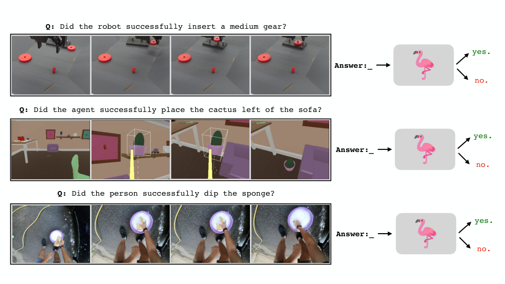

<!-- Start of picture text -->
Q:  Did the robot successfully insert a medium gear? yes. Answer:_ no. Q:  Did the agent successfully place the cactus left of the sofa? yes. Answer:_ no. Q:  Did the person successfully dip the sponge? yes. Answer:_ no. <!-- End of picture text -->

Figure 1 | **SuccessVQA** : Success detection tasks can be formulated as visual question answering (VQA) problems. Large multimodal language models, such as Flamingo, offer the opportunity to learn a generalisable success detector, which can act either as a reward model or agent evaluator in a broad range of domains. 

specification. For instance, a model that is trained on detecting success for the instruction “lift a rubber duck” should also accurately measure success for “lift a toy duck object”. Secondly, success detectors should generalise to _visual variations_ . For example, if a camera moves or additional objects are introduced in the scene, the model should still reliably detect success on accomplishing a known task. Standard reward models are typically trained for fixed conditions and tasks, and are thus unable to generalise to such variations. As such, adapting success detectors to new conditions typically requires collecting a new annotated dataset and re-training the model. 

In this work, we aim to train success detectors that are robust with respect to variations in both language specifications and perceptual conditions. To this end, we leverage large pretrained visionlanguage models (VLMs), such as Flamingo (Alayrac et al., 2022), as a foundation for learning success detectors. We hypothesize that Flamingo’s pretraining on vast amounts of diverse language and visual data will enable learning more robust success detectors. In particular, we show that the same simple approach of finetuning Flamingo with human annotations leads to generalisable success detection across vastly different domains. This simple approach allows us to use a unified architecture and training scheme, where we require only 1) videos describing the world state, and 2) text describing the desired behaviour or task. We reframe the problem of success detection as a visual question answering (VQA) task and refer to this formulation as _SuccessVQA_ (Figure 1). 

Concretely, we finetune Flamingo for success detection on three diverse domains: a simulated household (Abramson et al., 2021), real-world robotic manipulation, and in-the-wild egocentric human videos (Grauman et al., 2022). The universality of the SuccessVQA task formulation is instrumental in enabling use of the same training architecture in a wide range of tasks and environments. We demonstrate that the resulting success detectors are capable of zero-shot generalisation to unseen conditions (both in language and vision) where bespoke learned reward models fail. 

2

<!-- Page 3 -->

Vision-Language Models as Success Detectors 

### **2. Related Work** 

**Vision-Language Models (VLMs)** Multimodal vision-language models (VLMs) have shown remarkable success in recent years, where VLMs can serve as a foundation for various tasks using language, vision, or arbitrary combinations of modalities. VLMs can be trained with contrastive objectives (Jia et al., 2021; Radford et al., 2021) and/or generative objectives (Alayrac et al., 2022; Dai et al., 2022; Hu et al., 2021; Luo et al., 2020). In this work we rely on the Flamingo model (Alayrac et al., 2022), which leverages a contrastive objective for pretraining the vision encoder on text-and-image pairs. This is combined with a frozen pretrained language model though the Perceiver Resampler and interleaved cross-attention layers, and optimized with a generative objective. We approach success detection as a closed-form visual question answering (VQA) task. However, unlike other applications of VLMs in single-image VQA tasks (Tiong et al., 2022), we rely on videos to specify the world state, making our work more similar to video QA tasks (Xu et al., 2016). While the original Flamingo work demonstrates capabilities on video understanding, we extend this approach to training video-based reward models. Variants of our approach ( _e.g.,_ by reducing the video input to a single frame) can also be applied with other VLMs built on large language models (Koh et al., 2023; Li et al., 2023). 

**Reward Modelling** Reward modelling is often necessary when it is challenging to hard-code a reward function for an agent to learn from. To circumvent this, there has been a rich body of prior work on learning reward functions from data. When rewards are accessible through a simulator, one can use supervised learning to train a reward model for model-based agent learning (Hafner et al., 2023). However, many tasks can be difficult to simulate and hand-engineer simulated rewards for. To overcome this challenge, one can learn reward models from human data. When demonstrations of desirable behaviour are available, one can leverage inverse reinforcement learning (IRL), where the key idea is to recover a reward function that best explains expert behaviour (Baram et al., 2017; Finn et al., 2016; Fu et al., 2018; Ho and Ermon, 2016; Li et al., 2017; Merel et al., 2017; Ng et al., 2000; Zhu et al., 2018). However, IRL relies on access to such expert demonstrations, makes assumptions about the relationship between the expert actions and the true reward, and can be difficult to learn. 

When demonstrations are difficult to acquire, a more natural way of providing human feedback is through comparative preferences that indicate the degree to which certain agent behaviour is desirable. This can be done with comparisons of whole episodes (Akrour et al., 2012; Brown et al., 2019; Sadigh et al., 2017; Schoenauer et al., 2014), trajectory segments (Abramson et al., 2022a; Christiano et al., 2017; Ibarz et al., 2018; Lee et al., 2021), or even synthesized hypothetical trajectories (Reddy et al., 2020). These methods then fit a reward function as a preference-predictor, _e.g.,_ using a Bradley-Terry model (Bradley and Terry, 1952). Nevertheless, preferences are not always the most natural form of feedback from humans, and in many cases we would like the exploit the goal-oriented nature of many tasks we care about. In other words, sometimes it can be easier for a person to provide direct success labels or scalar rewards with respect to a given goal. This can be done online in response to observed agent actions and state transitions (Arumugam et al., 2019; Knox and Stone, 2008; MacGlashan et al., 2017). In robotics, proposed methods vary from sparse, single frame annotations (Singh et al., 2019) to dense, whole trajectory annotations (Cabi et al., 2020). In this work we learn from reward annotations, focusing on training success detectors which can be viewed as binary reward functions. Since collecting human annotations for each new task and environment can be expensive, we aim to study whether pretrained, large VLMs can enable learning more generalisable success detectors from human annotations. 

**Large-Scale Pretraining for Success Detectors** Our work falls under the general category of using foundation models as reward models. In language modelling, reward models are typically trained by finetuning a pretrained LLM with human preferences over LLM generations. This reward 

3

<!-- Page 4 -->

Vision-Language Models as Success Detectors 

model can then be used to finetune an LLM with filtered supervised finetuning or reinforcement learning from human feedback (RLHF) (Askell et al., 2021; Bai et al., 2022; Glaese et al., 2022; Menick et al., 2022; Nakano et al., 2022; Stiennon et al., 2020). For embodied agents, large-scale datasets of in-the-wild human videos have been used to train reward models (Chen et al., 2021; Ma et al., 2022). Rather than using human reward annotations of agent behaviours, these methods rely on task-annotated human videos of successful behaviours. Most similar to our work, some prior approaches propose using contrastive VLMs as reward models. In simulated robot domains, Cui et al. (2022); Mahmoudieh et al. (2022) propose using CLIP (Radford et al., 2021) to generate task rewards from a text-based goal description and pixel observations. Fan et al. (2022) leverage large-scale Minecraft data to finetune a Minecraft-specific video CLIP model for detecting alignment ( _i.e.,_ reward) with text task descriptions. Our work differs in that we leverage a generative VLM built on a frozen large language model, which we hypothesize enables better language generalisation. We also apply our method to three vastly different domains, including real-world domains where ground truth rewards are difficult to obtain, and thus directly make use of human annotations. 

### **3. SuccessVQA: Success Detection as a VQA Task** 

Our primary contribution is SuccessVQA, a framework that allows us to train multi-task success detectors by directly leveraging powerful pretrained VLMs, such as Flamingo. In SuccessVQA, the VLM is given a visual input representing the state of the world ( _e.g.,_ a single image or a short video clip) and a question asking if the specified task is successfully accomplished. This problem formulation has several advantages: 

- It allows us to unify success detection across domains, using the same architecture and training scheme. We consider three domains: a simulated 3D playroom used in prior research on language-conditioned interactive agents ( **IA Playroom** ) (Abramson et al., 2020, 2021), real robotic manipulation, and “in-the-wild" human videos from Ego4D (Grauman et al., 2022). 

- Relying on a pretrained vision-language model enables us to harness the advantages of pretraining on a large multimodal dataset. We hypothesize that this is the reason for better generalisation to both language and visual variations. 

- The task and state specification allows us to unify treatment of success detection in tasks defined either by singular successful states or target behaviours ( _i.e.,_ detecting success requires reasoning across multiple frames). 

**SuccessVQA Datasets** To create the SuccessVQA datasets, we use behaviour trajectories annotated by humans to indicate _whether_ a task is completed successfully, and if so, _when_ a success occurs. There may be multiple annotations per trajectory from different human raters. In the cases where raters disagree, success or failure is determined by a majority vote, and the median (across the raters who annotated success) of the first annotated success frame is used as the ’point of success’. All subsequent frames are also successful, unless the task is reversed ( _e.g._ removing a gear after inserting it for the robotics domain). To generate SuccessVQA examples, a trajectory is split into non-overlapping subsequences (Figure 2). For simplicity, we make the clip lengths the same as the pretraining clip lengths used for Flamingo: by first creating subsequences of length 211 frames, then downsampling from 30 FPS to 1 FPS to create 8-frame subsequences. We then generate the VQA question using one of two methods. When trajectories correspond to some known task, we use the template: `“Did the robot/agent/person successfully {task}?”` , for example, `“Did the agent successfully place the cactus left of the sofa?”` (see Figure 1, first and second rows). When no task is provided but there is a narration corresponding the actions in the 

4

<!-- Page 5 -->

Vision-Language Models as Success Detectors 

## **Annotated trajectory** 

**Agent task:** <mark>place a cyan pointy object on the bed</mark> 

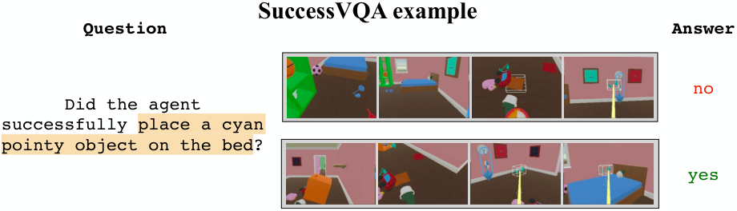

<!-- Start of picture text -->
SuccessVQA example Question Answer no Did the agent successfully  place a cyan pointy object on the bed ? yes <!-- End of picture text -->

Figure 2 | **SuccessVQA dataset creation:** A trajectory is annotated by human raters with a point of success (denoted by the trophy). Then the trajectory is split into subsequences and converted to multiple SuccessVQA datapoints with corresponding questions and answers. 

**Question:** Did the agent successfully place a cyan pointy object on the bed? 

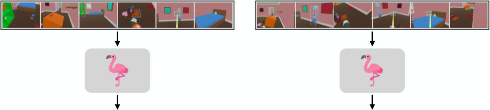

<!-- Start of picture text -->
no yes <!-- End of picture text -->

Figure 3 | We compute episode-level success detection accuracy during evaluation in order to compare against bespoke success detection models for each domain. To do this, we create subsequences and predict success on each clip individually, then consolidate the predictions at an episode level. 

clip, as in Ego4D, we use a frozen Flamingo model to rephrase the narrations into questions. For example, given a narration `“The person is scooping the ice cream”` , we convert it to the question `“Did the person successfully scoop the ice cream?”` (see Figure 1, last row). Finally, the answer is generated: `“yes”` if the given subsequence ends in success frames, and `“no”` otherwise. 

**Training and Evaluation** We finetune the Flamingo (3B) vision-language model on the SuccessVQA dataset for each domain. Specifically, we finetune all the vision layers (vision encoder, perceiver, and cross attention layers) and keep the language layers frozen. In the experiments we refer to this model 

5

<!-- Page 6 -->

Vision-Language Models as Success Detectors 

as the **FT Flamingo 3B** . For evaluation we compute clip-level success detection accuracy against the ground truth human annotations on held-out trajectories. In the simulated household and robotics domains (Sections 4 and 5) we also compute episode-level accuracy to directly compare against baseline bespoke success detection models, denoted **bespoke SD** . Note that these baselines were hand-designed independently and tuned specifically for each domain. While these models differ from Flamingo in both pretraining schemes and architecture, they represent _a best attempt at designing an accurate reward model for in-distribution evaluations_ . Episode-level success detection is computed as follows: first, we generate subsequences from the test trajectories in the same way as during training. Next, the success detection model classifies each clip individually for success, as illustrated in Figure 3. We consolidate the classifications in one of two ways. 1) When the success is completely defined by the observed environment state (as in the robotics tasks), we only look at the first and the last clip of an episode. Then, the entire episode as successful if the first clip is in a failure state and the last clip is in a success state. 2) When the success is defined by a particular behaviour (as in the simulated household domain), if any subsequence in an episode is classified as success we classify the episode as successful. We report _balanced_ accuracy on the test episodes, as there can be a large imbalance between the number of successful and failure episodes in the dataset. A random model would achieve 50% balanced accuracy. 

**Experiments overview** We use the SuccessVQA problem formulation to train success detectors across a diverse range of tasks in vastly different domains: simulated household or **IA Playroom** (Section 4), robotics (Section 5), and Ego4D videos (Section 6). We investigate whether Flamingo as a success detector model backbone enables generalisation across the following axes: 

- **language generalisation** (Section 4). Can we accurately detect success for novel tasks specified with language? To answer this question, we evaluate generalisation to unseen tasks specified with language. For example, if we train on detecting success for the task `“arrange objects in a row”` , can we accurately detect success for the task `“arrange objects in a circle”` ? For these experiments, we use simulated tasks in the **IA Playroom** environment where the trajectory dataset contains a large and diverse set of language-specified tasks. 

- **visual robustness** (Section 5). Can we detect success in the presence of unseen visual variations? To answer this question, we evaluate success detection accuracy for a known semantic task, but in the presence of naturalistic visual perturbations. In these experiments, we use real-world robotic manipulation tasks where we introduce visual variations at test-time using different camera viewpoints and distractor objects. 

We compare our model against bespoke evaluation models designed and trained specifically for each domain. We do not necessarily expect the Flamingo-based models to outperform the bespoke models in a given in-distribution scenario. Rather, we aim to investigate whether the Flamingo-based models have better robustness to both aforementioned language and visual changes, while also not requiring any domain-specific architectural or training changes. We emphasize that the benefit of SuccessVQA is the simple task formulation that can be applied across a wide range of domains and is directly amenable for use with large pretrained VLMs. Finally, in Section 6 we show an example of an in-the-wild SuccessVQA dataset derived from Ego4D (Grauman et al., 2022). Initial results for success detection in this domain are promising, and we hope to encourage further work on accurate reward modelling in unstructured real-world settings. 

6

<!-- Page 7 -->

Vision-Language Models as Success Detectors 

### **4. Language Robustness with Interactive Agents (IA Playroom)** 

In this section we train and evaluate success detectors in the simulated **IA Playroom** environment, a diverse 3D house environment designed for training language-conditioned interactive agents (Abramson et al., 2020, 2021). The environment consists of “a randomised set of rooms, with children’s toys and domestic objects, as well as containers, shelves, furniture, windows, and doors" (see Figure 1 in Abramson et al. (2020)). The tasks are generated from human-human interactions in the **IA Playroom** , where a _setter_ is instructed to provide a task via language for a _solver_ , _e.g.,_ `"bring me the book from the living room"` . Success detectors in this environment can serve as automated evaluators for trained policies. 

There are two properties in this environment that are particularly challenging for automated success detection: large language variety and the environment’s multi-task nature. Large language variations are present because the tasks were originally generated from human interactions, and people are likely to use diverse language to specify even semantically similar tasks. For example, the task of bringing an object to the setter can be phrased in many ways: `"bring a fruit from the pantry"` , `"bring me the banana which is in the pantry"` , `"bring the yellow coloured object near me"` . Moreover, success detection in this environment is intrinsically _multi-task_ in its nature because: (1) there is a vast set of possible tasks that can be specified with different utterances, and (2) the behaviour of different people and trained agents can vary greatly for the same task. For automated evaluation, it is not scalable to train a new model for each language and task variation. 

#### **4.1. Methodology** 

**Training Dataset** We use tasks and trajectories from the Standardized Test Suite (STS), designed specifically for evaluating learned Interactive Agents (Abramson et al., 2020, 2021). We focus on the movement-based tasks: tasks that require the solver agent to move around and interact with the environment. The STS consists of a set of "scenarios that typify the behaviour [the Interactive Agents team] wishes to evaluate" (Abramson et al., 2022b), and various trained agent policies are tasked with accomplishing the given scenarios. These test episodes are then annotated by human raters to indicate if a task is successfully completed and if so, at which frame success occurred. We use these annotations to create a SuccessVQA dataset for **FT Flamingo 3B** finetuning and to train a **bespoke SD** model for comparison. The training set consists of STS and human interaction data collected between September 2021 to April 2022 (see Figure 4), 546,887 trajectories in total (1,421,111 clips). 

**Baseline Success Detectors** For the **bespoke SD** baseline, we use a success detection model specifically designed for the STS independently of this work. There are two types of baseline models: whole episode evaluation and autoregressive evaluation. As the whole episode model consistently outperformed the autoregressive model, in this section we only report the results from that baseline (see Appendix A for additional results). This model creates a downsampled set of 32 frames from the entire evaluation episode and embeds the images with a ResNet-101. The agent input and output text are embedded using a learned text embedding. All embeddings are then concatenated together and fed to a transformer with an MLP head that predicts the likelihood the episode was successful. In addition to training on success detection, an auxiliary instruction-matching contrastive loss is applied. 

**Evaluation** To select the best success detection model, we use the model and checkpoint with the highest balanced accuracy on a held-out validation split from the same distribution as the training data. We then evaluate the chosen success detector model across three different test sets: 

7

<!-- Page 8 -->

Vision-Language Models as Success Detectors 

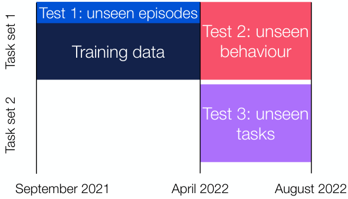

<!-- Start of picture text -->
Test 1: unseen episodes Test 2: unseen Training data behaviour Test 3: unseen tasks September 2021 April 2022 August 2022 Task set 1 Task set 2 <!-- End of picture text -->

Figure 4 | **IA Playroom datasets split.** Training and evaluation splits for **IA Playroom** STS evaluation. Test episodes include unseen trajectories, unseen behaviours, and/or unseen language instructions. See Table 1 for details on the different task sets. 

|Property|Test 3 Examples|
|---|---|
|Unseen descriptor|`“arrange 4 pointy objects in a square shape in the bed room"`, where `square`is not mentioned in the training set. Instead, at train time we have tasks arranging objects in an`arc`or`triangle`.|
|Unseen objects|`“push the train engine with water bird"`, where neither`train engine`nor `bird`are mentioned in the training set.|
|Unseen actions|`“hit the candle using the pillow which is left of airplane in the` `living room"`, where the action`hit`is not mentioned in the training set.|

Table 1 | Examples of unseen task variants from Task Set 2, used in Test 3. 

- **Test 1: unseen episodes (in distribution)** – a randomly held-out 10% of training dataset trajectories, which includes rephrasings of training tasks. This dataset contains 175,952 clips. 

- **Test 2: unseen behaviour (out of distribution agents)** – trajectories generated by _new agents_ on tasks seen in the training dataset, including rephrasings of training tasks. These agents potentially demonstrate novel behaviour. This allows us to assess success detector robustness to unseen behaviours on known tasks, which is important as it determines if we can reuse the same models even as agent behaviour evolves over time ( _i.e._ the success detector should be accurate even when the agent solves a known task in a novel way). This dataset contains 462,061 clips. 

- **Test 3: unseen tasks (out of distribution tasks and agents)** – the most challenging setting: trajectories generated by new agents on _new tasks_ not seen during training. For examples of how these tasks differ from the training set, see Table 1. Note that this set comprises _completely new tasks_ as well as rephrasings of said tasks. As the tasks are new, the success detector models need to master a semantic understanding of language to properly generalise to success detection in this set. This dataset contains 272 _,_ 031 clips. 

#### **4.2. Experimental Results** 

Table 2 presents the episode-level balanced accuracy on each test set. We find that without finetuning, the accuracy of the Flamingo model is close to random chance (see Appendix A for details). This is unsurprising, as the IA domain differs greatly from Flamingo’s pretraining data. With finetuning on the same training set, **FT Flamingo 3B** matches the performance of **bespoke SD** in both Test 1 

8

<!-- Page 9 -->

Vision-Language Models as Success Detectors 

|Model|Test 1:|Test 2:|Test 3:|
|---|---|---|---|
||unseen episodes|unseen behaviour|unseen tasks|
|**bespoke SD**|80.6%|**85.4%**|49.9%|
|**FT Flamingo 3B**|**83.4%**|85.0%|**59.3%**|

Table 2 | Zero-shot episode-level balanced accuracies for **IA Playroom** evaluation models. For reference, human level balanced accuracy is around 88% due to inter-rater disagreement. 

(unseen episodes) and Test 2 (unseen behaviour). More importantly, in Test 3 (unseen tasks), the performance of a bespoke model drops to a random chance, while **FT Flamingo 3B** outperforms it by a significant margin (10%), see Table 2. As the instructions in Test 3 are for novel tasks, not just rephrasings of tasks seen during training, this experiment demonstrates that the success detector exhibits some amount of semantic understanding of the scenes. We hypothesize that this is possible due to Flamingo’s large language model backbone and web-scale pretraining. That said, there is still a large margin for improvement on the most challenging test set. For future work, it would be interesting to investigate how different model scales, dataset sizes, or cross-finetuning with different datasets can affect generalisation. 

### **5. Visual Robustness with Robotic Manipulation** 

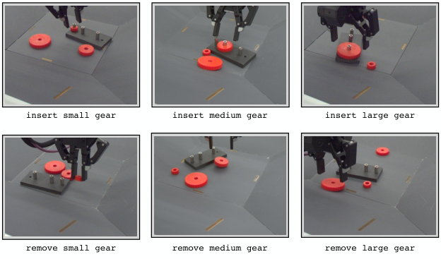

<!-- Start of picture text -->
insert small gear insert medium gear insert large gear remove small gear remove medium gear remove large gear <!-- End of picture text -->

Figure 5 | Successful frames for the 6 robotics gear manipulation tasks: insert small, medium, large, and remove small, medium, large gear. 

In this section we train and evaluate success detectors on a family of real-life robotic gear manipulation tasks with a Panda robot arm. There are six tasks corresponding to inserting or removing a small, medium, or large gear within a basket (Figure 5). We consider visual observations from a basket camera. Ideally, a success detector should remain accurate under naturalistic visual changes, such as different camera view angles, lighting conditions, or backgrounds. Furthermore, as the performance of learned policies improves, we may want to introduce new objects or tasks to the environment. It quickly becomes impractical to re-annotate and re-train success detectors from previous tasks in new conditions, thus making it important to train visually robust success detectors. For example, a model that has learned to detect successful gear insertion should still be able to robustly detect success even if the basket has additional task-irrelevant distractor objects or the camera angle changes. To investigate this, we experiment with zero-shot evaluations on episodes with such visual changes. 

9

<!-- Page 10 -->

Vision-Language Models as Success Detectors 

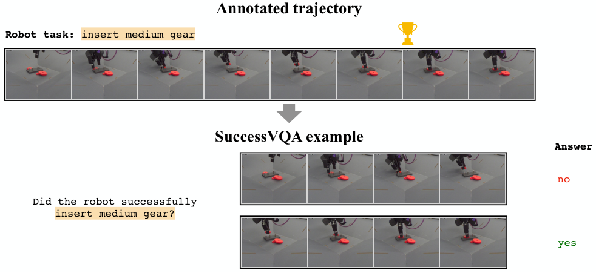

<!-- Start of picture text -->
Annotated trajectory Robot task: insert medium gear SuccessVQA example Answer Question no Did the robot successfully insert medium gear? yes <!-- End of picture text -->

Figure 6 | Sample SuccessVQA example created from an annotated subsequence of a gear manipulation episode. Success annotation is shown with the trophy. 

#### **5.1. Methodology** 

**Training dataset** Human operators provide 101 _,_ 789 demonstrations for 6 tasks using a 6DoF control device. Each episode is then annotated by humans with rewards for each task ( _e.g.,_ every episode has 6 reward annotations, one for each task). Human annotators label positive rewards for all frames with a success state ( _i.e.,_ if the task is solved), and zero rewards otherwise. Note that it is possible for a task to be accidentally undone in the same episode, at which point the reward annotation would revert to zero. The reward annotations and corresponding episode frames are then converted into SuccessVQA examples (see Figure 6). The ground truth VQA answer is obtained from the human annotations: clip answers are labelled successful if they contain only a single transition from zero to positive reward or only have positive rewards throughout, otherwise they are labelled as unsuccessful. We train a single **FT Flamingo 3B** success detector model for all 6 tasks. 

**Baseline Success Detector** As a baseline, we consider a ResNet-based (He et al., 2016) per-frame success classification model, tuned specifically for this task by the robotics team. The ResNet-18 is pretrained on ImageNet, and the classification layer is swapped out for a binary classification layer. We finetune a _separate_ success classification model for each of the 6 gear tasks, with image augmentations applied during training. This is distinct from our method where we train a single multi-task model across all 6 conditions. We consider an episode successful if the first and last frames1 of the episode are classified as a failure (output < 0 _._ 5) and success (output > 0 _._ 5) correspondingly. We will further refer to the baseline model as bespoke success detector ( **bespoke SD** ). 

**Evaluation** To compare against the **bespoke SD** , we look at episode-level balanced accuracy. Given an evaluation episode, we consider the episode successful under **FT Flamingo 3B** if the first clip is classified as unsuccessful and the last clip is classified as successful (see Figure 11 in the Appendix). This matches the episode-level classification scheme of **bespoke SD** . 

> 1We find that incorporating more frames does not improve episode-level accuracy. 

10

<!-- Page 11 -->

Vision-Language Models as Success Detectors 

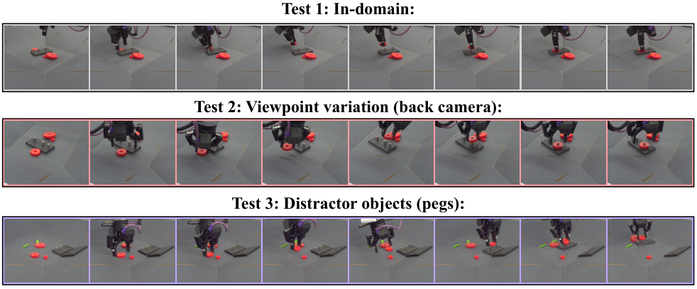

<!-- Start of picture text -->
Test 1: In-domain: Test 2: Viewpoint variation (back camera): Test 3: Distractor objects (pegs): <!-- End of picture text -->

Figure 7 | Examples of three evaluation datasets: in-domain episodes similar to the training dataset, episodes with a different camera viewing angle and episodes with distractor objects in the basket. 

We conduct the evaluation on three test sets (see Figure 7): 

- Test 1: In-domain episodes (first row), 

- Test 2: Episodes with a **viewpoint variation** , using a different (back) camera (second row), 

- Test 3: Episodes with **distractor objects** in the basket, but the original camera (last row). 

The last two settings are designed to test the robustness of the models to naturalistic visual perturbations in the environment. The trained success detectors can then either be used as automated evaluators or reward models for agent training. 

#### **5.2. Experimental results** 

#### **_In-Domain Performance_** 

In Test 1, we conduct an in-domain evaluation where the test set comes from the same visual conditions as the training set (see Figure 7, top row). The test set includes all the training episodes and an additional held out 2076 episodes. The results in Table 3 show that while the **bespoke SD** consistently outperforms the **FT Flamingo 3B** , the performance of the **FT Flamingo 3B** model is still comparable for the insertion task. Note that the accuracy of the Flamingo model on the remove tasks is lower, which we hypothesize is likely due to a data balancing issue. We have 5 times more training data available for insertion than removal, and training a single model across all tasks likely led to a tradeoff in accuracy between the insertion and removal tasks, which are temporal opposites of each other. 

|||Insert|||Remove||
|---|---|---|---|---|---|---|
||Small|Medium|Large|Small|Medium|Large|
|**bespoke SD**|**98.0%**|**98.4%**|**99.1%**|**97.3%**|**98.7%**|**98.4%**|
|**FT Flamingo 3B**|96.0%|94.4%|95.0%|82.1%|83.4%|87.2%|

Table 3 | **In-Domain Episode-level Accuracy for Gear Manipulation.** Balanced accuracy evaluated on 50 _,_ 000-60 _,_ 000 episodes per task. 

We further verify that the **FT Flamingo 3B** success detector can be used to train useful policies 

11

<!-- Page 12 -->

Vision-Language Models as Success Detectors 

using reward-filtered behaviour cloning (BC). In filtered BC, we first use **FT Flamingo 3B** to classify demonstration episodes as successes or failures for a particular task. Then, we use only the episodes classified as success for BC training. Table 4 shows the average success rates of the policies evaluated on 20 episodes with manual resets. In manual resets no extra gears are pre-inserted on the pegs for the insert task and only the one relevant gear is pre-inserted for the remove tasks. The success rates vary between 50% and 75%, suggesting that the accuracy of the success detector models is sufficient for some amount of policy training. To compare with the **bespoke SD** model, we also conduct filtered BC training with the **bespoke SD** reward model and evaluate an insert large gear policy over 100 episodes with automated resets. In automated resets, policies for different tasks are run in sequence one after another and any number of gears might be already inserted at the start of the episode, presenting a harder scenario. In this case, the success rate is 30% with **FT Flamingo 3B** is and 33% with **bespoke SD** . This provides a preliminary proof-of-concept that the difference in reward model accuracy does not lead to a large difference in policy performance. We leave more detailed policy evaluations to future work. 

||Small|Medium|Large|
|---|---|---|---|
|Insert|55%|65%|70%|
|Remove|60%|75%|60%|

Table 4 | **Policy success rates.** Policies are trained with filtered behaviour cloning where only successful episodes are used for training and success is determined by **FT Flamingo 3B** . 

#### **_Visual Robustness_** 

Next, we focus on testing the generalisation capabilities of success detectors. We measure zero-shot accuracy on two natural visual variations described above: Test 2 and Test 3. 

In Test 2, we look at zero-shot robustness to different viewpoints (Figure 7, middle row). Given that the success detectors were only trained on frames from the _front_ basket camera, we evaluate robustness by measuring success detector accuracy on episodes recorded with the _back_ basket camera. As we can see in Table 5, changing the camera angle drastically hurts the quality of **bespoke SD** (accuracy decreases of 10-50 absolute percentage points) while the performance of **FT Flamingo 3B** is more stable (accuracy decreases by less than 10%). Note that in some tasks the performance of the bespoke model drops to the level of random guessing, essentially rendering the model useless for success detection. With this, **FT Flamingo 3B** becomes the best performing model in 5 out of 6 tasks. 

||Small|Insert Medium|Large|Small|Remove Medium|Large|
|---|---|---|---|---|---|---|
|**bespoke SD**|78.0% **-19.9%**|53.1% **-45.4%**|50.9% **-48.3%**|**85.8%** **-11.5%**|53.8% **-44.9%**|72.8% **-25.5%**|
|**FT Flamingo 3B**|**91.0%** -4.0%|**89.8%** -4.6%|**89.7%** -5.3%|76.7% -5.5%|**75.9%** -7.5%|**79.4%** -7.8%|

Table 5 | **Viewpoint variation.** Zero-shot success detection balanced accuracy when trained on the front camera view and evaluated on the back camera view. We show the absolute balanced accuracy and the percentage point change compared to Test 1 from Table 3. 

Next, in Test 3 we look at zero-shot robustness in the setting where some _distractor objects_ (two pegs and a board, see Figure 7, last row) are introduced. Table 6 shows that detecting success on known tasks across this novel visual setting causes a 4-30% (absolute percentage points) drop in balanced 

12

<!-- Page 13 -->

Vision-Language Models as Success Detectors 

||Small|Insert Medium|Large|Small|Remove Medium|Large|
|---|---|---|---|---|---|---|
|**bespoke SD**|88.8% **-9.2%**|85.0% **-13.4%**|71.8% **-27.4%**|**93.6%** **-3.8%**|**93.8%** **-4.9%**|**92.4%** **-6.0%**|
|**li**|**96.1%**|**95.6%**|**90.6%**|82.4%|83.6%|84.7%|
|**FT Famngo 3B**|+0.1%|+1.2%|-4.5%|+0.3%|+0.1%|-2.5%|

Table 6 | **Distractor Objects.** Zero-shot success detection balanced accuracy on scenes with distractor objects. We show the absolute balanced accuracy and the percentage point change compared to Test 1 from Table 3. 

accuracy for the bespoke model, while the accuracy mostly stays stable for the Flamingo-based models, with a 4 _._ 5% drop in accuracy at most. 

These two experiments demonstrate that Flamingo-based success detection models are robust to natural visual variations. We hypothesize that the pretrained Flamingo-based success detection model is better suited to zero-shot visual generalisation than the bespoke baseline reward model, as Flamingo is pretrained on a diverse set of visual data with corresponding language grounding. While the baseline model was also pretrained and used image augmentations during task finetuning, it was not exposed to such a diverse set of visual data or language. Large-scale diverse pretraining might contribute to better semantic tasks recognition under naturalistic visual changes. These encouraging results suggest that pretrained VLM-based success detectors are likely better suited to the real-world tasks involving unstructured, open, and evolving settings. 

### **6. Real World Success Detection with Ego4D** 

In this section we describe creating a SuccessVQA dataset using “in-the-wild" egocentric videos of humans performing tasks. This present a much more diverse setting than the prior two domains, in both visuals and language. We construct this dataset using annotations from the Ego4D dataset (Grauman et al., 2022), where unlike prior benchmarks in action recognition, the focus is on detecting a temporal point of success for a given action. It is an example of a realistic, unstructured setting where the ground-truth success labels can be obtained only from human annotations. While the **FT Flamingo 3B** success detector model shows initial promising results, our experiments show that the benchmark is nonetheless very challenging with much room for future progress. 

Ego4D is a publicly available dataset of egocentric human-in-the-wild videos. The videos show people executing common tasks ( _e.g.,_ washing dishes, cleaning cars, gardening). To generate “successful" and “unsuccessful" action sequences, we make use of annotations from the Ego4D Forecasting + Hands & Objects (FHO) dataset, where corresponding narrations describe the actions of the camera wearer in the videos. Additionally, critical state changes are annotated: “how the camera wearer changes the state of an object by using or manipulating it–which we call an object state change” (Grauman et al., 2022). Each narration is centered on an 8-second clip, which is further annotated with action verbs, object nouns, and state change types corresponding to the narration and clip, as well as the critical frames PRE, Point of No Return (PNR), and POST for indicating when the state change has occurred. The PNR frame annotates the start of the state change, the PRE frame indicates a point before the state change, and the POST frame is a point after the state change is completed. 

We propose using the critical frame annotations as annotations of “success" for the behaviour described in the narration. Specifically, we treat PNR frame as a point at which “success" occurs. To generate a negative example for a clip, we use the frames in the 8-second clip prior to the PRE frame. 

13

<!-- Page 14 -->

Vision-Language Models as Success Detectors 

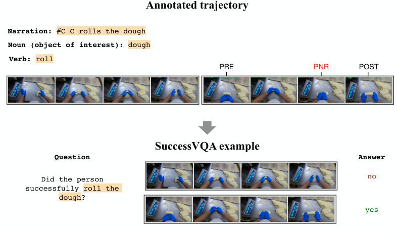

<!-- Start of picture text -->
Annotated trajectory Narration: #C C rolls the dough Noun (object of interest): dough Verb: roll PRE PNR POST SuccessVQA example Question Answer Did the person  no successfully  roll the dough ? yes <!-- End of picture text -->

Figure 8 | Sample Ego4D clip converted to SuccessVQA Examples. Ego4D annotations include PRE, POST and PNR (point of no return) annotations which are then used to generate answers in the SuccessVQA examples. 

These frames do not contain the point of success, but they often demonstrate the beginning of the relevant action. We then generate the questions for SuccessVQA by rephrasing the narrations into questions using Flamingo, as shown in Figure 8. 

Unlike the **IA Playroom** and robotics domains where there is only one relevant task per episode, a single Ego4D “episode" ( _i.e._ video) can have multiple narrations corresponding to different actions. Thus, instead of episode-level accuracy we evaluate success detection accuracy on clips taken from _held out videos_ . In our experiments, **FT Flamingo 3B** finetuned on the SuccessVQA dataset attains 99% training balanced accuracy and 62% test set balanced accuracy. For context, zero shot and 4-shot Flamingo models only achieve 50% and 52%. That is, without finetuning, the Flamingo model is not capable of detecting success. Providing a few examples with few-shot prompting improves performance, but very slightly. However, finetuning Flamingo on the in-domain Ego4D SuccessVQA examples achieves a significant improvement over random chance. That said, there is still a large gap between train and test performance. We find that it is currently difficult to generalise to completely unseen videos and language tasks, so this domain provides an exciting avenue for future work. 

### **7. Conclusion** 

In this work we propose SuccessVQA – a reformulation of success detection that is amenable to pretrained VLMs such as Flamingo. We investigate success detection across a wide range of domains: simulated language-conditioned interactive agents, real-world robotic manipulation, and “in-the-wild" human videos. We find that the pretrained VLM has comparable performance on most in-distribution tasks, and increased robustness across language and visual changes compared to task-specific reward models, and emphasize that our contribution is a more universal success detection task formulation that can be applied easily across vastly different domains. VLMs can be used as policies, see _e.g.,_ Reed et al. (2022), but in this work we have demonstrated that there is also great value in using them as reward models. In contrast to VLMs as policies, VLMs as rewards focuses on the ‘what to do’ and not on ‘how to do it’. We therefore expect such models to transfer more easily than policies when the 

14

<!-- Page 15 -->

Vision-Language Models as Success Detectors 

same task can be accomplished in many ways, and where fine visual details are not necessary ( _e.g.,_ grasp angle for fine motor control). 

That said, this method has some limitations. There still exist some gaps between the Flamingobased reward models and the bespoke reward models in our experiments, especially in some tasks in the robotics environment. Furthermore, inference with a larger VLM is expensive, making online success detection challenging. Lastly, we find that finetuning on a sufficient amount of in-domain data is necessary for robust success detection, as zero-shot or few-shot performance is not sufficient yet. Nonetheless, we are optimistic that further progress on broadly improving VLMs will result in more accurate few-shot success detection. 

To address the limitations of the current approach, improving inference speed or distillation to a smaller model can help with efficient online success detection. Before deployment as a reward model for learning policies, we need further investigations into model accuracy and thorough characterizations of the effects of false positives and false negatives. So far we have experimented with a Flamingo 3B, but larger models might bring further improvements in robustness and generalisation. Another interesting avenue would be to investigate the practicality of in-domain few-shot generalisation to novel tasks ( _e.g.,_ train on ‘insert gear’ tasks, then detect success on ‘remove gear’ after prompting with a few examples). An interesting question is _when_ to choose few-shot or finetuning and how to combine the two. The shared SuccessVQA format can enable shared finetuning across different datasets ( _e.g.,_ combining Ego4D SuccessVQA and VQAv2 (Goyal et al., 2017)) to study the impact of cross-task transfer. Lastly, the flexibility in input format of VLM models allows us to consider success detection tasks where the task is specified visually ( _e.g.,_ with a goal image) or the state is described in language ( _e.g.,_ a dialogue agent) in the same framework as the current work. 

### **Acknowledgements** 

We would like to thank Olivia Watkins and Antoine Miech for careful proofreading of the paper and detailed comments. We would also like to thank the DM Robotics Team, the Interactive Agents team, and the Flamingo team for insightful discussions and research support. 

### **References** 

- P. Abbeel and A. Y. Ng. Apprenticeship learning via inverse reinforcement learning. In _Proceedings of the twenty-first international conference on Machine learning_ , page 1, 2004. 

- J. Abramson, A. Ahuja, I. Barr, A. Brussee, F. Carnevale, M. Cassin, R. Chhaparia, S. Clark, B. Damoc, A. Dudzik, et al. Imitating interactive intelligence. _arXiv preprint arXiv:2012.05672_ , 2020. 

- J. Abramson, A. Ahuja, A. Brussee, F. Carnevale, M. Cassin, F. Fischer, P. Georgiev, A. Goldin, T. Harley, et al. Creating multimodal interactive agents with imitation and self-supervised learning. _arXiv preprint arXiv:2112.03763_ , 2021. 

- J. Abramson, A. Ahuja, F. Carnevale, P. Georgiev, A. Goldin, A. Hung, J. Landon, J. Lhotka, T. Lillicrap, A. Muldal, et al. Improving multimodal interactive agents with reinforcement learning from human feedback. _arXiv preprint arXiv:2211.11602_ , 2022a. 

- J. Abramson, A. Ahuja, F. Carnevale, P. Georgiev, A. Goldin, A. Hung, J. Landon, T. Lillicrap, A. Muldal, B. Richards, et al. Evaluating multimodal interactive agents. _arXiv preprint arXiv:2205.13274_ , 2022b. 

15

<!-- Page 16 -->

Vision-Language Models as Success Detectors 

- R. Akrour, M. Schoenauer, and M. Sebag. APRIL: Active preference learning-based reinforcement learning. In _European Conference on Machine Learning and Principles and Practice of Knowledge Discovery in Databases_ , 2012. 

- J.-B. Alayrac, J. Donahue, P. Luc, A. Miech, I. Barr, Y. Hasson, K. Lenc, A. Mensch, K. Millican, M. Reynolds, et al. Flamingo: a visual language model for few-shot learning. _arXiv preprint arXiv:2204.14198_ , 2022. 

- D. Arumugam, J. K. Lee, S. Saskin, and M. L. Littman. Deep reinforcement learning from policydependent human feedback. _arXiv preprint arXiv:1902.04257_ , 2019. 

- A. Askell, Y. Bai, A. Chen, D. Drain, D. Ganguli, T. Henighan, A. Jones, N. Joseph, B. Mann, N. DasSarma, et al. A general language assistant as a laboratory for alignment. _arXiv preprint arXiv:2112.00861_ , 2021. 

- Y. Bai, A. Jones, K. Ndousse, A. Askell, A. Chen, N. DasSarma, D. Drain, S. Fort, D. Ganguli, T. Henighan, et al. Training a helpful and harmless assistant with reinforcement learning from human feedback. _arXiv preprint arXiv:2204.05862_ , 2022. 

- N. Baram, O. Anschel, I. Caspi, and S. Mannor. End-to-end differentiable adversarial imitation learning. In _International Conference on Machine Learning_ , 2017. 

- R. A. Bradley and M. E. Terry. Rank analysis of incomplete block designs: I. the method of paired comparisons. _Biometrika_ , 39(3/4):324–345, 1952. 

- D. Brown, W. Goo, P. Nagarajan, and S. Niekum. Extrapolating beyond suboptimal demonstrations via inverse reinforcement learning from observations. In _International Conference on Machine Learning_ , 2019. 

- S. Cabi, S. Gómez Colmenarejo, A. Novikov, K. Konyushkova, S. Reed, R. Jeong, K. Zolna, Y. Aytar, D. Budden, M. Vecerik, O. Sushkov, D. Barker, J. Scholz, M. Denil, N. de Freitas, and Z. Wang. Scaling data-driven robotics with reward sketching and batch reinforcement learning. In _Robotics: Science and Systems Conference_ , 2020. 

- A. S. Chen, S. Nair, and C. Finn. Learning generalizable robotic reward functions from" in-the-wild" human videos. _arXiv preprint arXiv:2103.16817_ , 2021. 

- P. F. Christiano, J. Leike, T. Brown, M. Martic, S. Legg, and D. Amodei. Deep reinforcement learning from human preferences. _Advances in neural information processing systems_ , 30, 2017. 

- Y. Cui, S. Niekum, A. Gupta, V. Kumar, and A. Rajeswaran. Can foundation models perform zero-shot task specification for robot manipulation? In _Learning for Dynamics and Control Conference_ , pages 893–905. PMLR, 2022. 

- W. Dai, L. Hou, L. Shang, X. Jiang, Q. Liu, and P. Fung. Enabling multimodal generation on clip via vision-language knowledge distillation. _arXiv preprint arXiv:2203.06386_ , 2022. 

- L. Fan, G. Wang, Y. Jiang, A. Mandlekar, Y. Yang, H. Zhu, A. Tang, D.-A. Huang, Y. Zhu, and A. Anandkumar. Minedojo: Building open-ended embodied agents with internet-scale knowledge. _arXiv preprint arXiv:2206.08853_ , 2022. 

- C. Finn, S. Levine, and P. Abbeel. Guided cost learning: Deep inverse optimal control via policy optimization. In _International Conference on Machine Learning_ , 2016. 

16

<!-- Page 17 -->

Vision-Language Models as Success Detectors 

- J. Fu, K. Luo, and S. Levine. Learning robust rewards with adversarial inverse reinforcement learning. In _International Conference for Learning Representations_ , 2018. 

- A. Glaese, N. McAleese, M. Trebacz, J. Aslanides, V. Firoiu, T. Ewalds, M. Rauh, L. Weidinger, M. Chadwick, P. Thacker, L. Campbell-Gillingham, J. Uesato, P.-S. Huang, R. Comanescu, F. Yang, A. See, S. Dathathri, R. Greig, C. Chen, D. Fritz, J. S. Elias, R. Green, S. Mokrá, N. Fernando, B. Wu, R. Foley, S. Young, I. Gabriel, W. Isaac, J. Mellor, D. Hassabis, K. Kavukcuoglu, L. A. Hendricks, and G. Irving. Improving alignment of dialogue agents via targeted human judgements. arXiv:2209.14375, 2022. 

- Y. Goyal, T. Khot, D. Summers-Stay, D. Batra, and D. Parikh. Making the v in vqa matter: Elevating the role of image understanding in visual question answering. In _Proceedings of the IEEE conference on computer vision and pattern recognition_ , pages 6904–6913, 2017. 

- K. Grauman, A. Westbury, E. Byrne, Z. Chavis, A. Furnari, R. Girdhar, J. Hamburger, H. Jiang, M. Liu, X. Liu, et al. Ego4d: Around the world in 3,000 hours of egocentric video. In _Proceedings of the IEEE/CVF Conference on Computer Vision and Pattern Recognition_ , pages 18995–19012, 2022. 

- D. Hafner, J. Pasukonis, J. Ba, and T. Lillicrap. Mastering diverse domains through world models. _arXiv preprint arXiv:2301.04104_ , 2023. 

- K. He, X. Zhang, S. Ren, and J. Sun. Deep residual learning for image recognition. In _Proceedings of the IEEE conference on computer vision and pattern recognition_ , pages 770–778, 2016. 

- J. Ho and S. Ermon. Generative adversarial imitation learning. In _Advances in Neural Information Processing Systems_ , 2016. 

- X. Hu, Z. Gan, J. Wang, Z. Yang, Z. Liu, Y. Lu, and L. Wang. Scaling up vision-language pre-training for image captioning. _arXiv:2111.12233_ , 2021. 

- B. Ibarz, J. Leike, T. Pohlen, G. Irving, S. Legg, and D. Amodei. Reward learning from human preferences and demonstrations in atari. _Advances in neural information processing systems_ , 31, 2018. 

- C. Jia, Y. Yang, Y. Xia, Y.-T. Chen, Z. Perekh, H. Pham, Q. V. Le, Y. Sung, Z. Li, and T. Duerig. Scaling up visual and vision-language representation learning with noisy text supervision. In _International Conference on Machine Learning_ , 2021. 

- W. B. Knox and P. Stone. Tamer: Training an agent manually via evaluative reinforcement. In _2008 7th IEEE international conference on development and learning_ , pages 292–297. IEEE, 2008. 

- J. Y. Koh, R. Salakhutdinov, and D. Fried. Grounding language models to images for multimodal generation. _arXiv preprint arXiv:2301.13823_ , 2023. 

- K. Lee, L. Smith, and P. Abbeel. Pebble: Feedback-efficient interactive reinforcement learning via relabeling experience and unsupervised pre-training. _arXiv preprint arXiv:2106.05091_ , 2021. 

- J. Li, D. Li, S. Savarese, and S. Hoi. Blip-2: Bootstrapping language-image pre-training with frozen image encoders and large language models. _arXiv preprint arXiv:2301.12597_ , 2023. 

- Y. Li, J. Song, and S. Ermon. InfoGAIL: Interpretable imitation learning from visual demonstrations. In _Advances in Neural Information Processing Systems_ , 2017. 

- H. Luo, L. Ji, B. Shi, H. Huang, N. Duan, T. Li, J. Li, T. Bharti, and M. Zhou. Univl: A unified video and language pre-training model for multimodal understanding and generation. _. arXiv:2002.06353_ , 2020. 

17

<!-- Page 18 -->

Vision-Language Models as Success Detectors 

- Y. J. Ma, S. Sodhani, D. Jayaraman, O. Bastani, V. Kumar, and A. Zhang. Vip: Towards universal visual reward and representation via value-implicit pre-training. _arXiv preprint arXiv:2210.00030_ , 2022. 

- J. MacGlashan, M. K. Ho, R. Loftin, B. Peng, G. Wang, D. L. Roberts, M. E. Taylor, and M. L. Littman. Interactive learning from policy-dependent human feedback. In _International Conference on Machine Learning_ , pages 2285–2294. PMLR, 2017. 

- P. Mahmoudieh, D. Pathak, and T. Darrell. Zero-shot reward specification via grounded natural language. In _ICLR 2022 Workshop on Generalizable Policy Learning in Physical World_ , 2022. 

- J. Menick, M. Trebacz, V. Mikulik, J. Aslanides, F. Song, M. Chadwick, M. Glaese, S. Young, L. CampbellGillingam, G. Irving, and N. McAleese. Teaching language models to support answers with verified quotes. arXiv:2203.11147, 2022. 

- J. Merel, Y. Tassa, S. Srinivasan, J. Lemmon, Z. Wang, G. Wayne, and N. Heess. Learning human behaviors from motion capture by adversarial imitation. arXiv:1707.02201, 2017. 

- V. Mnih, K. Kavukcuoglu, D. Silver, A. Graves, I. Antonoglou, D. Wierstra, and M. Riedmiller. Playing atari with deep reinforcement learning. _arXiv preprint arXiv:1312.5602_ , 2013. 

- R. Nakano, J. Hilton, S. Balaji, J. Wu, L. Ouyang, C. Kim, C. Hesse, S. Jain, V. Kosaraju, W. Saunders, X. Jiang, K. Cobbe, T. Eloundou, G. Krueger, K. Button, M. Knight, B. Chess, and J. Schulman. Webgpt: Browser-assisted question-answering with human feedback. arXiv:2112.09332, 2022. 

- A. Y. Ng, S. Russell, et al. Algorithms for inverse reinforcement learning. In _Icml_ , volume 1, page 2, 2000. 

- L. Ouyang, J. Wu, X. Jiang, D. Almeida, C. L. Wainwright, P. Mishkin, C. Zhang, S. Agarwal, K. Slama, A. Ray, et al. Training language models to follow instructions with human feedback. _arXiv preprint arXiv:2203.02155_ , 2022. 

- A. Radford, J. W. Kim, C. Hallacy, A. Ramesh, G. Goh, S. Agarwal, G. Sastry, A. Askell, P. Mishkin, J. Clark, et al. Learning transferable visual models from natural language supervision. In _International Conference on Machine Learning_ , pages 8748–8763. PMLR, 2021. 

- S. Reddy, A. Dragan, S. Levine, S. Legg, and J. Leike. Learning human objectives by evaluating hypothetical behavior. In _International Conference on Machine Learning_ , pages 8020–8029. PMLR, 2020. 

- S. Reed, K. Zolna, E. Parisotto, S. G. Colmenarejo, A. Novikov, G. Barth-Maron, M. Gimenez, Y. Sulsky, J. Kay, J. T. Springenberg, T. Eccles, J. Bruce, A. Razavi, A. Edwards, N. Heess, Y. Chen, R. Hadsell, O. Vinyals, M. Bordbar, and N. de Freitas. A generalist agent. _arXiv preprint arXiv:2205.06175_ , 2022. 

- D. Sadigh, A. D. Dragan, S. Sastry, and S. A. Seshia. Active preference-based learning of reward functions. In _Robotics: Science and Systems Conference_ , 2017. 

- M. Schoenauer, R. Akrour, M. Sebag, and J.-C. Souplet. Programming by feedback. In _International Conference on Machine Learning_ , 2014. 

- A. Singh, L. Yang, K. Hartikainen, C. Finn, and S. Levine. End-to-end robotic reinforcement learning without reward engineering. In _Robotics: Science and Systems Conference_ , 2019. 

- N. Stiennon, L. Ouyang, J. Wu, D. M. Ziegler, R. Lowe, C. Voss, A. Radford, D. Amodei, and P. Christiano. Learning to summarize from human feedback. In _Advances in Neural Information Processing Systems_ , 2020. 

18

<!-- Page 19 -->

Vision-Language Models as Success Detectors 

- A. M. H. Tiong, J. Li, B. Li, S. Savarese, and S. C. Hoi. Plug-and-play vqa: Zero-shot vqa by conjoining large pretrained models with zero training. _arXiv preprint arXiv:2210.08773_ , 2022. 

- S. Tunyasuvunakool, A. Muldal, Y. Doron, S. Liu, S. Bohez, J. Merel, T. Erez, T. Lillicrap, N. Heess, and Y. Tassa. dm_control: Software and tasks for continuous control. _Software Impacts_ , 6, 2020. 

- J. Xu, T. Mei, T. Yao, and Y. Rui. Msr-vtt: A large video description dataset for bridging video and language. In _Proceedings of the IEEE conference on computer vision and pattern recognition_ , pages 5288–5296, 2016. 

- Y. Zhu, Z. Wang, J. Merel, A. A. Rusu, T. Erez, S. Cabi, S. Tunyasuvunakool, J. Kramár, R. Hadsell, N. de Freitas, and N. Heess. Reinforcement and imitation learning for diverse visuomotor skills. In _Robotics: Science and Systems Conference_ , 2018. 

19

<!-- Page 20 -->

Vision-Language Models as Success Detectors 

### **A. Simulated household domain** 

To evaluate agent policies on the standardized set of scenarios (STS), each agent is first given a period of context to replay up to a "continuation point", after which the agent policy is used to complete the trajectory. Each continuation is then evaluated offline by human annotators as either successful or failure, along with the point at which success or failure occurs. These human annotations are then used to rank agent policies, using the proportion of successful annotations they receive. For more details on the evaluation procedure, see Abramson et al. (2022b). 

#### **A.1. Baseline Evaluation Models** 

While human evaluations provide the ground truth signal for assessing agent capabilities, the cost of annotations scales directly with the number of evaluations for each new task and agent. Thus, there has been interest in automating the evaluation protocol to enable evaluation to scale over time. Ideally, an automated evaluation model will condition on an episode of agent behaviour and the input task utterance, and output a classification whether or not the task is successful. 

Currently two baseline evaluation models have been developed for the STS: whole-episode and autoregressive models. In both cases, the reward annotations for a particular episode are aggregated using majority voting. 

#### **Whole episode evaluation models.** 

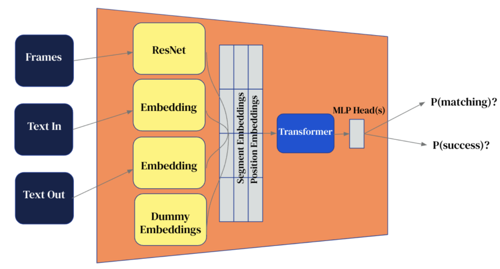

Figure 9 | Whole Episode Bespoke Evaluation Model 

For these models, we first preprocess an STS episode by downsampling it to 32 frames and tokenizing the text instruction and agent responses. The images are then embedded with a ResNet101, the input and output text are embedded, and these embeddings are concatenated together and fed to a transformer with 16 layers and 16 attention heads. The transformer output is fed through two MLP heads: one to predict the likelihood of the episode being successful, P(success), and an auxiliary contrastive loss, P(matching). P(success) is supervised with the aggregated reward annotations, and 

20

<!-- Page 21 -->

Vision-Language Models as Success Detectors 

P(matching) is trained to predict whether an instruction matches the episode or has been shuffled. 

**Autoregressive evaluation models.** The autoregressive evaluation models use the same architec- 

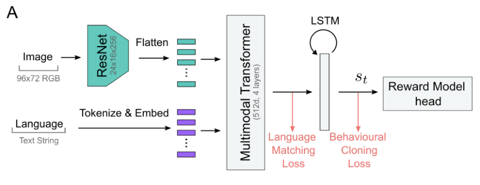

Figure 10 | Autoregressive Bespoke Evaluation Model 

ture as the Playhouse agents, which takes inputs on a per-frame basis, rather than at the episode level. The model embeds the images and language for each frame, passes the embeddings to a multimodal transformer followed by an LSTM, and is asked to predict success or no-success on a per frame basis. The success of an entire episode is then determined by whether or not any single frame was predicted to be successful. 

|Model|Test 1: unseen episodes|Test 2: unseen behaviour|Test 3: unseen language|
|---|---|---|---|
|Baseline Whole Episode Model|80.6%|**85.4%**|49.9%|
|Baseline Autoregressive Model|71.7%|70.4%|(not tested)|
|Flamingo 3B|50%|50%|50%|
|**FT Flamingo 3B**|**83.4%**|85.0%|**59.3%**|

Table 7 | Zero-shot episode-level balanced accuracies for **IA Playroom** STS evaluation models. For reference, human level balanced accuracy is around 88%. 

21

<!-- Page 22 -->

Vision-Language Models as Success Detectors 

### **B. Robotics domain** 

#### **B.1. Ground truth in robotics domain** 

Figure 11 shows how the ground truth success and failure labels are assigned to the full episodes. For an episode to be successful, it must start in a failure state and terminate in a success state. 

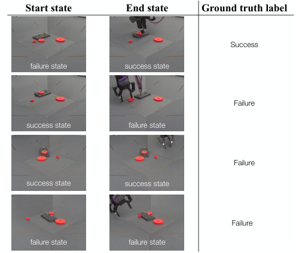

<!-- Start of picture text -->
Start state End state Ground truth label Success failure state success state Failure success state failure state Failure success state success state Failure failure state failure state <!-- End of picture text -->

Figure 11 | **Ground truth labels for robotics tasks.** The episode is considered positive only when it starts in a failure state and ends in a success state, all other episodes are considered as negative. 

#### **B.2. Data Efficiency in robotics domain** 

We investigate whether the pretraining used for Flamingo makes it more amenable to accurate success detection in the lower-data regime. For this set of experiments, we train on only 100-200 episodes (100x less than the tens of thousands of episodes used in the above experiments) per task and evaluate on the same in-domain test set. As shown in Table 8, for five of the six tasks the Flamingo-based model is less affected by the smaller dataset than the ResNet-based model. 

|Balanced Accuracy|Insert Small|Insert Medium|Insert Large|
|---|---|---|---|
|**bespoke SD**|68.7%(-29.2%)|70.2%(-28.3%)|89.7%(-9.4%)|
|**FT Flamingo 3B**|**77.6%**(-18.3)|**85.3%**(-9.1%)|**93.2%**(-1.8%)|
||Remove Small|Remove Medium|Remove Large|
|**bespoke SD**|**86.7%**(-10.6%)|**95.3%**(-3.4%)|**95.7%**(-2.7%)|
|**FT Flamingo 3B**|70.5%(-11.6%)|86.7%(+3.3%)|87.1%(-0.0%)|

Table 8 | Data Efficiency – train on 100-200 episodes, evaluate on 50-60k episodes. 

22
