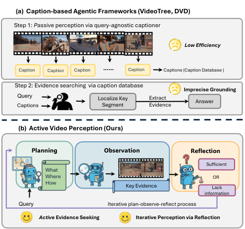
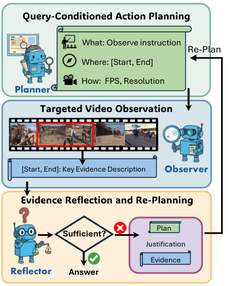
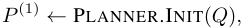
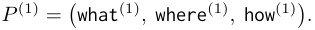
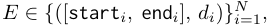
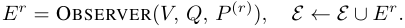
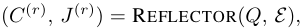
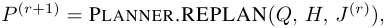
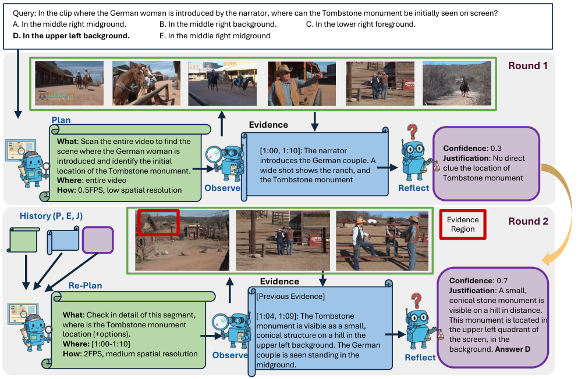

# Wang_Active_Video_Perception_Iterative_Evidence_Seeking_for_Agentic_Long_Video_CVPRF_2026_paper

[Original PDF](../Wang_Active_Video_Perception_Iterative_Evidence_Seeking_for_Agentic_Long_Video_CVPRF_2026_paper.pdf)

Pages: 12

> Automatically converted from PDF. Check the original for exact equations, symbols, table alignment, and figure details.

<!-- Page 1 -->

This CVPR Findings paper is the Open Access version, provided by the Computer Vision Foundation. Except for this watermark, it is identical to the accepted version; the final published version of the proceedings is available on IEEE Xplore. 

# **Active Video Perception: Iterative Evidence Seeking for Agentic Long Video Understanding** 

Ziyang Wang1_,_2* Honglu Zhou1 Shijie Wang1 Junnan Li1 Caiming Xiong1 Silvio Savarese1 Mohit Bansal2 Michael S. Ryoo1 Juan Carlos Niebles1 

1Salesforce AI Research 

2University of North Carolina at Chapel Hill 

https://activevideoperception.github.io/ 

## **Abstract** 

_Long video understanding (LVU) is challenging because answering real-world queries often depends on sparse, temporally dispersed cues buried in hours of mostly redundant and irrelevant content. While agentic pipelines improve video reasoning capabilities, prevailing frameworks rely on a query-agnostic captioner to perceive video information, which wastes computation on irrelevant content and blurs fine-grained temporal and spatial information. Motivated by active perception theory, we argue that LVU agents should actively decide what, when, and where to observe, and continuously assess whether the current observation is sufficient to answer the query. We present_ **_Active Video Perception_** _(_ AVP _), an evidence-seeking framework that treats the video as an interactive environment and acquires compact, queryrelevant evidence directly from pixels. Concretely,_ AVP _runs an iterative plan–observe–reflect process with MLLM agents. In each round, a planner proposes targeted video interactions, an observer executes them to extract time-stamped evidence, and a reflector evaluates the sufficiency of the evidence for the query, either halting with an answer or triggering further observation. Across five LVU benchmarks,_ AVP _achieves highest overall accuracy with significant improvements. Notably,_ AVP _outperforms the best agentic method by_ **_5.7%_** _in average accuracy while only requires_ **_18.4%_** _inference time and_ **_12.4%_** _input tokens._ 

## **1. Introduction** 

From streaming platforms to TV programs, video has become a primary medium for capturing and conveying information. However, long video understanding (LVU) remains challenging because it demands the ability to localize and 

> *Work done during internship at Salesforce. 

<!-- Start of picture text -->
(a)  Caption-based Agentic Frameworks (VideoTree, DVD) Step 1:  Passive  perception via query-agnostic captioner Low Efficiency Caption Caption Caption …… Caption Captions (Caption Database ) Step 2: Evidence searching  via caption database Imprecise Grounding Query Localize Key  Extract  Answer Captions Segment Evidence (b)  Active Video Perception (Ours) Planning Observation Reflection Sufficient What Where OR How Key Evidence Lack information Query Iterative plan-observe-reflect process Active  Evidence Seeking Iterative Perception via Reflection <!-- End of picture text -->

Figure 1. **Motivation of Active Video Perception** . Prior methods follow a _passive_ perception paradigm which leverage queryagonistic captioner to perceive the video information, leading to low efficiency and imprecise visual grounding. Instead, we _actively_ perceive query-relevant content by treating the long video as an interactive environment to be explored in a goal-directed manner. 

integrate sparse, temporally dispersed cues across long time spans. Although recent multimodal large language models (MLLMs) [3, 23–25, 36, 53, 55, 61] substantially improve visual recognition, naively applying them to densely sampled, full-length videos is both computationally costly and brittle for complex queries: most video tokens are redundant, while the brief, localized evidence that actually matters is diluted or overlooked in the long sequence. 

These limitations have motivated a recent surge of agentic approaches for long video understanding [62, 65, 75, 78]. Rather than treating the video as a single monolithic input, 

9088

<!-- Page 2 -->

these methods use LLMs to orchestrate perception and reasoning over the video through planning. However, recent leading methods [46, 82, 88] still rely on captioners to convert visual information into text space as the primary interface for LLM reasoning and tool calling. This caption-based framework leverages LLMs’ strengths in text processing but introduces two inherent limitations: 

1. **High Computational Cost:** Query-agnostic captioning generates large amounts of irrelevant information, expending computation on unrelated content and resulting in low efficiency. 

2. **Imprecise Grounding via Captions:** Existing approaches use captions to localize key events, which may discard fine-grained temporal and spatial cues and weaken causal tracing. 

These limitations underscore the need for an agentic framework that adaptively focuses on informative video regions, seeks query-related evidence directly over video pixels while maintaining high efficiency. 

We take inspiration from how humans inspect long videos: we do not need to watch every frame; instead, we plan our observation based on the query. For instance, given a question about a specific plot, we first skim the video for coarse cues (plot localization), then take targeted observation by focusing on the key video regions for detail clues. Active perception theory [1, 4, 5] formalizes this behavior: _“An agent is an active perceiver if it knows why it wishes to sense, and then chooses what to perceive, and determines how, when and where to achieve that perception”_ . Even though active perception concept is mainly used in robotics domain [44, 50, 69], We argue that agentic LVU frameworks can similarly benefit from query-driven, temporally grounded observation that decides what, when, and where to look, while continually assessing whether the accumulated evidence is sufficient for the query or whether further observation is required. 

Building on this view, we propose **Active Video Perception** (AVP), an agentic evidence seeking framework for long video understanding. As shown in Fig. 1, rather than passively perceiving the video by captioning, AVP treats the video as an interactive environment and actively decides what/where/how to observe the video to acquire the queryrelated information. This targeted observation design allows AVP to focus on the key informative segments, avoid redundant processing over static or irrelevant content, ultimately improving both efficiency and reliability on complex longhorizon queries. 

Since complex queries often depend on sparse or ambiguous cues that cannot be resolved in a single round of observation, AVP adopts an iterative plan–observe–reflect process with MLLM agents. In each round, a planner proposes targeted interactions with the video by deciding what to inspect, where to focus, and at what granularity. Then, a observer 

executes these plans to extract compact, time-stamped evidence. Finally, a reflector evaluates the query-sufficiency of the extracted evidence and decide whether additional round of observation is needed. If the extracted evidence is insufficient, it appends the current plan, evidence, and justification to the running history to guide the planner in deciding the next plan. This closed-loop process enables AVP to progressively refine its focus, revisit uncertain moments, and allocate computation adaptively, leading to more efficient processing and reliable reasoning on long, complex videos. 

We demonstrate the effectiveness and efficiency of AVP by evaluating it on five long video understanding benchmarks, including MINERVA [34], LVBench [70], VideoMME [16], MLVU [84] and LongVideoBench [68]. Compared to the existing agentic approaches, AVP attains higher accuracy while using substantially less compute by formulating LVU as goal-conditioned observations. Specifically, compared to the leading agentic method DeepVideoDiscovery (DVD) [82], AVP achieves an average accuracy gain of **5.7%** . What’s more, on LVBench, AVP achieves better performance while only consuming **18.4%** inference time and **12.4%** input tokens compared to DVD, validating the efficiency of AVP. We further conduct extensive ablation studies that highlight and justify the key design choices of AVP. 

## **2. Related Work** 

**Long Video Understanding** The advancement in long video understanding (LVU) benchmarks [7, 16, 68, 70, 84] has extended video reasoning problem from short clips to realistic scenarios, involving multi-minute or hour-long videos. To address this, previous video-specific MLLMs [27, 42, 43, 56, 58, 83] mainly focus on the challenge of excessive token inputs by extending the context length [9, 81], reducing the video tokens [26, 45, 49, 63] or keyframe selection [2, 6, 51, 59, 72, 74, 76, 87]. Notably, VAP [30] also introduce the concept of “action perception” to LVU task, they treats key frame selection as data acquisition in active perception and leverages a lightweight text-conditioned video generation model to represent prior world knowledge. Instead, AVP treats LVU as query-driven evidence seeking in video environments. As a result, AVP tackles complex LVU task by focus perception in key regions, achieves significantly better efficiency. 

Recently, inspired by the great success of DeekSeekR1 [10], several works [15, 57, 64, 67] explore the Chainof-thoughts video reasoning model. Later works [17– 19, 39, 52, 60, 77, 80] explore the idea of “Thinking with Video”, which incorporate visual CoT strategy to conduct coarse-to-fine video exploration. Compared to these methods, AVP has two clear advantages: (1) query-adaptive, previous work mainly follows a coarse-to-fine schema with fixed FPS/resolution setup, instead, AVP decides what/where/how 

9089

<!-- Page 3 -->

to observe the video based on the query; (2) training-free, instead of generating large-scale training samples with reasoning trace, we directly employ an agentic approach and significantly reduce compute cost. 

**Agentic Frameworks for Long Video Understanding** LLM-based agents that combine reasoning, planning, and action have been widely studied [12, 48, 73] in NLP domain, which also draws growing attention in LVU community. To decouple the complex LVU task, early agentic frameworks [13, 20, 21, 31, 41, 65, 66, 78, 79] adopt a captioner–LLM design: video segments are converted into captions, which an LLM then uses the generated caption to answer the video query. Meanwhile, several works [14, 22, 28, 32, 33, 47, 86] utilize the idea of “visual programming”, decompose the complex query into multiple steps to leverage expert modules. Reflection-based frameworks [8, 85] add a verification agent after the initial answering process to refine the reasoning. . Building on these works, recent studies [8, 11, 29, 40, 46, 71, 82, 88] aim to improve evidence retrieval and reasoning efficiency in text space. Notably, VGent [46] constructs a caption-based graph to enable longrange retrieval and relational reasoning across segments. VideoLucy [88]introduces a memory backtracking mechanism that allows the model to revisit earlier multi-scale text captions during multi-step reasoning. Deep Video Discovery [82] uses tool-based search to iteratively refine textual evidence over long videos. Instead of relying on captioners, AVP reasons directly over visual inputs through an iterative plan–observe–reflect process, selectively watching only what the query requires and maintaining a compact evidence record. This active, iterative video observation design preserves fine-grained grounding while avoiding the redundancy and overhead of caption-based LVU pipelines. 

## **3. Method** 

We present **Active Video Perception** (AVP), an iterative evidence seeking framework for agentic LVU. AVP is inspired by the concept of _active perception_ [1, 4, 5], which argues “a complete artificial agent necessarily must include the ability of knowing why it wishes to sense, and then choosing what to perceive, and determining how, when and where to achieve that perception”. Through the lens of active perception, we formulate LVU task as query-driven evidence seeking in video environments, where the LVU agent iteratively decides what, where and how to interact with the video to find the key evidence based on previous observation. 

Concretely, as shown in Fig. 2, given a query _Q_ and a video _V_ , AVP runs an iterative plan-observe-reflect process with MLLM agents. In each round, a planner first proposes observation plan by choosing what to inspect, where to focus, and how to sample. An observe agent executes that plan to extract compact, time-stamped evidence by observing the 

<!-- Start of picture text -->
Query-Conditioned Action Planning What: Observe instruction Re-Plan Where: [Start, End] How:  FPS, Resolution Planner Targeted Video Observation [Start, End]: Key Evidence Description Observer Evidence Reflection and Re-Planning Plan Sufficient? Justification Evidence Reflector Answer <!-- End of picture text -->

Figure 2. **Framework of Active Video Perception** (AVP). AVP operates by an iterative plan-observe-reflect process with MLLM agents. At each round, the planner decide what/where/how to interact with the video, the observer extract structured query-related evidence by executing the plan and the reflector evaluates the extracted evidence to decide whether an additional round is need. 

video purposefully. A reflector verifies evidence against the query to estimate the confidence; if it exceeds the confidence threshold, AVP outputs the answer and stops, otherwise it returns a justification to guide the next round of observation planning. We iterate this process until either a sufficiently confident answer is obtained or the round limit is reached. We introduce each component in detail as follow. 

### **3.1. Query-Conditioned Action Planning** 

Inspired by active perception concept, instead of passively processing frames uniformly or converting into caption list, AVP first plans deciding what, where, and how to observe the long video to obtain the query-related evidence. Specifically, AVP leverage a planner (PLANNER) to decide what to look for, where to look, and how to observe in order to solve the give query. 

**Initial Plan.** At round _r_ =1, given query _Q_ and video _V_ , the PLANNER instantiates a concrete observation specification that states what to observe, the region to inspect, and how to sample. We initialize 

and represent it as 

9090

<!-- Page 4 -->

- **what** is a brief, query-conditioned instruction naming the key evidence to seek (e.g., “locate the moment the coach enters,” “determine who hands over the box,” “verify the scoreboard change”). For complex query which requires multi-step reasoning, we prompt the PLANNER to first plan the initial observation and leave the following steps in the next rounds. By decomposing the complex queries, AVP achieves better handling in multi-hop reasoning and temporally dispersed evidence seeking. 

- **where** is a targeted temporal region [ _ts, te_ ]. It is seeded from: (i) explicit timestamps in _Q_ (e.g., “1:00–1:30”), (ii) soft textual cues (“opening scene,” “final minutes”). When no prior is available, we first sweep the entire video at low cost (low fps and spatial_res) to gather coarse evidence. Across rounds, this region can be tightened or shifted based on the Reflector’s feedback, enabling coarseto-fine localization without dense scanning. 

- **how** specifies sampling granularity for the long video observation, where how = (fps _,_ spatial_res). The PLANNER determines the granularity of the targeted evidence and accordingly decides the sampling strategy. By default, it adopts coarse settings (lower fps and spatial_res) to perform low-cost exploration across the video and quickly identify potential evidence regions. When finer details are required—such as subtle object interactions or small spatial cues, the PLANNER increases sampling density to ensure more precise perception. This adaptive design allows AVP to allocate computation efficiently across granularities while maintaining high fidelity. 

The resulting _P_ serves as a compact, executable target observation that guides the Observer on what to looking for, which region of the video to inspect, and how to sample for efficient, query-focused observation. 

### **3.2. Targeted Video Observation** 

Once the plan is generated, the observer (OBSERVER, a MLLM) executes the plan to gather detailed, time-stamped evidence from the video. Specifically, in round _r_ , given the plan _P_(_r_) = (what(_r_) _,_ where(_r_) _,_ how(_r_) ), the OBSERVER inputs the the query _Q_ and instruction in what(_r_) , the video segment defined by the temporal where and uses the sampling strategy in how (fps and spatial resolution). Instead of generating free-form text responses, the OBSERVER is prompted to produce structured, timestamp-aware evidence text in the form of 

where each _di_ is a concise, query-conditioned description of the visual event within the time interval [start _i,_ end _i_ ]. Specifically, we maintain an evidence list _E_ that accumulates evidence across rounds. At each round _r_ , the OBSERVER generates new evidence _E__r_ and append it to the cumulative 

evidence list: 

This cumulative evidence list _E_ serves as the working memory of AVP, allowing the reflector to assess sufficiency based on all past evidence and guiding the PLANNER’s subsequent updates. Compared with free-form captioning, this design yields more stable, query-relevant evidence and leads to better grounded reasoning over long videos. This targeted video observation design allows AVP to perceive only the most query-relevant portions of the video, keeping it efficient and avoiding redundant or irrelevant information. 

### **3.3. Evidence Reflection and Re-Planning** 

After each observation round, AVP employs a reflector (REFLECTOR) to evaluate the sufficiency of the accumulated evidence and decide whether additional observation is required. The REFLECTOR verifies how well the collected evidence supports an answer, and when confidence is insufficient, it provides feedback for the next round of planning. 

**Evidence Reflection.** At round _r_ , given the query _Q_ and the current cumulative evidence list _E_ , the REFLECTOR jointly produces a query confidence score _C_(_r_) and a justification _J_(_r_) : 

where _C_(_r_) _↑_ [0 _,_ 1] measures the confidence in evidence sufficiency to answer the given query, and _J_(_r_) specifies which answer the current evidence supports or what information is still missing. If the confidence is higher than the confidence threshold _ω_ conf, the REFLECTOR directly extracts the final answer from _J_(_r_) ; otherwise, the justification highlights missing or uncertain cues to guide the next round of planning step. 

**History Update and Re-Planning.** When confidence remains below the threshold, the Reflector appends the current observation and justification to the running history _H_ . The history provides the PLANNER with a concise summary of what has been inspected, verified, or left unresolved. The PLANNER then refines its next plan using this feedback: 

shifting attention toward the regions, entities, or temporal spans identified as uncertain by the Reflector. 

By iteratively running the plan-observe-reflect process, AVP forms a closed-loop perception–reasoning cycle that continuously refines its focus until the gathered evidence becomes sufficient. This iterative design allows the system to adaptively reason over long videos, reducing computation, and maintaining grounded, query-aligned understanding. We present full algorithm in Algorithm 1. 

9091

<!-- Page 5 -->

**Algorithm 1: Active Video Perception** (AVP) 

|**In** **O** |**puts :**Video_V_, Query_Q_, Max Rounds_R_max, Confidence Threshold_ω_conf **utput :**Answer_A_, Justification_J_, Evidence List_E_, History_H_    |
|---|---|
|**1** _P_|(1) _→_PLANNER.INIT(_Q_); _E →_[ ]; _H →_[ ] // Init plan, evidence list and history|
|**2 fo** **3**|**r**_r →_1**to**_R_max **do** _E_(_r_) _→_OBSERVER(_V, Q, P_ (_r_))|
|**4**|_E →E ↑E_(_r_) // accumulate this round’s evidence|
|**5**|(_C_(_r_)_, J_(_r_))_→_REFLECTOR(_Q, E_) // evidence reflection: confidence & justification |
|**6**|**if**_C_(_r_) _↓ω_conf **then**|
|**7** **8**|_A →_REFLECTOR.EXTRACTANSWER(_J_(_r_)) // answer is entailed by justification **return**_A, J_(_r_)_, E, H_|
|**9**|**if**_r_ =_R_max **then**|
|**10**|_A →_REFLECTOR.FORCEANSWER(_Q, E_) // force to give answer on final round |
|**11**|**return**_A, J_(_r_)_, E, H_|
|**12**|_H →H ↑{_(_P_ (_r_)_, E_(_r_)_, J_(_r_))_}_ // append plan & evidence & justification to history|
|**13**|_P_ (_r_+1) _→_PLANNER.REPLAN(_Q, H, J_(_r_)) // re-plan for additional observation|

## **4. Experimental Setup** 

### **4.1. Datasets** 

We evaluate AVP on five diverse long video understanding benchmarks: 

(1) **MINERVA** [34] is a recent challenging video reasoning benchmark consisting of 1515 hand-crafted questions. The average video duration is 12 minutes. 

(2) **LV-Bench** [70] is a benchmark specifically designed for long video understanding which includes 1549 multiplechoice questions across 103 hour-long videos. 

(2) **MLVU** [84] is a multi-task Long Video Understanding Benchmark for the comprehensive and in-depth evaluation of LVU. We use the multiple-choice QA samples from the MLVU test split, containing 2175 video QA samples with more than 15 minutes average video duration. 

(4) **Video MME** [16] is a comprehensive evaluation benchmark for video analysis from short to long videos (average min for long split video). We use the standard split of VideoMME, which contains 2700 samples designed for both perception and reasoning tasks (900 samples with 41min average duration for the long split). 

(5) **LongVideoBench (LVB)** [68] is a video QA benchmark that highlights referred reasoning questions, which are dependent on long frame inputs. We test on the public validation split, which contains 1337 video reasoning questions (533 samples with 15-60 min video for long split). 

### **4.2. Evaluation Metrics** 

We evaluate AVP under the multiple-choice QA setting. We use standard accuracy metrics for all experiments. We do not include auxiliary subtitle for all benchmarks. 

### **4.3. Implementation Details** 

We adopt Gemini-2.5-Pro1 [53] as our default MLLM agent for all components. We also provide the results with lightweight Gemini-2.5-Flash model in Tab. 1 and Tab. 4. We provided more ablation with different backbone models (including open-source models) in appendix. For fair comparison, we fix the max input token as 128 _K_ . If the input video (region) exceeds this budget, we uniformly sample the max frames that within the token limit. For spatial token setup (spatial_res), we follow Gemini’s MediaResolution setup to have 2 scale (low, medium, high), while low and medium is 66 and 258 tokens per frame, respectively. We set the max rounds _R_ max as 3 and confidence threshold _ω_ conf as 0 _._ 7. We provide additional analysis for the design choices in Sec. 5.2.2. We provided more implementation details (including detailed prompts) and analysis in appendix. 

## **5. Results** 

### **5.1. Main Results on Long Video Benchmarks** 

Tab. 1 presents a comprehensive comparison of AVP against existing general-purpose MLLMs [35, 37, 53, 55], videospecific MLLMs [18, 45, 63, 67], and agentic video frameworks [8, 46, 62, 65, 79, 82, 88] across five video understanding benchmarks: MINERVA [34], LVBench [70], MLVU [84], Video-MME [16] and LongVideoBench [68]. 

**Comparison with MLLMs.** Among general-purpose multimodal LLMs, proprietary systems such as Gemini-2.5-Pro [53] and Seed-1.5-VL [55] achieve strong overall results but still fall short of our proposed AVP. In particular, AVP (w/ 

> 12025-06-17 version 

9092

<!-- Page 6 -->

|Methods|MINERVA|LVBench|MLVU|Video|-MME|LongVid|eoBench|
|---|---|---|---|---|---|---|---|
||Overall|Overall|Test|Overall|Long|Val|Long|
|_General-Purpose MLLMs_||||||||
|Seed-1.5-VL [55]|-|64.6|82.1|77.9|-|74.4|-|
|Qwen-3-VL [54]|-|67.7|**84.3**|79.2|-|-|-|
|GPT-4o [35]|45.5|48.9|54.9|71.9|65.3|66.7|60.9|
|GPT-4.1 [37]|54.0|63.4|-|72.0|-|-|-|
|Gemini-2.5-Flash [53]|54.6|56.7|72.4|74.2|69.1|66.2|61.8|
|Gemini-2.5-Pro [53]|61.8|67.4|79.6|82.4|77.6|69.8|66.6|
|_Video-Specific MLLMs_||||||||
|LongVU [45]|-|-|65.4|60.6|59.5|-|-|
|AdaReTaKe [63]|-|53.3|78.1|73.5|65.0|67.0|-|
|Video-RTS [67]|37.8|43.2|-|63.0|54.1|56.6|52.2|
|FrameMind [18]|-|-|48.6|60.9|57.5|-|-|
|_Agentic Video Frameworks_||||||||
|VideoAgent [62]|-|29.3|64.4|-|46.4|-|-|
|VideoTree [65]|40.2|28.8|60.4|60.6|54.2|-|-|
|SiLVR [79]|44.4|-|45.2|74.1|77.7|-|-|
|VideoLucy [88]|-|58.8|76.1|72.5|66.8|-|-|
|Vgent [46]|-|-|72.1|68.9|-|59.7|-|
|LVAgent [8]|-|-|83.9|81.7|74.3|80.0|-|
|DeepVideoDiscovery (DVD) [82]|-|74.2|-|-|67.3|71.6|68.6|
|_Active Video Perception (Ours)_||||||||
|AVP w Gemini-2.5-Flash|56.9 **(+2.3)**|63.8 **(+7.1)**|74.1 **(+1.7)**|81.2 **(+7.0)**|76.7 **(+7.6)**|70.2 **(+4.0)**|65.5 **(+3.7)**|
|AVP w Gemini-2.5-Pro|**65.6 (+3.8)**|**74.8 (+7.4)**|**84.3 (+4.7)**|**85.3 (+2.9)**|**81.9 (+4.3)**|**73.4 (+3.6)**|**70.0 (+3.4)**|

Table 1. Comparison with general-purpose MLLMs, Video-specific MLLMs, and agentic video frameworks on five long video understanding benchmarks (MINERVA, LVBench, MLVU, Video-MME, LongVideoBench). We **bold** the best and <u>underline</u> the second-best result in each column. Results shows that AVP achieves best overall accuracy on all datasets across different baselines, achieving significant improvements on its backbone model (in blue) across all benchmark. We gray out the results that use auxiliary subtitle information. 

Gemini-2.5-Pro) surpasses the state-of-the-art Gemini-2.5Pro model [53] by **4.5%** average accuracy over all benchmarks, demonstrating that direct inference over full length remains insufficient for complex, long-horizon queries that require targeted evidence seeking. AVP (w/ Gemini-2.5Flash) also outperforms its backbone by **4.4%** , showing generalization ability of the proposed framework in weaker backbone MLLMs. Meanwhile, AVP significantly outperforms the video-specific MLLMs, including compression-based methods [45, 63] and (visual) Chain-of-Thoughts methods [18, 67]. This result highlights the active perception concept for long video understanding and encourages future research. 

**Comparison with Agentic Frameworks.** Within the class of agentic video reasoning systems, AVP consistently achieves the best (or second-best) results across all benchmarks. We compare AVP with six recent agentic video frameworks, including VideoAgent [62], VideoTree [65], SiLVR [79], VideoLucy [88], LVAgent [8] and DeepVideoDiscovery (DVD) [82]. We find that AVP achieves best performance against all baseline methods and signifi- 

cant improvement compared to the backbone model in all benchmarks. Comparing to the recent VideoLucy and DVD methods, AVP achieves **10.5%** and **5.7%** average improvements while both using strong LLM backbones (DeepSeekR1 [10] for VideoLucy, and OpenAI-o3 [38] for DVD). We also compared the efficiency in term of inference time with DVD in Tab. 2, showing AVP is not only more performant, but also significantly efficient. These results validate the effectiveness of active perception for long video understanding : rather than passively encoding frames, AVP plans what to observe, observes purposefully, and reflects adaptively, leading to higher accuracy and greater efficiency than both MLLMs and recent agentic frameworks. 

### **5.2. Quantitative Analysis** 

In this section, we analyze different aspect of AVP, including efficiency analysis, ablation study on AVP’s design choices. We provided more quantitative analysis in the appendix. 

9093

<!-- Page 7 -->

|**Method**|**Avg. Inference Time (s)**|**Avg. Input Tokens (K)**|**Acc**|
|---|---|---|---|
|DVD|790.5|1071.6|74.2|
|AVP (Ours)|**145.3**|**132.5**|**74.8**|

Table 2. Efficiency comparison on LVBench. We report average inference time in seconds, average input token count, and accuracy. By actively querying the video rather than passively captioning all clips, AVP achieves better overall efficiency and accuracy. 

|**Method**|**MINERVA**|**LVBench**|
|---|---|---|
|Observer (Baseline)|60.8|67.4|
|Planner + Observer l|63.9|72.6|
|Planner + Observer + Reflector (AVP)|**65.6**|**74.8**|

Table 3. **Component ablation of AVP.** Adding the Planner and then the Reflector on top of the Observer baseline consistently improves MINERVA and LVBench accuracy, showing that queryconditioned planning and reflection are key to AVP’s performance. 

#### **5.2.1. Efficiency Analysis** 

As shown in Tab. 2, we evaluate inference efficiency on LVBench in terms of average runtime, average input token count, and accuracy. DVD [82] requires 790 _._ 5s per video and processes on average 1 _._ 07M tokens. Notably, a finer breakdown shows that its captioning stage alone takes 637 _._ 2s and consumes roughly 0 _._ 9M tokens. In contrast, AVP eliminates this query-agnostic captioning stage and performs only targeted query reasoning, reducing inference time to 145 _._ 3s, achieving 5.44 _↔_ faster ( **81.6%** reduction). Meanwhile, AVP only consumes **12.4%** of the input tokens compared to DVD while improving the LVBench accuracy. These results indicate that **actively** deciding what, where, and how to observe not only removes redundant caption processing but also strengthens reasoning by concentrating computation on query-relevant content. 

#### **5.2.2. Ablation Study** 

**AVP Components.** We conduct a step-wise ablation to assess the contribution of each component in AVP. As shown in Tab. 3, introducing the PLANNER notably improves both MINERVA and LVBench accuracy, demonstrating the benefit of query-conditioned multi-step exploration over static observation. The PLANNER guides the agent to allocate computation toward potentially informative regions rather than processing frames uniformly. Adding the REFLECTOR yields a further performance gain, confirming that iterative process enhances reasoning trustworthy. Together, these results highlight that active perception, planning what to observe and reflecting on what has been seen substantially strengthens long video understanding. 

**Model Selection.** Table 4 examines the impact of varying the model selection across Planner, OBSERVER, and RE- 

|**PLANNER**|**OBSERVER**|**REFLECTOR**|**MINERVA**|**LVBench**|
|---|---|---|---|---|
|2.5-Flash|2.5-Flash|2.5-Flash|56.9|63.8|
|2.5-Pro|2.5-Flash|2.5-Pro|60.2|67.6|
|2.5-Flash|2.5-Pro|2.5-Flash|63.6|71.8|
|2.5-Pro|2.5-Pro|2.5-Pro|**65.6**|**74.8**|

Table 4. **Agent MLLM selection within AVP.** We vary Gemini-2.5 Flash/Pro backbones for the PLANNER, OBSERVER, and REFLECTOR, stronger components consistently improve performance on both benchmarks. 

|**Max Rounds**|**MINERVA**|**LVBench**|
|---|---|---|
|1|63.9|72.6|
|2|65.0|74.6|
|3|**65.6**|**74.8**|
|5|65.5|74.6|

Table 5. **Ablation on max round limit.** Increasing the number of max round limit improves performance on both benchmarks and gets best results by three rounds, indicating that only a few interaction steps are sufficient. 

FLECTOR within AVP under Gemini-2.5 [53] family (we add additional model ablation in supp.). We observe that both benchmarks benefit from stronger components, but their sensitivities differ. On MINERVA, which features complex, multi-hop reasoning queries, performance improves substantially with stronger **Planner** and **Reflector** models, indicating that strategic planning and reflective consolidation are crucial for handling compositional reasoning. In contrast, LVBench, characterized by extremely long videos, relies more heavily on a robust **Observer** , the component directly responsible for navigating and gathering evidence efficiently from vast temporal spans. The best configuration employs powerful models across all three modules, confirming that AVP’s active perception design yields synergistic gains in both reasoning depth and temporal scalability. 

**Max Round Limit.** Table 5 studies how the number of Plan–Observe–Reflect rounds affects performance. Both MINERVA and LVBench show steady gains from one to three rounds, confirming that iterative reasoning enables AVP to progressively refine its evidence set and improve decision confidence. The improvement is more pronounced on MINERVA, where multi-hop reasoning benefits from repeated reflection and targeted re-observation. Beyond three rounds, performance saturates, suggesting that AVP has already acquired sufficient evidence and additional cycles bring limited benefit. This result validates the efficiency of our design, AVP achieves strong reasoning capability with only a few lightweight interaction rounds. 

9094

<!-- Page 8 -->

<!-- Start of picture text -->
Query: In the clip where the German woman is introduced by the narrator, where can the Tombstone monument be initially seen on screen? A. In the middle right midground. B. In the middle right background. C. In the lower right foreground. D. In the upper left background.   E. In the middle right midground Round 1 Plan Evidence What : Scan the entire video to find the scene where the German woman is  [1:00, 1:10]: The narrator  Confidence : 0.3 introduced and identify the initial  introduces the German couple. A  Justification : No direct location of the Tombstone monument. wide shot shows the ranch, and  clue the location of Where : entire video the Tombstone monument Tombstone monument How : 0.5FPS, low spatial resolution  Observe Reflect History (P, E, J) Evidence  Round 2 Region Evidence Confidence : 0.7 Re-Plan Justification : A small, [Previous Evidence] conical stone monument is visible on a hill in distance. What : Check in detail of this segment,  [1:04, 1:09]: The Tombstone  This monument is located in where is the Tombstone monument  monument is visible as a small, the upper left quadrant of location (+options).  conical structure on a hill in the the screen, in the Where:  [1:00-1:10] upper left background. The German background.  Answer D How : 2FPS, medium spatial resolution  Observe couple is seen standing in the  Reflect midground. <!-- End of picture text -->

Figure 3. **Qualitative example of AVP** . Given a multiple-choice query about the Tombstone monument’s first on-screen appearance, Round 1 performs a coarse scan of the entire video (0.5 FPS, low resolution) and localizes a candidate interval [1:00, 1:10], but the REFLECTOR judges the evidence insufficient. Round 2 re-plans a targeted pass over this window (2 FPS, medium resolution), enabling the OBSERVER to localize the monument in the upper-left background and the REFLECTOR to confidently select the correct answer (option D) and halt. 

### **5.3. Visualization** 

In Fig. 3, we illustrate how AVP acquires and verifies evidence through a multi-round Plan–Observe–Reflect loop on a long video. Given the query, “In the clip where the German woman is introduced by the narrator, where can the Tombstone monument be initially seen on screen?”, Round 1 uses a coarse, uniform sweep to localize candidate moments (0.5 FPS, low resolution). This pass narrows the search to the [1:00, 1:10] interval but the reflector flags the observations as insufficient due to lack of detail, prompting a refined followup (Round 2). In Round 2, the planner schedules a targeted revisit over [1:00, 1:10] at 2 FPS with medium resolution, and the observer extracts query-relevant cues: the Tombstone monument appears as a small, conical structure on a hill in the upper-left background while the German couple stands in the mid-ground. The evidence list is now sufficient for the reflector to stop and produce the final answer, demonstrating AVP’s coarse-to-fine scheduling, evidence-grounded verification. We provided additional visualization samples with different scenario (start with a grounded video region from query prior and refine the region based on the observation in 

the next round) and failure case in appendix. 

## **6. Conclusion** 

Inspired by active perception theory, we present **Active Video Perception** (AVP), which handles long video understanding as an iterative, query-driven evidence seeking process. Rather than passively caption the video frames, AVP treats the video as an interactive environment and actively decides what to inspect, where to focus, and at what granularity in order to acquire compact, time-stamped evidence directly from pixels. Concretely, AVP runs an iterative plan–observe–reflect process using MLLM agents. Empirically, AVP achieves best overall accuracy among agentic frameworks across five long video benchmarks, and surpasses the leading agentic method (DVD) by **5.7%** in average accuracy while only requiring **18.4%** inference time and **12.4%** input tokens. Our ablation study shows that AVP achieves significant improvement under different MLLM backbones, validating the robustness. Looking ahead, an exciting direction is extending active video perception to embodied agents that must decide what and when to observe while acting under real-world physical constraints. 

9095

<!-- Page 9 -->

## **References** 

- [1] Yiannis Aloimonos. _Active perception_ . Psychology Press, 2013. 2, 3 

- [2] Anurag Arnab, Ahmet Iscen, Mathilde Caron, Alireza Fathi, and Cordelia Schmid. Temporal chain of thought: Long-video understanding by thinking in frames, 2025. 2 

- [3] Shuai Bai, Keqin Chen, Xuejing Liu, Jialin Wang, Wenbin Ge, Sibo Song, Kai Dang, Peng Wang, Shijie Wang, Jun Tang, Humen Zhong, Yuanzhi Zhu, Mingkun Yang, Zhaohai Li, Jianqiang Wan, Pengfei Wang, Wei Ding, Zheren Fu, Yiheng Xu, Jiabo Ye, Xi Zhang, Tianbao Xie, Zesen Cheng, Hang Zhang, Zhibo Yang, Haiyang Xu, and Junyang Lin. Qwen2.5vl technical report. _arXiv preprint arXiv:2502.13923_ , 2025. 1 

- [4] Ruzena Bajcsy. Active perception. _Proceedings of the IEEE_ , 76(8):966–1005, 1988. 2, 3 

- [5] Ruzena Bajcsy, Yiannis Aloimonos, and John K. Tsotsos. Revisiting active perception, 2016. 2, 3 

- [6] Shyamal Buch, Cristobal Eyzaguirre, Adrien Gaidon, Jiajun Wu, Li Fei-Fei, and Juan Carlos Niebles. Revisiting the “Video” in Video-Language Understanding. In _Proceedings of the IEEE/CVF Conference on Computer Vision and Pattern Recognition (CVPR)_ , 2022. 2 

- [7] Keshigeyan Chandrasegaran, Agrim Gupta, Lea M. Hadzic, Taran Kota, Jimming He, Cristobal Eyzaguirre, Zane Durante, Manling Li, Jiajun Wu, and Li Fei-Fei. Hourvideo: 1-hour video-language understanding. In _NeurIPS Datasets and Benchmarks Track_ , 2024. 2 

- [8] Boyu Chen, Zhengrong Yue, Siran Chen, Zikang Wang, Yang Liu, Peng Li, and Yali Wang. Lvagent: Long video understanding by multi-round dynamical collaboration of mllm agents. _arXiv preprint arXiv:2503.10200_ , 2025. 3, 5, 6 

- [9] Yukang Chen, Fuzhao Xue, Dacheng Li, Qinghao Hu, Ligeng Zhu, Xiuyu Li, Yunhao Fang, Haotian Tang, Shang Yang, Zhijian Liu, Ethan He, Hongxu Yin, Pavlo Molchanov, Jan Kautz, Linxi Fan, Yuke Zhu, Yao Lu, and Song Han. Longvila: Scaling long-context visual language models for long videos, 2024. 2 

- [10] DeepSeek-AI. Deepseek-r1: Incentivizing reasoning capability in llms via reinforcement learning, 2025. 2, 6 

- [11] Zixuan Dong, Baoyun Peng, Yufei Wang, Lin Liu, Xinxin Dong, Yunlong Cao, and Xiaodong Wang. See what you need: Query-aware visual intelligence through reasoning-perception loops, 2025. 3 

- [12] Lutfi Eren Erdogan, Hiroki Furuta, Sehoon Kim, Nicholas Lee, Suhong Moon, Gopala Anumanchipalli, Kurt Keutzer, and Amir Gholami. Plan-and-act: Improving planning of agents for long-horizon tasks. In _Forty-second International Conference on Machine Learning_ , 2025. 3 

- [13] Sunqi Fan, Meng-Hao Guo, and Shuojin Yang. Agentic keyframe search for video question answering, 2025. 3 

- [14] Yue Fan, Xiaojian Ma, Rujie Wu, Yuntao Du, Jiaqi Li, Zhi Gao, and Qing Li. Videoagent: A memory-augmented multimodal agent for video understanding, 2024. 3 

- [15] Kaituo Feng, Kaixiong Gong, Bohao Li, Zonghao Guo, Yibing Wang, Tianshuo Peng, Benyou Wang, and Xiangyu Yue. Video-r1: Reinforcing video reasoning in mllms. _arXiv preprint arXiv:2503.21776_ , 2025. 2 

- [16] Chaoyou Fu, Yuhan Dai, Yongdong Luo, Lei Li, Shuhuai Ren, Renrui Zhang, Zihan Wang, Chenyu Zhou, Yunhang Shen, Mengdan Zhang, Peixian Chen, Yanwei Li, Shaohui Lin, Sirui Zhao, Ke Li, Tong Xu, Xiawu Zheng, Enhong Chen, Rongrong Ji, and Xing Sun. Video-mme: The first-ever comprehensive evaluation benchmark of multi-modal llms in video analysis, 2024. 2, 5 

- [17] Shenghao Fu, Qize Yang, Yuan-Ming Li, Xihan Wei, Xiaohua Xie, and Wei-Shi Zheng. Love-r1: Advancing long video understanding with an adaptive zoom-in mechanism via multistep reasoning, 2025. 2 

- [18] Haonan Ge, Yiwei Wang, Kai-Wei Chang, Hang Wu, and Yujun Cai. Framemind: Frame-interleaved video reasoning via reinforcement learning, 2025. 5, 6 

- [19] Zefeng He, Xiaoye Qu, Yafu Li, Siyuan Huang, Daizong Liu, and Yu Cheng. Framethinker: Learning to think with long videos via multi-turn frame spotlighting, 2025. 2 

- [20] Sullam Jeoung, Goeric Huybrechts, Bhavana Ganesh, Aram Galstyan, and Sravan Bodapati. Adaptive video understanding agent: Enhancing efficiency with dynamic frame sampling and feedback-driven reasoning, 2024. 3 

- [21] Kumara Kahatapitiya, Kanchana Ranasinghe, Jongwoo Park, and Michael S Ryoo. Language repository for long video understanding. In _Findings of the Association for Computational Linguistics: ACL 2025_ , pages 5627–5646, Vienna, Austria, 2025. Association for Computational Linguistics. 3 

- [22] Noriyuki Kugo, Xiang Li, Zixin Li, Ashish Gupta, Arpandeep Khatua, Nidhish Jain, Chaitanya Patel, Yuta Kyuragi, Yasunori Ishii, Masamoto Tanabiki, Kazuki Kozuka, and Ehsan Adeli. Videomultiagents: A multi-agent framework for video question answering, 2025. 3 

- [23] Dongxu Li, Yudong Liu, Haoning Wu, Yue Wang, Zhiqi Shen, Bowen Qu, Xinyao Niu, Fan Zhou, Chengen Huang, Yanpeng Li, Chongyan Zhu, Xiaoyi Ren, Chao Li, Yifan Ye, Peng Liu, Lihuan Zhang, Hanshu Yan, Guoyin Wang, Bei Chen, and Junnan Li. Aria: An open multimodal native mixture-ofexperts model, 2025. 1 

- [24] Junnan Li, Dongxu Li, Caiming Xiong, and Steven Hoi. BLIP: Bootstrapping language-image pre-training for unified visionlanguage understanding and generation. In _Proceedings of the 39th International Conference on Machine Learning_ , pages 12888–12900. PMLR, 2022. 

- [25] Junnan Li, Dongxu Li, Silvio Savarese, and Steven Hoi. Blip2: Bootstrapping language-image pre-training with frozen image encoders and large language models. In _International conference on machine learning_ , pages 19730–19742. PMLR, 2023. 1 

- [26] Xinhao Li, Yi Wang, Jiashuo Yu, Xiangyu Zeng, Yuhan Zhu, Haian Huang, Jianfei Gao, Kunchang Li, Yinan He, Chenting Wang, Yu Qiao, Yali Wang, and Limin Wang. Videochat-flash: Hierarchical compression for long-context video modeling. _arXiv preprint arXiv:2501.00574_ , 2024. 2 

- [27] Bin Lin, Bin Zhu, Yang Ye, Munan Ning, Peng Jin, and Li Yuan. Video-llava: Learning united visual represen- 

9096

<!-- Page 10 -->

tation by alignment before projection. _arXiv preprint arXiv:2311.10122_ , 2023. 2 

- [28] Ye Liu, Kevin Qinghong Lin, Chang Wen Chen, and Mike Zheng Shou. Videomind: A chain-of-lora agent for long video reasoning. _arXiv preprint arXiv:2503.13444_ , 2025. 3 

- [29] Yongdong Luo, Xiawu Zheng, Xiao Yang, Guilin Li, Haojia Lin, Jinfa Huang, Jiayi Ji, Fei Chao, Jiebo Luo, and Rongrong Ji. Video-rag: Visually-aligned retrieval-augmented long video comprehension, 2024. 3 

- [30] Martin Q Ma, Willis Guo, Aditya Agrawal, Ankit Gupta, Paul Pu Liang, Russ Salakhutdinov, and Louis-Philippe Morency. Video active perception: Efficient inference-time long-form video understanding with vision-language models. 2024. 2 

- [31] Ziyu Ma, Chenhui Gou, Hengcan Shi, Bin Sun, Shutao Li, Hamid Rezatofighi, and Jianfei Cai. Drvideo: Document retrieval based long video understanding, 2024. 3 

- [32] Sachit Menon, Ahmet Iscen, Arsha Nagrani, Tobias Weyand, Carl Vondrick, and Cordelia Schmid. Caviar: Criticaugmented video agentic reasoning, 2025. 3 

- [33] Juhong Min, Shyamal Buch, Arsha Nagrani, Minsu Cho, and Cordelia Schmid. Morevqa: Exploring modular reasoning models for video question answering, 2025. 3 

- [34] Arsha Nagrani, Sachit Menon, Ahmet Iscen, Shyamal Buch, Ramin Mehran, Nilpa Jha, Anja Hauth, Yukun Zhu, Carl Vondrick, Mikhail Sirotenko, Cordelia Schmid, and Tobias Weyand. Minerva: Evaluating complex video reasoning, 2025. 2, 5, 13 

- [35] OpenAI. Gpt-4o system card, 2024. 5, 6 

- [36] OpenAI. Gpt-5 system card. https://cdn.openai.com/ gpt-5-system-card.pdf, 2025. 1 

- [37] OpenAI. Introducing gpt-4.1 in the api. https://openai. com/index/gpt-4-1/, 2025. Accessed: 2025-11-10. 5, 6 

- [38] OpenAI. Openai o3 and o4-mini system card. System Card v1, OpenAI, 2025. PDF available at: https://cdn.openai.com/pdf/2221c875-02dc-4789-800be7758f3722c1/o3-and-o4-mini-system-card.pdf. Accessed: 2025-11-10. 6 

- [39] Kun Ouyang, Yuanxin Liu, Linli Yao, Yishuo Cai, Hao Zhou, Jie Zhou, Fandong Meng, and Xu Sun. Conan: Progressive learning to reason like a detective over multi-scale visual evidence, 2025. 2 

- [40] Ziqi Pang and Yu-Xiong Wang. Mr. video: "mapreduce" is the principle for long video understanding, 2025. 3 

- [41] Jongwoo Park, Kanchana Ranasinghe, Kumara Kahatapitiya, Wonjeong Ryu, Donghyun Kim, and Michael S. Ryoo. Too many frames, not all useful: Efficient strategies for long-form video qa, 2025. 3 

- [42] Kanchana Ranasinghe, Xiang Li, Kumara Kahatapitiya, and Michael Ryoo. Understanding long videos in one multimodal language model pass. In _International Conference on Learning Representations_ , 2025. 2 

- [43] Michael S. Ryoo, Honglu Zhou, Shrikant Kendre, Can Qin, Le Xue, Manli Shu, Jongwoo Park, Kanchana Ranasinghe, Silvio Savarese, Ran Xu, Caiming Xiong, and Juan Carlos Niebles. xgen-mm-vid (blip-3-video): You only need 32 tokens to represent a video even in vlms, 2025. 2 

- [44] Jinghuan Shang and Michael S. Ryoo. Active vision reinforcement learning under limited visual observability, 2023. 2 

- [45] Xiaoqian Shen, Yunyang Xiong, Changsheng Zhao, Lemeng Wu, Jun Chen, Chenchen Zhu, Zechun Liu, Fanyi Xiao, Balakrishnan Varadarajan, Florian Bordes, Zhuang Liu, Hu Xu, Hyunwoo J. Kim, Bilge Soran, Raghuraman Krishnamoorthi, Mohamed Elhoseiny, and Vikas Chandra. Longvu: Spatiotemporal adaptive compression for long video-language understanding. _arXiv preprint arXiv:2410.17434_ , 2024. 2, 5, 6 

- [46] Xiaoqian Shen, Wenxuan Zhang, Jun Chen, and Mohamed Elhoseiny. Vgent: Graph-based retrieval-reasoning-augmented generation for long video understanding, 2025. 2, 3, 5, 6 

- [47] Yudi Shi, Shangzhe Di, Qirui Chen, and Weidi Xie. Enhancing video-llm reasoning via agent-of-thoughts distillation, 2025. 3 

- [48] Noah Shinn, Federico Cassano, Ashwin Gopinath, Karthik Narasimhan, and Shunyu Yao. Reflexion: language agents with verbal reinforcement learning. In _Advances in Neural Information Processing Systems_ , pages 8634–8652. Curran Associates, Inc., 2023. 3 

- [49] Yan Shu, Zheng Liu, Peitian Zhang, Minghao Qin, Junjie Zhou, Zhengyang Liang, Tiejun Huang, and Bo Zhao. Videoxl: Extra-long vision language model for hour-scale video understanding. _arXiv preprint arXiv:2409.14485_ , 2024. 2 

- [50] Venkatesh Sripada, Samuel Carter, Frank Guerin, and Amir Ghalamzan. Scene exploration by vision-language models, 2025. 2 

- [51] Xi Tang, Jihao Qiu, Lingxi Xie, Yunjie Tian, Jianbin Jiao, and Qixiang Ye. Adaptive keyframe sampling for long video understanding, 2025. 2 

- [52] Sicheng Tao, Jungang Li, Yibo Yan, Junyan Zhang, Yubo Gao, Hanqian Li, ShuHang Xun, Yuxuan Fan, Hong Chen, Jianxiang He, and Xuming Hu. Moss-chatv: Reinforcement learning with process reasoning reward for video temporal reasoning, 2025. 2 

- [53] Gemini team. Gemini 2.5: Pushing the frontier with advanced reasoning, multimodality, long context, and next generation agentic capabilities, 2025. 1, 5, 6, 7 

- [54] Qwen Team. Qwen3-vl: A general vision-language model. https://qwenlm.github.io/blog/qwen3- vl/, 2025. Model card and technical documentation. 6 

- [55] Seed-VL team. Seed1.5-vl technical report, 2025. 1, 5, 6 

- [56] Jiawei Wang, Liping Yuan, Yuchen Zhang, and Haomiao Sun. Tarsier: Recipes for training and evaluating large video description models, 2024. 2 

- [57] Qi Wang, Yanrui Yu, Ye Yuan, Rui Mao, and Tianfei Zhou. Videorft: Incentivizing video reasoning capability in mllms via reinforced fine-tuning, 2025. 2 

- [58] Shijie Wang, Qi Zhao, Minh Quan Do, Nakul Agarwal, Kwonjoon Lee, and Chen Sun. Vamos: Versatile action models for video understanding, 2023. 2 

- [59] Shihao Wang, Guo Chen, De an Huang, Zhiqi Li, Minghan Li, Guilin Li, Jose M. Alvarez, Lei Zhang, and Zhiding Yu. Videoitg: Multimodal video understanding with instructed temporal grounding, 2025. 2 

9097

<!-- Page 11 -->

- [60] Shijian Wang, Jiarui Jin, Xingjian Wang, Linxin Song, Runhao Fu, Hecheng Wang, Zongyuan Ge, Yuan Lu, and Xuelian Cheng. Video-thinker: Sparking "thinking with videos" via reinforcement learning, 2025. 2 

- [61] Weiyun Wang, Zhangwei Gao, Lixin Gu, Hengjun Pu, Long Cui, Xingguang Wei, Zhaoyang Liu, Linglin Jing, Shenglong Ye, Jie Shao, et al. Internvl3.5: Advancing open-source multimodal models in versatility, reasoning, and efficiency. _arXiv preprint arXiv:2508.18265_ , 2025. 1 

- [62] Xiaohan Wang, Yuhui Zhang, Orr Zohar, and Serena YeungLevy. Videoagent: Long-form video understanding with large language model as agent, 2024. 1, 5, 6 

- [63] Xiao Wang, Qingyi Si, Jianlong Wu, Shiyu Zhu, Li Cao, and Liqiang Nie. Adaretake: Adaptive redundancy reduction to perceive longer for video-language understanding, 2025. 2, 5, 6 

- [64] Ye Wang, Boshen Xu, Zihao Yue, Zihan Xiao, Ziheng Wang, Liang Zhang, Dingyi Yang, Wenxuan Wang, and Qin Jin. Timezero: Temporal video grounding with reasoning-guided lvlm. _arXiv preprint arXiv:2503.13377_ , 2025. 2 

- [65] Ziyang Wang, Shoubin Yu, Elias Stengel-Eskin, Jaehong Yoon, Feng Cheng, Gedas Bertasius, and Mohit Bansal. Videotree: Adaptive tree-based video representation for llm reasoning on long videos. _arXiv preprint arXiv:2405.19209_ , 2024. 1, 3, 5, 6 

- [66] Zikang Wang, Boyu Chen, Zhengrong Yue, Yi Wang, Yu Qiao, Limin Wang, and Yali Wang. Videochat-a1: Thinking with long videos by chain-of-shot reasoning, 2025. 3 

- [67] Ziyang Wang, Jaehong Yoon, Shoubin Yu, Md Mohaiminul Islam, Gedas Bertasius, and Mohit Bansal. Video-RTS: Rethinking reinforcement learning and test-time scaling for efficient and enhanced video reasoning. In _Proceedings of the 2025 Conference on Empirical Methods in Natural Language Processing_ , pages 28114–28128, Suzhou, China, 2025. Association for Computational Linguistics. 2, 5, 6 

- [68] Haoning Wu, Dongxu Li, Bei Chen, and Junnan Li. Longvideobench: A benchmark for long-context interleaved video-language understanding. _Advances in Neural Information Processing Systems_ , 37:28828–28857, 2024. 2, 5 

- [69] Haoyu Xiong, Xiaomeng Xu, Jimmy Wu, Yifan Hou, Jeannette Bohg, and Shuran Song. Vision in action: Learning active perception from human demonstrations, 2025. 2 

- [70] Bowen Xu, Yifan Zhang, Yufei Zhao, Yizhou Wang, Yu Qiao, and Hongsheng Li. Lvbench: An extreme long video understanding benchmark. _arXiv preprint arXiv:2406.08035_ , 2024. 2, 5 

- [71] Yuxuan Yan, Shiqi Jiang, Ting Cao, Yifan Yang, Qianqian Yang, Yuanchao Shu, Yuqing Yang, and Lili Qiu. Ava: Towards agentic video analytics with vision language models, 2025. 3 

- [72] Linli Yao, Haoning Wu, Kun Ouyang, Yuanxing Zhang, Caiming Xiong, Bei Chen, Xu Sun, and Junnan Li. Generative frame sampler for long video understanding. _arXiv preprint arXiv:2503.09146_ , 2025. 2 

- [73] Shunyu Yao, Jeffrey Zhao, Dian Yu, Nan Du, Izhak Shafran, Karthik Narasimhan, and Yuan Cao. ReAct: Synergizing reasoning and acting in language models. In _International Conference on Learning Representations (ICLR)_ , 2023. 3 

- [74] Jinhui Ye, Zihan Wang, Haosen Sun, Keshigeyan Chandrasegaran, Zane Durante, Cristobal Eyzaguirre, Yonatan Bisk, Juan Carlos Niebles, Ehsan Adeli, Li Fei-Fei, Jiajun Wu, and Manling Li. Re-thinking temporal search for longform video understanding, 2025. 2 

- [75] Serena Yeung, Olga Russakovsky, Greg Mori, and Li FeiFei. End-to-end learning of action detection from frame glimpses in videos. In _Proceedings of the IEEE Conference on Computer Vision and Pattern Recognition (CVPR)_ , 2016. 1 

- [76] Shoubin Yu, Jaemin Cho, Prateek Yadav, and Mohit Bansal. Self-chained image-language model for video localization and question answering. In _NeurIPS_ , 2023. 2 

- [77] Huaying Yuan, Zheng Liu, Junjie Zhou, Hongjin Qian, Yan Shu, Nicu Sebe, Ji-Rong Wen, and Zhicheng Dou. Videoexplorer: Think with videos for agentic long-video understanding, 2025. 2 

- [78] Ce Zhang, Taixi Lu, Md Mohaiminul Islam, Ziyang Wang, Shoubin Yu, Mohit Bansal, and Gedas Bertasius. A simple llm framework for long-range video question-answering, 2023. 1, 3 

- [79] Ce Zhang, Yan-Bo Lin, Ziyang Wang, Mohit Bansal, and Gedas Bertasius. Silvr: A simple language-based video reasoning framework, 2025. 3, 5, 6 

- [80] Haoji Zhang, Xin Gu, Jiawen Li, Chixiang Ma, Sule Bai, Chubin Zhang, Bowen Zhang, Zhichao Zhou, Dongliang He, and Yansong Tang. Thinking with videos: Multimodal toolaugmented reinforcement learning for long video reasoning, 2025. 2 

- [81] Peiyuan Zhang, Kaichen Zhang, Bo Li, Guangtao Zeng, Jingkang Yang, Yuanhan Zhang, Ziyue Wang, Haoran Tan, Chunyuan Li, and Ziwei Liu. Long context transfer from language to vision. _arXiv preprint arXiv:2406.16852_ , 2024. 

   - 2 

- [82] Xiaoyi Zhang, Zhaoyang Jia, Zongyu Guo, Jiahao Li, Bin Li, Houqiang Li, and Yan Lu. Deep video discovery: Agentic search with tool use for long-form video understanding. In _Advances in Neural Information Processing Systems (NeurIPS 2025)_ , 2025. 2, 3, 5, 6, 7, 13 

- [83] Yuanhan Zhang, Jinming Wu, Wei Li, Bo Li, Zejun Ma, Ziwei Liu, and Chunyuan Li. Video instruction tuning with synthetic data. _arXiv preprint arXiv:2410.02713_ , 2024. 2 

- [84] Junjie Zhou, Yan Shu, Bo Zhao, Boya Wu, Shitao Xiao, Xi Yang, Yongping Xiong, Bo Zhang, Tiejun Huang, and Zheng Liu. Mlvu: A comprehensive benchmark for multi-task long video understanding. _arXiv preprint arXiv:2406.04264_ , 2024. 2, 5 

- [85] Yiyang Zhou, Yangfan He, Yaofeng Su, Siwei Han, Joel Jang, Gedas Bertasius, Mohit Bansal, and Huaxiu Yao. Reagent-v: A reward-driven multi-agent framework for video understanding, 2025. 3 

- [86] Muzhi Zhu, Hao Zhong, Canyu Zhao, Zongze Du, Zheng Huang, Mingyu Liu, Hao Chen, Cheng Zou, Jingdong Chen, Ming Yang, and Chunhua Shen. Active-o3: Empowering multimodal large language models with active perception via grpo, 2025. 3 

- [87] Yuanhao Zou, Shengji Jin, Andong Deng, Youpeng Zhao, Jun Wang, and Chen Chen. A.i.r.: Enabling adaptive, iterative, and 

9098

<!-- Page 12 -->

reasoning-based frame selection for video question answering, 2025. 2 

- [88] Jialong Zuo, Yongtai Deng, Lingdong Kong, Jingkang Yang, Rui Jin, Yiwei Zhang, Nong Sang, Liang Pan, Ziwei Liu, and Changxin Gao. Videolucy: Deep memory backtracking for long video understanding. In _Advances in Neural Information Processing Systems (NeurIPS 2025)_ , 2025. 2, 3, 5, 6 

9099
